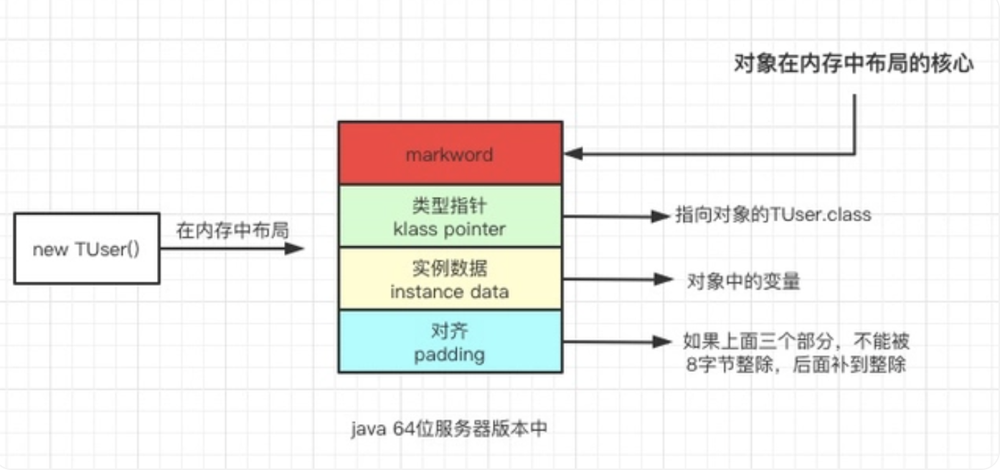

## 谈谈 JVM 内部锁升级过程

PS：本篇的虚拟机以 Hotspot 为例。

#### 一、开篇

当聊到JVM锁机制时，一般会从以下这些问题问起：

1. 对象在内存中的内存布局是怎样的？
2. 描述 synchronize 和 ReentrantLock 的实现和重入的底层原理；
3. 谈谈 AQS，为什么 AQS 的底层是 CAS + volatile？
4. 请描述锁的四种状态和锁升级的过程；
5. Object o = new Object() 在内存中占用多少字节？
6. 自旋锁是不是一定比重量级锁效率更高？
7. 打开偏向锁是否效率一定会提升？
8. 重量级锁到底重在哪里？
9. 重量级锁什么时候比轻量级锁的效率更高，反之如何？

> 冷知识：System.out.println() 也加了锁：
>
> ``` java
> /**
>      * Prints a String and then terminate the line.  This method behaves as
>      * though it invokes <code>{@link #print(String)}</code> and then
>      * <code>{@link #println()}</code>.
>      *
>      * @param x  The <code>String</code> to be printed.
>      */
>     public void println(String x) {
>         synchronized (this) {
>             print(x);
>             newLine();
>         }
>     }
> ```

#### 二、对象的内存布局

对象在 new 出来之后，其在内存中主要分为4个部分：



##### 1. 对象头（Header）

markword：对象头的第一类，用于存储对象自身运行时数据，如哈希码（HashCode）、GC分代年龄、锁状态标志、线程持有的锁、偏向线程ID、偏向时间戳等，这部分数据的长度在 32位 和 64位 的虚拟机（未开启压缩指针）中分别是 32个比特 和 64个比特；

klass pointer：对象头的第二类，记录了指向对象的class文件指针，即对象指向它的类型元数据的指针，Java虚拟机通过这个指针来确定该对象是哪个类的实例。并不是所有的虚拟机实现都必须在对象数据上保留类型指针，换句话说，查找对象的元数据信息，并不一定要经过对象本身。

> 如果对象是一个Java数组，在对象头中还必须有一块用于记录数组大小的数据，因为虚拟机可以通过普通Java对象的元数据确定Java对象的大小，但是如果Java数组的长度是不确定的，将无法推断出数组的大小。

##### 2. 实例数据（Instance Data）

实力数据部分是对象真正存储的有效信息，即代码中锁定义的各种类型的字段内容，无论是从父类继承下来的，还是子类中定义的字段，都必须记录起来，这部分的存储顺序会受到虚拟机分配策略参数（-XX:FieldAllocationStyle）和字段在Java源码中定义的顺序的影响。

##### 3. 对其信息（Padding）

这部分并不是必然存在的，也没有特殊的意义，仅仅起着占位的作用。由于 Hotspot 虚拟机的自动内存管理系统要求对象起始地址必须是8字节的整数倍，换句话说就是任何对象的大小，都必须是8字节的整数倍。对象头部分已经被精心设计成刚好是8字节的倍数（1倍或2倍），因此如果对象实力数据部分没有对齐的话，就需要通过 padding 来填充补全。

*参考《深入理解Java虚拟机》第二章第三节 对象的内存布局*

我们借助 JOL（Java Object Layout）来看看对象的内存布局，执行下面的代码：

``` java
public static void main(String[] args) {
	Object o = new Object();
	System.out.println("==== 加锁前 ==== ");
	System.out.println(ClassLayout.parseInstance(o).toPrintable());
	System.out.println("==== 加锁后 ==== ");
	synchronized (o){
		System.out.println(ClassLayout.parseInstance(o).toPrintable());
	}
	System.out.println("==== 释放锁 ==== ");
	System.out.println(ClassLayout.parseInstance(o).toPrintable());
}
```

执行后我们得到下面的结果：

``` java
==== 加锁前 ==== 
# WARNING: Unable to attach Serviceability Agent. You can try again with escalated privileges. Two options: a) use -Djol.tryWithSudo=true to try with sudo; b) echo 0 | sudo tee /proc/sys/kernel/yama/ptrace_scope
java.lang.Object object internals:
OFF  SZ   TYPE DESCRIPTION               VALUE
  0   8        (object header: mark)     0x0000000000000001 (non-biasable; age: 0)
  8   4        (object header: class)    0xf80001e5
 12   4        (object alignment gap)    
Instance size: 16 bytes
Space losses: 0 bytes internal + 4 bytes external = 4 bytes total

==== 加锁后 ==== 
java.lang.Object object internals:
OFF  SZ   TYPE DESCRIPTION               VALUE
  0   8        (object header: mark)     0x000070000b24c990 (thin lock: 0x000070000b24c990)
  8   4        (object header: class)    0xf80001e5
 12   4        (object alignment gap)    
Instance size: 16 bytes
Space losses: 0 bytes internal + 4 bytes external = 4 bytes total

==== 释放锁 ==== 
java.lang.Object object internals:
OFF  SZ   TYPE DESCRIPTION               VALUE
  0   8        (object header: mark)     0x0000000000000001 (non-biasable; age: 0)
  8   4        (object header: class)    0xf80001e5
 12   4        (object alignment gap)    
Instance size: 16 bytes
Space losses: 0 bytes internal + 4 bytes external = 4 bytes total

```

从输出结果上看，对象头包含了 12 个字节，分为3行，其中前2行是 Object Header（对象头），第一行是 Markword，第二行是类型指针。从 Markword 中看出，加锁后状态从 non-biasable 变为 thin lock。


#### 三、锁升级的过程

##### 1、验证锁升级

探讨锁的升级之前，先做个对照实验：准备两份代码，其不同之处在于 new 对象时，一个中途让它睡5秒，一个不睡，看看是否有区别：

``` java
// 没有Sleep的方法
public static void function1() {
	o = new Object();
	synchronized (o) {
		System.out.println(ClassLayout.parseInstance(o).toPrintable());
	}
}
// Sleep 5秒的方法
public static void fuction2() {
	try {
		Thread.sleep(5000);
	} catch (InterruptedException e) {
		e.printStackTrace();
	}
	o = new Object();
	synchronized (o) {
		System.out.println(ClassLayout.parseInstance(o).toPrintable());
	}
}
```

function1输出的内容如下：

``` sh
java.lang.Object object internals:
OFF  SZ   TYPE DESCRIPTION               VALUE
  0   8        (object header: mark)     0x0000700004460948 (thin lock: 0x0000700004460948)
  8   4        (object header: class)    0xf80001e5
 12   4        (object alignment gap)    
Instance size: 16 bytes
Space losses: 0 bytes internal + 4 bytes external = 4 bytes total
```

function2输出的内容如下：

``` sh
java.lang.Object object internals:
OFF  SZ   TYPE DESCRIPTION               VALUE
  0   8        (object header: mark)     0x00007fa89380e805 (biased: 0x0000001fea24e03a; epoch: 0; age: 0)
  8   4        (object header: class)    0xf80001e5
 12   4        (object alignment gap)    
Instance size: 16 bytes
Space losses: 0 bytes internal + 4 bytes external = 4 bytes total
```


