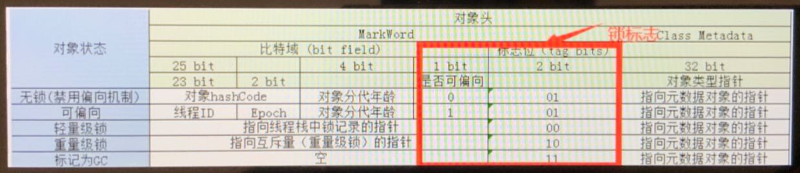

### Java 面试攻坚 —— 并发

#### 一、Java如何开启线程，怎么保证线程安全？

首先解释进程和线程的区别：进程是操作系统进行资源分配的最小单位。线程是操作系统进行任务分配的最小单元。线程隶属于进程。

**开启线程**

有以下几种方式：

1. 继承 Thread 类，重写 run() 方法；
2. 实现 Runnable 接口，实现 run() 方法；
3. 实现 Callable 接口，实现 call() 方法；
   （通过 FutureTask 创建一个线程，获取线程执行的返回值）
4. 通过线程池来开启线程；

**线程安全**

当多个线程访问一个对象时，如果不用考虑这些线程在运行时环境下的调度和交替执行，也不需要进行额外的同步，或在调用方进行其他协作操作，调用这个对象的行为都能获得正确的结果，那么这个对象就是线程安全的。

保证线程安全的方式就是 **加锁**。

1. 使用 JVM 提供的锁：synchronized；
1. 使用 JDK 提供的锁：Lock；

#### 二、volatile 和 synchronized 有什么区别？

##### 1、区别

ynchronized 关键字，用来加锁。

volatile 关键字，只能保证变量的线程可见性，适用于一写多读的场景，不能保证线程安全。

例如下面的代码：

``` java
// 定义临时变量
private static /* volatile */ boolean flag = true;

// 主方法
public static void main (String[] args) {
  new Thread(() -> {
    while(flag) {
      System.out.println("End of thread.");
    }
  }).start();
  Thread.sleep(1000);
  System.out.println("Turn flag off.");
  flag = false;
}
```

如上，如果 ``flag`` 没有标记 ``volatile`` 关键字，那么该线程永远不会停止，因为子线程无法感知 ``flag`` 在主线程中产生的变化。

##### 2、DCL（Double Check Lock）单例

我们定义一个单例模式，代码如下：

``` java
// SingleDemo 类
public class SingleDemo {
  // 定义单例实例
  private static SingleDemo singleDemo = new SingleDemo();
  // 私有化构造方法
  private SingleDemo();
  // 定义单例的get方法
  public static SingleDemo getInstance() {
    return singleDemo;
  }
}
```

在上面的方法中，无论这个类是否被使用，都需要初始化一个 ``singleDemo`` 的静态私有化属性，但这一步完全没必要，可以等到实际使用时再去初始化，这样可以减少程序依赖的类加载。

根据上面的思路，我们修改代码如下：

``` java
// SingleDemo 类
public class SingleDemo {
  // 定义单例实例
  private static SingleDemo singleDemo;
  // 私有化构造方法
  private SingleDemo();
  // 定义单例的get方法
  public static SingleDemo getInstance() {
    if (null == singleDemo) {
    	singleDemo = new SingleDemo();
    }
    return singleDemo;
  }
}
```

在上面的代码中，我们将初始化步骤挪到 ``getInstance()`` 方法中，但是这里有并发问题，假设当前 线程A 和 线程B 同时调用 ``getInstance()`` 方法，都发现 ``singleDemo`` 没有初始化，这里就会产生重复的初始化操作，导致 ``singleDemo`` 的实际内存地址不相同，线程在引用时会直接报错。

那么加锁就好了，我们做如下修改：

``` java
// SingleDemo 类
public class SingleDemo {
  // 定义单例实例
  private static SingleDemo singleDemo;
  // 私有化构造方法
  private SingleDemo();
  // 定义单例的get方法
  public static SingleDemo getInstance() {
    if (null == singleDemo) {
      synchronized(this.Class) {
    		singleDemo = new SingleDemo();
      }
    }
    return singleDemo;
  }
}
```

但是这样也是有问题的，即使加了锁，极端情况下 线程A 和 线程B 都会走到 if 条件判断的内部，两个线程检测到锁，仍然在等待后顺序得对 ``singleDemo`` 进行初始化，没有解决根本问题。

因此，我们想到了，在 ``synchronized`` 里面，也加一层判断，但如果要在加锁后让两个线程感知双方的修改，就需要使用 volatile 关键字了。

我们最终得到下面的代码：

``` java
// SingleDemo 类
public class SingleDemo {
  // 定义单例实例
  private static volatile SingleDemo singleDemo;
  // 私有化构造方法
  private SingleDemo();
  // 定义单例的get方法
  public static SingleDemo getInstance() {
    if (null == singleDemo) {
      synchronized(this.Class) {
        if (null == singleDemo) {
    			singleDemo = new SingleDemo();
        }
      }
    }
    return singleDemo;
  }
}
```

这就是 双重检测锁的单例模式。

#### 三、volatile 如何解决指令重排？

当 CPU 与内存交互时，会执行很多指令，有的指令执行较慢，CPU 会对这些执行较慢的指令进行优化，在等待执行的过程中插入执行其他指令，这称为指令重排。

比如执行：``Integer i = 8;`` ，执行的顺序是：

1. 堆内存分配空间；
2. 对象初始化；
3. Java栈建立引用关系；

但是第二步可能会很耗时，所以经过指令重排后，执行顺序可能会变成：1、3、2。在单线程情况下不会有问题，但多线程并发下可能出现：线程A 在初始化时，线程B 去读取 ``i`` 的值，可能使得线程B 读取到空对象。

#### 四、Java线程锁机制是怎样的？

##### 1、Java如何实现对象锁

首先，我们看看锁是如何实现的。看看下面的代码：

``` java
// 打印对象信息
public static void main (String[] args) {
  Object o = new Object();
  System.out.println(ClassLayout.parseInstance(o).toPrintable());
  synchronized(o) {
    System.out.println(ClassLayout.parseInstance(o).toPrintable());
  }
}
```

pom文件添加对应的依赖：

``` xml
<dependency>
	<groupId>org.openjdk.jol</groupId>
	<artifactId>jol-cli</artifactId>
	<version>0.16</version>
</dependency>
```

或自行下载依赖包：https://repo.maven.apache.org/maven2/org/openjdk/jol/jol-cli/0.16/

可以得到下面的输出：

``` shell
# WARNING: Unable to attach Serviceability Agent. You can try again with escalated privileges. Two options: a) use -Djol.tryWithSudo=true to try with sudo; b) echo 0 | sudo tee /proc/sys/kernel/yama/ptrace_scope
java.lang.Object object internals:
OFF  SZ   TYPE DESCRIPTION               VALUE
  0   8        (object header: mark)     0x0000000000000001 (non-biasable; age: 0)
  8   4        (object header: class)    0xf80001e5
 12   4        (object alignment gap)    
Instance size: 16 bytes
Space losses: 0 bytes internal + 4 bytes external = 4 bytes total

java.lang.Object object internals:
OFF  SZ   TYPE DESCRIPTION               VALUE
  0   8        (object header: mark)     0x00007000033f9990 (thin lock: 0x00007000033f9990)
  8   4        (object header: class)    0xf80001e5
 12   4        (object alignment gap)    
Instance size: 16 bytes
Space losses: 0 bytes internal + 4 bytes external = 4 bytes total


Process finished with exit code 0
```

可以看到除了 header 中的 MarkWord发生了变化，其他的都没有变。由此可以得到一个结论：Java 的锁就是在对象的 MarkWord 中记录一个锁状态。

##### 2、MarkWord



##### 3、锁机制

Java的锁机制，就是根据资源经侦给的激烈程度不断进行锁升级的过程。

**轻量级锁**

当前有一个对象 ``Object o`` ，在对象信息中维护一个标志位，记录当前访问的线程id。假设当前 线程A 正在访问 o，那么 线程B 就会等待，并在队列中不断的尝试访问，这个过程叫做自旋，因此 **轻量级锁** 也被称为 **自旋锁**。

**重量级锁**

当对象外的自旋线程越来越多，达到一定规模时，由应用程序上报给操作系统，由操作系统来分配和调度线程，主动先知 何时可以访问对象，不需要线程来自旋，这就是 **重量级锁** 。

重量级锁需要消耗系统资源，同时调度很慢，轻量级锁只消耗 CPU 资源，调度很快。JDK 在 1.6 之前还是使用操作系统的重量级锁，在 1.6 之后才做了优化。下图展示了优化后的锁升级过程：


通过配置，可以修改创建对象时的锁类型：

``` cnf
-XX:UseBiaseLocking：是否打开偏向锁，默认不打开。
-XX:BiaseLockingStartupDelay：延迟打开偏向锁的时间，单位秒，默认4秒。
```

#### 五、何为AQS

**AQS** （AbstractQueuedSynchronizer）是一个 Java 线程同步的框架，是 JDK 中很多锁工具的核心实现框架。在 AQS 中维护了一个信号量 ``state`` 和一个线程组成的双向链表队列。其中，这个线程队列就是用来给线程排队或放行的。在不同的场景中，有不同的意义。

> 请仔细阅读 AQS 的源码！

**ReentranceLock** 是可重入锁，此时 ``state`` 表示加锁的次数，0表示无锁，每加一次锁， ``state`` 加1。释放锁就减1。

#### 六、并发控制

并发控制有3个核心工具(思想)：CountDownLatch、CylicBarrier、Semaphore(信号量)

>  假设现在有 A、B、C 3个线程，那么如何让这些线程同时执行？如何保证在并发的情况下依次执行？如何保证有序地交替执行？

##### 1、CountDownLatch（同时进行）

可以理解该类将线程统一在一个起跑线上，等待枪声响起，所有线程同时开始执行，看下方的代码：

``` java
public static void main(String[] args) throws InterruptedException {
		int size = 3;
		CountDownLatch cdl = new CountDownLatch(1);
		for (int index = 0; index < size; index ++) {
			new Thread(() -> {
				try {
					cdl.await();
					System.out.println(System.currentTimeMillis());
				} catch (InterruptedException ignored) {}
			}).start();
		}
		// 线程启动需要CPU时间，所以暂时休眠一下
		Thread.sleep(1000);
		cdl.countDown();
	}
```

等待一会后，得到下面的输出结果：

``` sh
temp.concurrentLearning.CountDownLatchDemo
1636462431123
1636462431123
1636462431123

Process finished with exit code 0
```

可以看到这3个线程的执行时间都是差不多的。

##### 2、CylicBarrier（依次执行）

CylicBarrier可以理解为一种思想，定义一个公共资源，使得公共资源依次满足线程的执行条件，让线程有序的交接 公共资源 并顺序执行。看下方代码：

``` java
  // 定义公共资源，并保证其线程可见性
	static volatile int ticket = 1;

	public static void main(String[] args) {
		// 定义线程 t1，让他公共资源满足条件时，执行业务逻辑
		Thread t1 = new Thread(() -> {
			while(true) {
				if (ticket == 1) {
					System.out.println("t1 is running;");
					try {
						Thread.sleep(500);
					} catch (InterruptedException e) {
						e.printStackTrace();
					}
					// 将公共资源的条件修改为满足 t2 线程的执行要求
					ticket = 2;
					return;
				}
			}
		});
		Thread t2 = new Thread(() -> {
			while(true) {
				if (ticket == 2) {
					System.out.println("t2 is running;");
					try {
						Thread.sleep(500);
					} catch (InterruptedException e) {
						e.printStackTrace();
					}
					// 将公共资源的条件修改为满足 t3 线程的执行要求
					ticket = 3;
					return;
				}
			}
		});
		Thread t3 = new Thread(() -> {
			while(true) {
				if (ticket == 3) {
					System.out.println("t3 is running;");
					return;
				}
			}
		});

		t3.start();
		t2.start();
		t1.start();
	}
```

执行后得到下方的结果：

``` sh
temp.concurrentLearning.CylicBarrierDemo
t1 is running;
t2 is running;
t3 is running;

Process finished with exit code 0
```

可以看到，即使 t3先开始，t1最后开始，但这三个线程依旧是按照 t1 -> t2 -> t3 来执行的。

##### 3、Semaphore（信号量）

信号量的思想，与 CylicBarrier 十分类似，看下方的代码：

``` java
// 定义3个信号量
	private static Semaphore sa = new Semaphore(1);
	private static Semaphore sb = new Semaphore(1);
	private static Semaphore sc = new Semaphore(1);

	public static void main(String[] args) throws InterruptedException {
		try {
			sa.acquire();
			sb.acquire();
		} catch (InterruptedException e) {
			e.printStackTrace();
		}
		// 执行线程sa，并打印 A
		new Thread(() -> {
			while (true) {
				sa.acquire();
				Thread.sleep(500);
				System.out.println("A");
				sb.release();
			}
		}).start();
		// B
		new Thread(() -> {
			while (true) {
				sb.acquire();
				Thread.sleep(500);
				System.out.println("B");
				sc.release();
			}
		}).start();
		// C
		new Thread(() -> {
			while (true) {
				sc.acquire();
				Thread.sleep(500);
				System.out.println("C");
				sa.release();
			}
		}).start();
	}
```

执行后可以得到下面的输出：

``` sh
temp.concurrentLearning.SemaphoreDemo
C
A
B
C
A
B
C
A
B

Process finished with exit code 130 (interrupted by signal 2: SIGINT)
```

可以看到使用信号量可以让线程交替等待和唤醒，使得他们依次交替执行。

