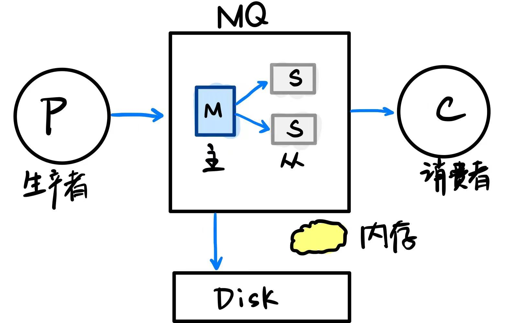
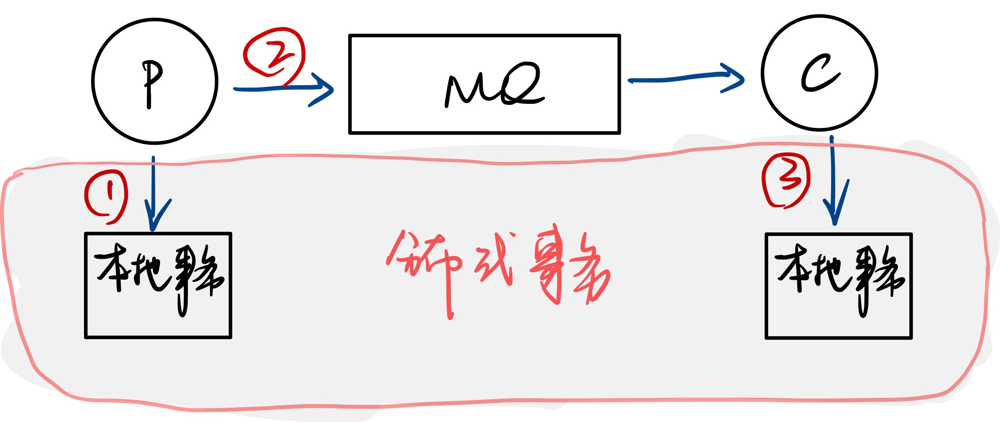
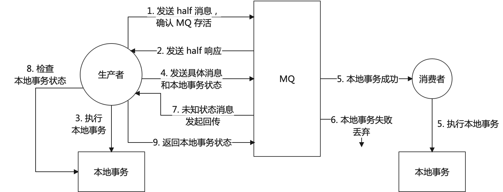
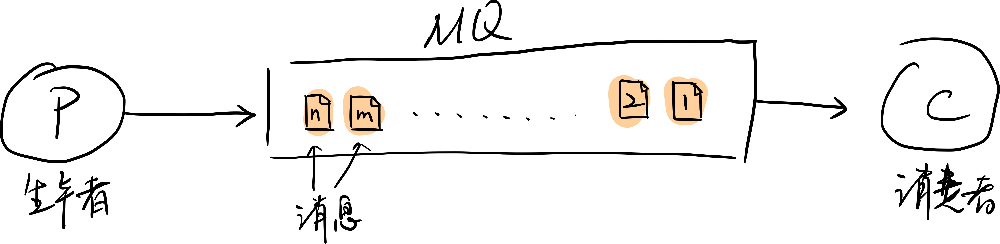
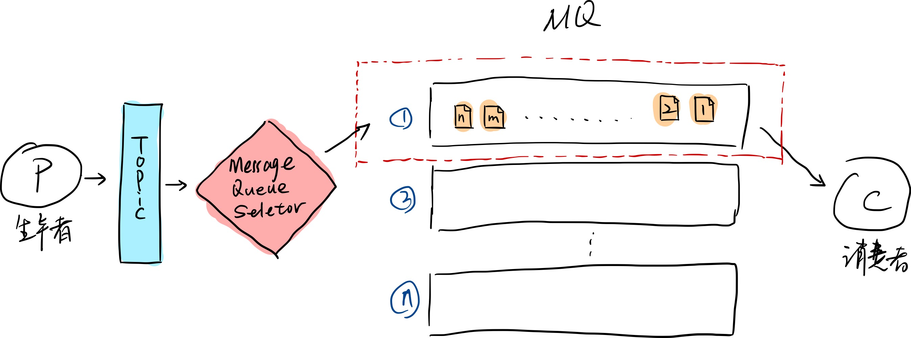

### Java 面试攻坚 —— 消息队列

#### 一、MQ有什么用？

MQ 是 消息队列（Message Queue），表示它是一个FIFO（First In First Out）的数据结构，消息有生产者发送到 MQ 进行排队，然后由消费者对消息进行处理。像聊天软件就是一个典型的 MQ 场景。

MQ 的作用主要有下面3个方面：

1. 异步：能提高系统的响应速度和吞吐量；
2. 解耦：服务间进行解耦，可以减少服务之间的影响，提高系统的稳定性和可拓展性。另外，解耦之后可以实现数据分发和广播；
3. 削峰：以稳定的系统资源应对突发的流量冲击；

MQ 有哪些缺点：

1. 系统的可用性降低：一旦 MQ 宕机，整个业务就会产生影响，不能达到高可用；
2. 系统的复杂度提高：引入 MQ 之后，数据链路会变得复杂，可能会发生数据丢失、重复消费的情况；
3. 数据一致性：若A模块生产消息，需要B和C共同处理，当其中一方处理成功，另一方处理失败时，会产生数据一致性问题；

#### 二、如何进行产品选型

#### 1、Kafka

优点：吞吐量非常大，性能很好，集群高可用；

缺点：会丢数据，功能比较单一；

使用场景：日志分析、大数据采集；

#### 2、RabbitMQ

优点：消息可靠姓高，功能全面；

缺点：吞吐量比较低，消息积累会严重影响性能；Erlang 语言不好定制；

使用场景：小规模场景。

#### 3、RocketMQ

优点：高吞吐、高性能、高可用，功能非常全面；

缺点：开源版功能不如云上商业版，官方文档和周边生态不够成熟，且客户端只支持Java；

使用场景：几乎全场景。

#### 三、如何保证消息不丢失

首先，我们不可能从所有的消息中间件都展开来分析，或者针对具体的业务场景来聊，最好是尽可能抽象的来看，可以从以下两个方面来分析：

##### 1. 哪些环节可能产生消息丢失？


在上图中，消息从生产到消费，中间有很多环节，在一些关键路径上可能产生消息丢失：
1）生产者将消息发送给 MQ 时，MQ丢失；
2）MQ 内部主从备份时产生消息丢失；
3）MQ 在归档消息时产生丢失；
4）消费者在消费时丢失；

##### 2. 怎么防止消息丢失？

针对以上四个关键路径，可以有下面的几种办法来解决：

**1）生产者防止消息丢失：**

1. Kafka：生产者维护回调队列，若消息推送给 MQ 后，没有收到 MQ 的回调，则会有重试机制；

2. RocketMQ：
   a）参考 Kafka 的方式，使用 消息推送+ 回调 的形式进行保障；
   b）事务消息；
   
   分布式事务是保证 1 和 3 的原子性，但这很难。RocketMQ 的事务消息能保证 1 和 2 的原子性。**RocketMQ如何实现事务消息机制，这是重点：**

   
   其中：7、8、9 的循环次数是15次，如果一直是未知状态，则在15次之后主动抛弃这个事务消息。

3. RabbitMQ：
   a）消息推送+回调；
   b）手动事务：可以使用 ``channel.txSelect()`` 来开启事务，``channel.txCommit()`` 提交事务，``channel.txRollback()`` 回滚事务，但这样会对 channel 产生阻塞，造成吞吐量下降；
   c）Publisher Confirm 生产者确认机制，整个处理流程跟 RocketMQ的事务消息，基本是一样的。

**2）MQ主从消息同步不丢失**

1. RocketMQ：
   a）**普通集群**：可以选择 同步同步 和 异步同步。同步同步是指生产者将消息推送给 MQ 时，master将消息立即同步给slave，当slave响应master后，master再响应生产者表示消息已接收。异步同步是指，master接受到生产者消息后，存盘结束后就响应生产者，另外开启线程来同步给slave。异步同步吞吐量高，但可能会在slave同步消息失败后，产生消息丢失，因为可能master并没有重试机制，这样会发生消息丢失。
   b）**Dledger集群-两阶段提交**：RocketMQ中普通集群模式下，一旦选举出master，除非其宕机，否则不会再选举。但 Dledger集群模式下，集群会频繁发生选举，master会轮换。且参考了异步同步的方式，但在master接受到生产者消息并响应后，将消息记录为 ``Uncommited``，在同步给大多数slave并接收到并给master正确响应后，再标记为 ``Commited``，此为两阶段提交，这也要求Dledger集群最少3个节点。
2. RabbitMQ：
   a）普通集群：消息分散存储，节点之间不会主动进行消息同步，是可能会丢失消息的。当生产者向集群推送一条消息时，接收到消息的节点本地存储后响应生产者，若消费者与其他节点创建了连接通道，则需要由该节点向消息存储的节点同步消息，才能给消费者消费。将 ``erlang.cookie`` 配置成一样的，就是普通集群。
   b）镜像集群：会再接点之间主动进行数据同步，这样数据安全性得到提高。
3. Kafka：因为它可能会丢失消息，所以业务方在选型时就要允许有少量丢失。同时提供 ``acks`` 配置，支持 0，1，all（自行百度）

**3）存盘时消息丢失**

1. RocketMQ：提供 同步刷盘 和 异步刷盘 两种机制，通过配置来修改。同步刷盘是在 MQ 将消息写入内存时就等待内存刷盘，这样能保证消息安全性，但效率会降低；异步刷盘则不等待刷盘持久化，消息写入系统内存后就立即响应。
2. RabbitMQ：将队列配置成持久化队列。在较新版本（3.*或以上）中，新增的 Quorum 类型的队列，会采用 Raft 协议来进行消息同步。

**4）消费者消费时丢失**

MQ 在维护消息队列时会有一个 offset 偏移量，当消费者接收到消息，处理完本地事务后，再给 MQ 响应，MQ 会将偏移量向后移动，并推送后续消息，这样是不会有消息丢失的。但如果消费者也才用异步处理方式，当接收到消息后立即响应 MQ，才去处理本地事务，若此时本地事务失败，而 MQ 已经移动了偏移量，是不会在重复推送消息给消费者的，就会造成消息丢失的假象。

1. RocketMQ：使用默认的方式消费即可，不要采用异步方式；
2. RabbitMQ：关闭 ``autoCommit``，不要自动提交，改为手动提交事务即可；
3. Kafka：手动提交 offset；

#### 四、消息消费的幂等性

消息的幂等性，是为了防止消费者重复消费消息的问题。

假设在 MQ 中维护了一个消息队列，当消息推送给消费者后，MQ 等待消费者的回调，当回调成功后，消息队列的 offset 标志位向前移动，并发送下一条消息。但是当消费者处理本地事务时，MQ 一直处于等待状态，假设我们设置一个等待的超时时间，若设置的太短，消费者还没有处理完本地事务而给出回调响应，或者出现网络抖动，会导致 MQ 提前结束超时，重复的向消费者推送消息。

所以，MQ 并没有提供主动解决幂等性的机制，需要由 **消费者自行解决**。

在RocketMQ中，会给每个消息定义一个 MessageId，可以用它来作为消费者判断迷瞪的依据，但其他的 MQ 产品并不提供。最好的方式是自带一个业务标识Id，来进行幂等判断，例如统一Id分配等。

#### 五、如何保证消息的顺序

在 MQ 产品层面，只有 RocketMQ 能提供有序消息（参考：[Apache RocketMQ Order Message](https://rocketmq.apache.org/docs/order-example/) ），RabbitMQ 和 Kafka 没有提供有序消息的实现，需要在业务代码中自行实现。下面我们针对 RocketMQ 的实现方式进行展开。

首先，一个队列的模型如下所示：



当 MQ 内部只有一个队列时，可以满足 FIFO 并以此提供消息的有序性。但为了获得更高的吞吐量，MQ内部会设计很多个队列，来存储消息，因为消费者在每次消费时，请求 MQ 获取消息时并不能指定从哪个队列中获得，而是 MQ 直接返回固定数量的消息，这样会使得由生产者产生的有序消息，堆放到不同的队列后，因为网络、调度等问题打乱了消费者消费时的顺序。




为了保证消息有序，消息由 Topic 交给 **MessageQueueSelector** 后，将所选的队列锁定，消费者消费消息时指定从某个队列中拉取全部的消息来进行消费，而在消费者接收消息时，由 ``MessageListenerOrderly``  类来处理顺序。。详见官方的样例代码：

``` java
// 生产者推送消息时，指定某个队列的id
SendResult sendResult = producer.send(msg, new MessageQueueSelector() {
	@Override
	public MessageQueue select(List<MessageQueue> mqs, Message msg, Object arg) {
		Integer id = (Integer) arg;
		int index = id % mqs.size();
		return mqs.get(index);
    }
	}, orderId);
}
```

RocketMQ的核心思想是：**生产者把一组有序的消息，放到同一个队列中，消费者一次消费整个队列的消息**。

RabbitMQ 通过配置，保证 exchange 指对应一个队列，并且一个队列只对应一个消费者。

Kafka 则需要在生产者定制 partition 分配规则，将消息分配给同一个 partition，且要保证一个 Topic 只对应一个消费者。但无论怎么配置，都十分影响性能，且不容易拓展。

