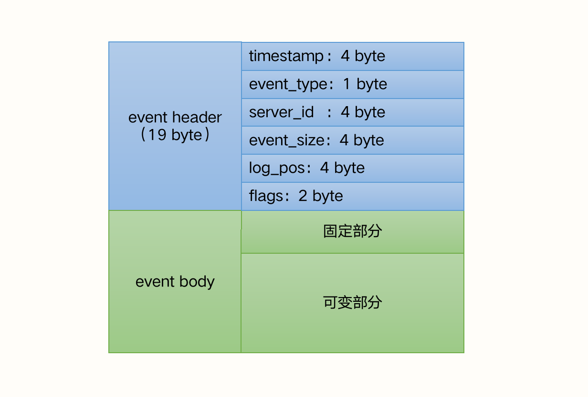
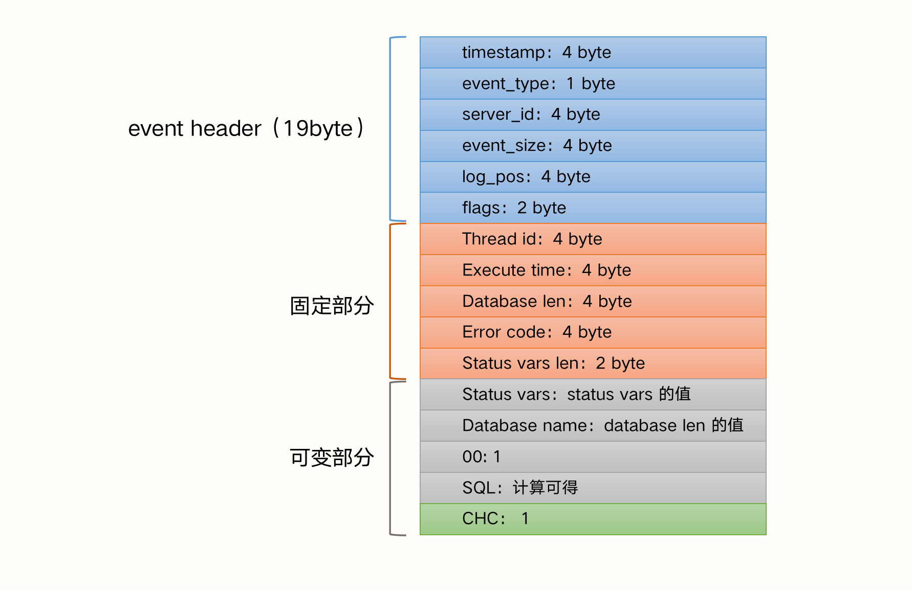
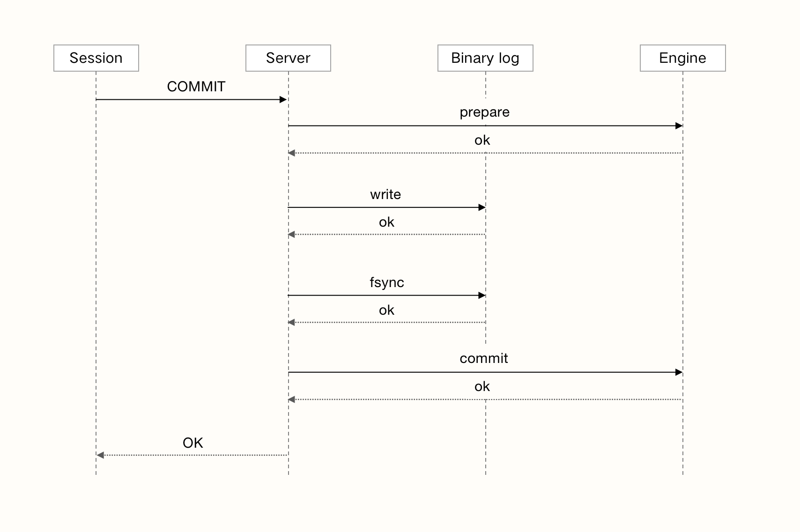
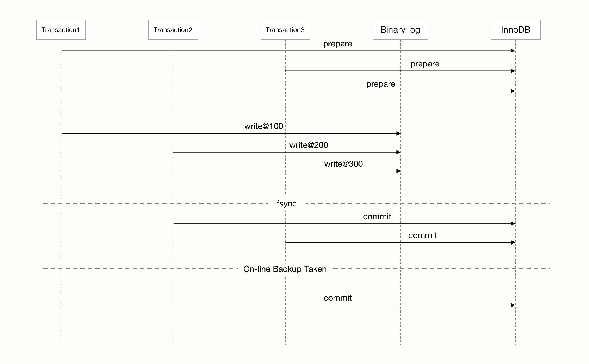

### MySQL日志 - binlog

binlog 是记录所有数据库表结构变更（例如 Create、Alter...）以及表数据的修改（Insert、Update、Delete...）的二进制日志。不会记录 Select 和 Show 这类操作，因为这类操作对数据本身并没有修改，但可以通过查询通用日志来查看 MySQL 执行过的所有语句，**且 binlog 是由 MySQL 服务层处理的**。

> 需要注意一点：即便 Update 操作没有造成数据变化，也会记录 binlog

binlog 有两个常见的使用场景：

1. **主从复制**：MySQL Replication 在 master 端开启 binlog，master 把它的二进制日志传递给 slaves 来达到 master-slave 数据一致的目的；
2. **数据恢复**：通过 mysqlbinlog 工具来恢复某个时间段或全量的数据；

#### 一、关键参数

##### 1）log_bin

binlog 默认是关闭的，可以通过 ``log_bin`` 控制。

##### 2）max_binlog_size

该参数指定了单个二进制日志文件的最大值，默认是 1GB，如果超过该值，会写入新文件，并记录到 .index 文件中。

##### 3）binlog_cache_size

InnoDB 会将所有未提交的 binlog 写到一个缓存中，等事务提交后再将缓存刷新到文件中，该参数就是控制缓存大小的。需要注意的是， 该值是基于 session 的，每个事务都会分配一个大小为 binlog_cache_size 的缓存，当一个事务的记录大于该值时，MySQL 会把缓存中的日志写入一个临时文件。因此，需要根据使用场景合理设置，过大或者过小都会影响性能。

##### 4）sync_binlog

该参数表示每 N 次写入缓存后就同步到磁盘中。N 为 0、1 和任意正整数时表示的含义不同：

1. sync_binlog = 0：表示 MySQL 不控制 binlog 的刷新，提交修改前将 binlog 写入 OS Cache，由文件系统来控制何时刷到磁盘中；这时候性能是最好的，但风险也是最大的，一旦操作系统宕机，OS Cache 缓存将被清空；
2. sync_binlog = 1：表示采用同步写磁盘的方式来写 binlog，不使用 OS Cache，每次修改都立即刷新磁盘；
3. sync_binlog = N：每次执行事务，都将修改写入 OS Cache，N 次事务后就调用一次系统函数 fsync 将 OS Cache 刷到磁盘中；

但是即便将 sync_binlog 设置为 1，还是会有问题：当使用 InnoDB 存储引擎时，在一个事务发出 Commit 动作之前，由于 sync_binlog 设置为 1，因此会异步将 binlog 立即写入磁盘。如果此时已经写入磁盘，而事务还未提交并发生了宕机，那么在 MySQL 下次启动时，因为 Commit 操作还未发生，所以这个事务会被回滚，但 binlog 已经记录了该信息，不能被回滚。

> 上面提到的问题可以用 innodb_support_xa 设置为 1 解决。虽然这个参数和 XA 事务有关，但它同时也保证了 binlog 和 InnoDB 存储引擎数据文件的同步。

##### 5）binlog_format

该参数决定了 binlog 的格式，或者说内容。该参数有以下这些可选值：

1. STATEMENT：记录 SQL 语句。日志文件很小，节约 IO，但是对一些系统函数不能准确复制或不能复制，如 now()、uuid() 等；
2. ROW：记录表的行更改，可以为数据库恢复、复制带来更好的可靠性，但是 binlog 文件的大小相对 STATEMENT 有所增加；
3. MIXED：以上两种的混合，默认采用 STATEMENT 格式进行记录，但在**一些情况下**会使用 ROW；

目前业内推荐使用的是 ROW，准确性高，虽然说文件大，但是 SSD 和 万兆光纤网络带宽的条件下，这些磁盘IO和网络IO都是可以接受的。

#### 二、文件结构

我们来了解一下文件头。一般来说存储文件都可以大致分为 3 个部分：文件头、核心属性（如类型、大小、长度之类）和数据体。binlog 的文件大致结构如下：

##### 1）文件头

文件头由一个4字节 Magic Number 构成，它的值固定为十进制 1852400382，十六进制表示为 **0xfe62696e**。用这4个字节的 Magic Number 来验证是否是 binlog。

> 其实在 Java 的 .class 的文件头中也有这么一个4字节的 Magic Number，值固定为十六进制 0xcafebabe，昵称为“咖啡宝贝”。

##### 2）event 事件

binlog 事件的文件结构也是类似的，包含 事件头（event header）和 事件体（event body），其结构大致如下：

事件头（event header）的具体结构与事件类型相关，以 QUERY_EVENT 类型为例，存储的格式如下：

常见的事件类型有以下：

| event type                      | 说明                                                         |
| ------------------------------- | ------------------------------------------------------------ |
| FORMAT_DESCRIPTION_EVENT        | 该部分位于整个文件的头部，每个 binlog 文件都必定会有唯一一个该event |
| PREVIOUS_GTIDS_EVENT            | 包含在每个 binlog 的开头，用于描述所有以前 binlog 所包含的全部 **GTID** 的一个集合（包括已经删除的 binlog） |
| GTID_EVENT/ANONYMOUS_GTID_EVENT | 每一个Query事务前都会有这样一个 GTID_EVENT，如果未开启，则是 ANONYMOUS_GTID_EVENT；事务开始时，执行的 BEGIN 操作；ROW 格式中的 DDL 操作等； |
| TABLE_MAP_EVENT                 | 每个 DML 事务之前，都会有一个 TABLE_MAP_EVENT，记录操作对应的表的信息 |
| WRITE_ROW_EVENT                 | 插入操作                                                     |
| DELETE_ROW_EVENT                | 删除操作                                                     |
| UPDATE_ROW_EVENT                | 更新操作，是一条记录的完整变化情况，即从变化前到变化后的过程 |
| XID_EVENT                       | 主要是事务提交的时候会在最后生成一个 xid 号，有这个便表示事务提交成功了 |
| ROTATE_EVENT                    | binlog 结束时的事件                                          |

#### 三、与 redo log 的区别

binlog 也记录了 InnoDB 表的狠毒哦操作，也能实现重做的功能，但它与 redo log 有很大区别：

##### 1）业务层级

binlog 是 MySQL Server层的，不管是什么存储引擎，对数据库进行了修改都会产生 binlog。而 redo log 是 InnoDB 存储引擎层的，只记录了该存储引擎中表的修改；

##### 2）文件存储方式

binlog 是逻辑日志，即便它是基于行格式的记录方式，其本质还是逻辑的 SQL 设置，如该行记录的每列的值是多少，而 redo log 是在物理格式上的日志，它记录的是数据库中每个页的修改。

##### 3）与事务的关系

binlog 只在每次提交事务的时候一次性写入缓存中的日志“文件”，对于非事务表的操作，则是每次执行语句成功后，就直接写入。而 redo log 在数据准备修改前就已写入 redo log buffer 中，然后才对 Buffer Pool 中的数据执行修改操作，而且保证在发出 Commit 指令时，先向 redo log buffer 写入日志，写完了才提交 Commit；

binlog 是在提交的时候一次性写入，所以 binlog 的记录方式和提交顺序有关，且一次提交对应一次记录。而 redo log 中记录的是物理页的修改，同一个事务可能提交多次记录，最后一个提交的事务会覆盖所有未提交的事务记录。而且 redo log 是并发写入的，不同事务之间的不同版本的记录会穿插写入到 redo log 中。

#### 四、redo log 和 binlog 的一致性

##### 1）CrashSafe

**CrashSafe** 指的是 MySQL 服务器宕机重启后需要保证：1. 所有已经提交的事务数据仍然存在；2. 所有没有提交的事务数据自动回滚；

MySQL 没有开启 binlog 的情况下，InnoDB 通过 redo log 和 undo log 可以保证以上两点。为了严格的 CrashSafe，必须要在每个事务提交的时候，将 redo log 写入磁盘中。那么 MySQL 在开启 binlog 的主从架构中，如何保证 CrashSafe 呢？

首先，为了保证 master 和 slaves 的数据一致性，需要保证 binlog 和 redo log 的一致性。因为 slave 是通过 binlog 重放 master 提交的事务来达到主从的，而 master 写入 binlog 是在 Commit 之前，如果写完 binlog，master crash 掉，再次启动时就会回滚事务。但此时 slaves 已经执行，就会造成主备数据不一致。

为此，MySQL 引入了二阶段提交，MySQL 内部会自动将普通事务当做一个 XA事务（内部分布式事务）来处理：

1. 自动为每一个事务分配一个唯一ID（XID）；
2. Commit 会被自动分成 Prepare 和 Commit 两个阶段；
3. binlog 会被当作事务协调者（Transaction Coordinator），binlog event 会被当作协调者日志；

那么整个事务的提交流程图如下：

以上图片可以看到，事务的提交主要分为三个步骤：

1. SQL 执行成功后，生成 xid 信息以及 redo 和 undo 的内存日志。然后调用 prepare 方法完成第一阶段。prepare 方法实际上什么也没做，将事务状态设置为 TRX_PREPARE，并将 redo log 刷到磁盘；
2. 如果事务涉及的所有存储引擎的 prepare 都执行成功，则记录协调者日志（binlog）。此时事务需要提交，否则调用 ha_rollback_trans 方法回滚事务，而 SQL 语句实际上也不会写到 binlog；
3. 调用存储引擎的 commit 完成事务提交，清除 undo log，刷新 redo log，将事务设置为 TRX_NOT_STARTED 状态；

也就是说，binlog 的记录发生在 InnoDB 的 prepare 之后，即 redo log 写入磁盘之后。一旦步骤2中的操作完成，就确保了事务的提交，即使在执行步骤3时数据库宕机。

另外需要注意的是，每个步骤都需要执行一次 fsync 操作才能保证上下两层数据的一致性，步骤2的fsync 参数由 ``sync_binlog = 1`` 控制，步骤3的 fsync 由 `innodb_flush_log_at_trx_commit = 1` 控制，俗称“双1”，是保证 CrashSafe 的根本。

**innodb_flush_log_at_trx_commit**：设置为 1，表示每次事务的 redo log 都直接持久化到磁盘（注意这里指的是 redo log 本身落盘），保证 MySQL 重启后的数据不丢失。

**sync_binlog**：设置为 1，表示每次事务的 binlog 都直接持久化到磁盘，保证 MySQL 重启后的 binlog 记录是完整的。

事务的两阶段提交协议保证了无论什么情况下，事务要么同时存在于存储引擎和 binlog 中，要么两个都不在，这保证了主从之间的数据一致性。另外，MySQL 内部两阶段提交需要开启 ``innodb_support_xa = true``，默认开启。这个参数就是支持分布式事务两阶段提交。redo 和 binlog 数据一致性就是靠这个来完成的，如果关闭会有事务数据丢失的风险。

##### 2）故障恢复

如果数据库发生崩溃，当数据库系统重启时会进行崩溃恢复，存储引擎中处于 prepare 状态的事务会去查询该事务是否也同时存在于 binlog 中，如果存在，表示存储引擎内部提交了该事务，若没有，则回滚该事务。

MySQL 在 prepare 阶段会生成 xid，在 commit 阶段写入 binlog。进行恢复时，**事务要先提交还是先回滚，由 binlog 来决定**。事务的 xid_log_event 存在，就要提交，不存在，就要回滚。

恢复的过程非常简单：

1. 从 binlog 中读出所有的 xid_log_event；
2. 告诉 InnoDB 提交这些 xid 的事务；
3. InnoDB 回滚其他事务；

在恢复阶段可能会出现：

1. 当事务在 prepare 阶段发生 crash，数据库 recovery 的时候该事务未写入 binlog 并且存储引擎未提交，将该事务回滚；
2. 当事务在 binlog 阶段发生crash，此时日志还没有成功写入到磁盘中，启动时该事务会被回滚；
3. 当事务在 binlog 已经 fsync() 到磁盘后 crash，但是 InnoDB 没有来得及 commit，此时数据库 recovery 会读取 binlog 的 xid_log_event，然后告诉 InnoDB 提交这些 xid 的事务，其他事务将被回滚；

可以看出，若一个事务在 prepare 阶段落盘成功，并在 MySQL Server 层中的 binlog 也写入成功，那么这个事务必定成功。

##### 3）commit 顺序一致性

上面提到单个事务的二阶段提交过程，能够保证存储引擎和 binlog 日志保持一致，但是在并发的情况下怎么保证 InnoDB 层的事务日志 和 MySQL 数据库的 binlog 的顺序一致？我们下来看下如果顺序不一致会导致什么问题。

假设我们通过 xtrabackup 和 ibbackup 这种物理备份工具进行备份时，使用备份来建立复制：

如上图，事务按照 T1、T2、T3 顺序开始执行，将 binlog 写入 OS Cache，调用 fsync() 进行一次组提交（group commit）将日志文件永久写入磁盘。

但存储引擎提交的顺序是 T2、T3、T1，当 T2 和 T3 提交后，若通过在线物理备份进行数据库恢复来建立复制时，因为在 InnoDB 存储引擎层会检测事务 T3 在上下两层都完成了事务提交，不需要进行恢复，则此时主备数据不一致了（搭建 Slave 时，change Master to 的日志偏移量记录 T3 在事务位置之后）。

为了解决以上问题，在早期的 MySQL 5.6 版本之前，通过 ``prepare_commit_mutex`` 锁以串行的方式来保证 MySQL 数据库上层 binlog 和 InnoDB 存储引擎层的事务提交顺序一致，然后会导致 组提交（group commit）特性无法生效。为了满足数据的持久化需求，一个完整事务的提交最多会导致 3 次 fsync() 操作。为了提高 MySQL 在开启 binlog 情况下单位时间的事务提交数（吞吐），就必须减少每个事务提交过程中导致的 fsync() 的调用次数。所以，MySQL 从 5.6 版本开始加入了 binlog group commit 技术。

MySQL 数据库内部在 prepare redo 阶段获取 preoare_commit_mutex 锁，一次只能有一个事务可以获取该 mutex。通过这个臭名昭著的 prepare_commit_mutex 锁，将 redo log 和 binlog 刷盘串行化，串行化的目的也仅仅是为了保证 redo log 和 binlog 一致，继而无法实现 group commit 牺牲了性能：**只有当一个事务的 prepare_commit_mutex 锁 释放后，下一个事务才能进行 prepare 操作，从而保证 redo log 和 binlog 的一致性**。锁机制造成高并发提交事务时的性能非常差，而且 binlog 无法进行组提交（group commit）。

##### 4）BLGC（binary log group commit）

MySQL 5.6 引入了 BLGC（binlog组提交），不但 MySQL 数据库上层 binlog 写入时是组提交，InnoDB 存储引擎层也是组提交。此外，移除了原先的锁 prepare_commit_mutex，从而大大提高了数据库的整体性。

事务的提交过程分为三个阶段：Flush Stage、Sync Stage、Commit Stage：

1. Flush Stage：将每个事务的 binlog 写入内存中；
2. Sync Stage：将内存中的 binlog 刷新到磁盘，若队列中有多个事务，那么仅仅一次 fsync 操作就完成了 binlog 的写入，这就是 BLGC；
3. Commit Stage：leader（队列中的第一个事务） 根据顺序调用存储引擎层事务的提交，InnoDB 本身就支持 group commit，因此修复了原先由于 prepare_commit_mutex 导致 group commit 失效的问题；

其基本思想是，**引入队列机制保证 InnoDB commit顺序与 binlog 落盘顺序一致**，并将事务分组，组内的 binlog 刷盘动作交给一个事务进行，实现组提交的目的。在 MySQL 数据库上层进行提交时，首先按提交顺序将其放入一个队列中，每个队列各自有 mutex 保护，队列中的第一个事务称为 leader，其他事务称为 follow，leader 控制着 follow 的行为。

当有一组事务在进行 commit，其他新事务可以进行 Flush 阶段，从而使 group commit 不断生效。当然 group commit 的效果由队列中事务的数量决定，若每次队列中仅有一个事务，那么效果和之前差不多，甚至会更差。但当提交的事务越多，group commit 的效果就越明显，数据库性能的提升也越大。

——————————

参考文章：[好文推荐：MySQL之binlog](https://baijiahao.baidu.com/s?id=1709428876934537465&wfr=spider&for=pc)

