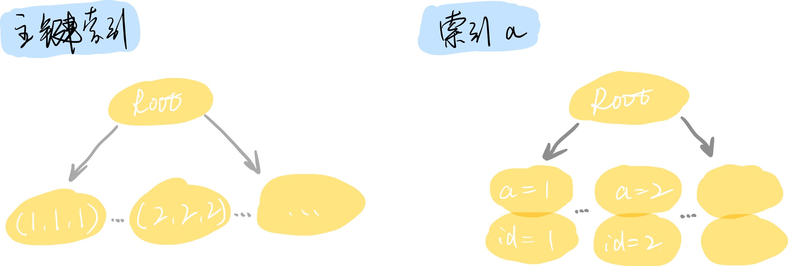

## 为什么SQL语句使用了索引，却还是慢查询

From：极客时间     By：林晓斌

常有同学问我，我的一个SQL使用了索引，但为什么还是被记录到慢查询中？我们就从这个问题开始今天的讨论。请看下面的表：

``` mysql
// 创建一个表t
CREATE TABLE `t` (
  `id` int(11) NOT NULL,
  `a` int(11) DEFAULT NULL,
  `b` int(11) DEFAULT NULL,
  PRIMARY KEY (`id`),
  KEY `a` (`a`)
) ENGINE = InnoDB;

// 插入一些数据
INSERT INTO `t` VALUES (1, 1, 1), (2, 2, 2);
```

首先，MySQL 判断一个 SQL 是否是慢查询，依据的是 SQL 语句的执行时间，它会根据 SQL 语句的执行时间，与 ``long_query_time`` 这个系统参数做比较，如果大于 ``long_query_time``，则记录到慢查询日志中。这个参数的默认值是 10s，但我们通常会设置为1s，对于延时敏感的业务，甚至会小于1s。

而对于语句是否使用索引，意思是我们在使用 ``explain`` 来分析 SQL 语句时，有没有使用表的索引。如下：

``` mysql
mysql> explain select * from t;
+----+-------------+-------+------+---------------+------+---------+------+------+-------+
| id | select_type | table | type | possible_keys | key  | key_len | ref  | rows | Extra |
+----+-------------+-------+------+---------------+------+---------+------+------+-------+
|  1 | SIMPLE      | t     | ALL  | NULL          | NULL | NULL    | NULL |    2 | NULL  |
+----+-------------+-------+------+---------------+------+---------+------+------+-------+
1 row in set (0.01 sec)
///////////////////////////////////////////////
mysql> explain select * from t where id > 0;
+----+-------------+-------+-------+---------------+---------+---------+------+------+-------------+
| id | select_type | table | type  | possible_keys | key     | key_len | ref  | rows | Extra       |
+----+-------------+-------+-------+---------------+---------+---------+------+------+-------------+
|  1 | SIMPLE      | t     | range | PRIMARY       | PRIMARY | 4       | NULL |    2 | Using where |
+----+-------------+-------+-------+---------------+---------+---------+------+------+-------------+
1 row in set (0.01 sec)
///////////////////////////////////////////////
mysql> explain select * from t where a > 0;
+----+-------------+-------+-------+---------------+------+---------+------+------+-----------------------+
| id | select_type | table | type  | possible_keys | key  | key_len | ref  | rows | Extra                 |
+----+-------------+-------+-------+---------------+------+---------+------+------+-----------------------+
|  1 | SIMPLE      | t     | range | a             | a    | 5       | NULL |    2 | Using index condition |
+----+-------------+-------+-------+---------------+------+---------+------+------+-----------------------+
1 row in set (0.00 sec)
```

从上面可以看到，第一个 SQL 的 key 是 **NULL**，表示没有使用索引；第二个 SQL 的 key 是 **PRIMARY**，表示使用了主键索引；第三个 SQL 的 key 是 **a**，表示使用了我们定义的 a 这个索引。

实际上第三个 SQL 扫描了整个索引树a，因为数据只有2行，所以索引树的扫描很快就结束了。如果数据量较大，如百万、千万级别的数据，第二个 SQL 还是可以执行很快，但第三个 SQL 就肯定很慢了。更极端的情况下，这个数据库所在的机器 CPU压力很高，那么第二个 SQL 的执行时间也很可能超过 long_query_time，被记录到慢查询日志里面。

所以，是否使用索引，只表示了 SQL 语句的执行过程，而是否记录慢查询是由语句的执行时间来决定的，可能会受各种外部因素的影响。也就是说，是否使用索引，和是否被记录到慢查询，没有必然的联系。

#### 何为 "使用了索引"

InnoDB是索引组织表，所有的数据都存储在索引树上，而主键索引存储了该表的所有数据。



根据上面的示例，我们知道这个表有2个索引，一个主键索引，一个索引a。那么从逻辑上说，所有的查询都至少要用到了1个索引（即主键索引）。假设执行 ``select * from t where id > 0`` ，你觉得是否使用到了索引？

``` mysql
mysql> explain select * from t where id > 0;
+----+-------------+-------+-------+---------------+---------+---------+------+------+-------------+
| id | select_type | table | type  | possible_keys | key     | key_len | ref  | rows | Extra       |
+----+-------------+-------+-------+---------------+---------+---------+------+------+-------------+
|  1 | SIMPLE      | t     | range | PRIMARY       | PRIMARY | 4       | NULL |    2 | Using where |
+----+-------------+-------+-------+---------------+---------+---------+------+------+-------------+
1 row in set (0.00 sec)
```

我们可以看到，key 显示的是 **PRIMARY**，但索引优化器认为，需要根据主键索引定位到第一个满足 id > 0 的值，所以即使 key 不是 NULL，也可能进行全表扫描的。在 InnoDB 中，**没有使用索引**，指的是从最左边的叶子节点开始向右扫描整个索引树。所以说，没有使用索引，并不是一个准确的描述。你可以用全表扫描或全索引扫描，表示他扫描了一个索引树，比如 ``select * from t where id > 0``。

而**使用了索引**，指的是类似 ``select * from t where id = 2`` 这样的 SQL 语句，使用了索引的快速搜索功能，并有效的减少了扫描行数。

下面我们看一个例子：

假设有一个表 ``t_people`` 存储了全中国所有的人，若要查询出年龄在 18岁到25岁的人，可以使用下面的 SQL 语句：

``` sql
select * from t_people where age between 10 and 15;
```

从这个 SQL 看，我们直观的知道如果不在 age 字段上建索引，则执行时间一定不乐观。但即使添加了索引，执行时间也没有直接的提升。我们分析一下这个 SQL 的执行流程：


首先在 索引树a 上查找到第一个 age 满足条件的记录，拿到这条记录的ID值，再回到主键索引中查找到对应的记录 User1，然后再在 索引树a 上向后检索，找到下一条 age 满足条件 的记录的ID值，回到主键索引找到对应的记录 User2，以此类推，直到索引树a上的记录不满足条件为止。

我们发现，即使命中了索引，扫描行数依旧十分巨大。所以我们不仅仅要关注是否使用了索引，还需要关注索引的过滤性是否足够好。

#### 索引过滤性 和 回表

现在我们执行下面的语句，给 t_people 添加一个联合索引：

``` mysql
alter table `t_people` add index idx_2 (`name`, `age`);
```

那么我们来分析下面的 SQL 语句的执行效率：

``` mysql
select * from t_people where name = '张三' and age = 8;
```

这个 SQL 语句是要查到全国人口中姓名是张三且年龄是8岁的人，首先 explain 分析这个 SQL：

``` mysql
mysql> explain select * from t_people where name = '张三' and age = 8;
+----+-------------+----------+------+---------------+-------+---------+-------------+------+--------------------------+
| id | select_type | table    | type | possible_keys | key   | key_len | ref         | rows | Extra                    |
+----+-------------+----------+------+---------------+-------+---------+-------------+------+--------------------------+
|  1 | SIMPLE      | t_people | ref  | idx_2         | idx_2 | 68      | const,const |    1 | Using where; Using index |
+----+-------------+----------+------+---------------+-------+---------+-------------+------+--------------------------+
1 row in set (0.01 sec)
```

可以看到索引命中了idx_2。

现在我们要查询姓张且年龄是8的人，那么 SQL 语句应该这么写：

``` mysql
select * from t_people where name like '张%' and age = 8;
```

在 MySQL 5.5 及之前版本中，他的执行流程是这样的：


1. 从索引(name,age) 中找到姓名是张开头的记录，并取出ID；
2. 根据ID，在主键索引上找到对应的记录；
3. 判断age是否是8，若是8，则加入到结果集中，若不是，则丢弃；

根据上面的执行流程，假设满足姓名中是张开头的条件的记录，有几千万，那么在主键索引上查询的次数就对应有几千万次。我们把 **先在普通索引上检索，得到主键ID后，再回到主键索引中取具体记录的行为，称作回表**。

可以看到，这个执行流程最耗时的部分是回表，在 MySQL 5.6 及之后的版本中，引入了 **index condition pushdown** 的优化，即索引条件下推。我们看看优化后的流程：

1. 从索引(name,age) 中找到姓名是张开头的记录，并判断年龄是否是8，若是，则取出ID，若不是，则查找下一个满足条件的记录；
2. 若第1步取到ID，则回表，并加入到结果集中；

对比可以看到，优化后，将第3步的行为，前置到第1步中，这里将减少回表的次数，从而达到优化的目的。但在索引(name,age) 中需要满足最左前缀原则，所以检索的次数仍然是几千万次，是否有更进一步的优化？

我们假设根据姓名开头的第一个字做查询，是一个普遍操作，那么我们可以给 t_people 表新加一列 name_first，它存储了姓名开头的第一个字，并给 name_first 和 age 建一个新的索引，这样就能做进一步的优化了。

但我们希望 name_first 能够由 MySQL 完成自动更新，即根据 name 来生成，这里就要使用到在MySQL 5.7 中引入了**虚拟列**的概念。

我们执行下面的 SQL 语句，来修改表结构：

``` mysql
alter table t_people add name_first varchar(2) generated always as (left(name,1)), add index (name_first,age);
```

修改后的表结构如下：


查询一下数据库的数据，可以看到 name_first 由 name 自动生成得到：


那么我们可以把上面的like查询修改为：

``` mysql
select * from t_people where name_first = '张' and age = 8;
```

这样就可以用更紧凑的索引结构，来加速查询和检索的过程。