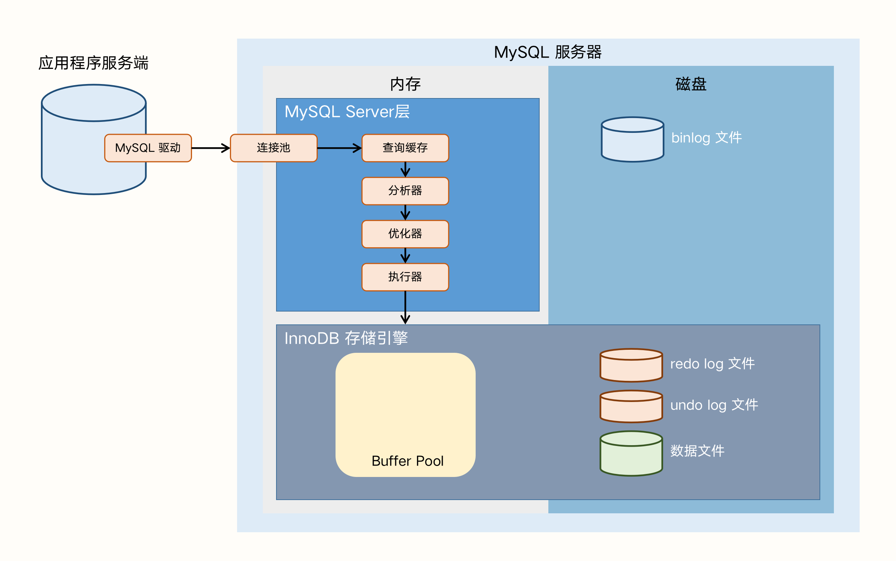
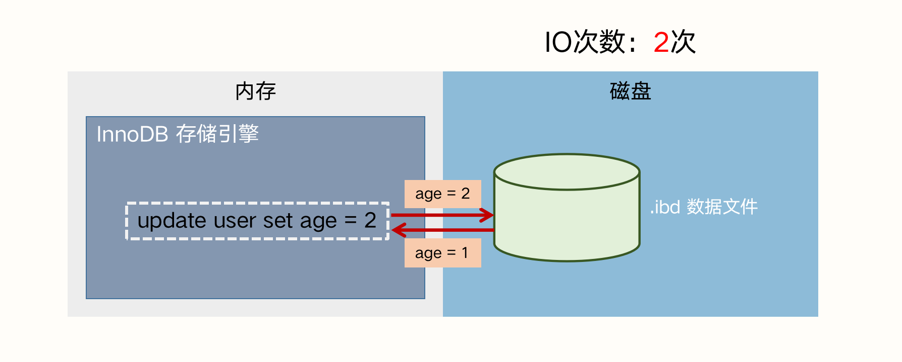
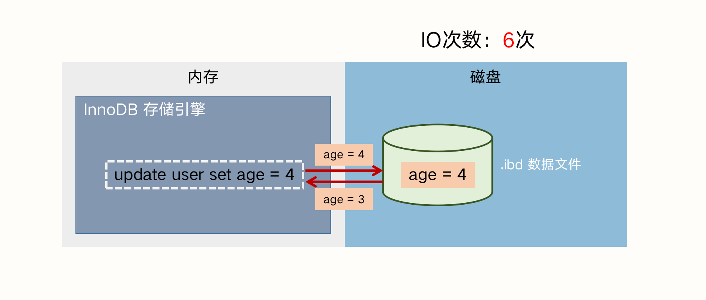
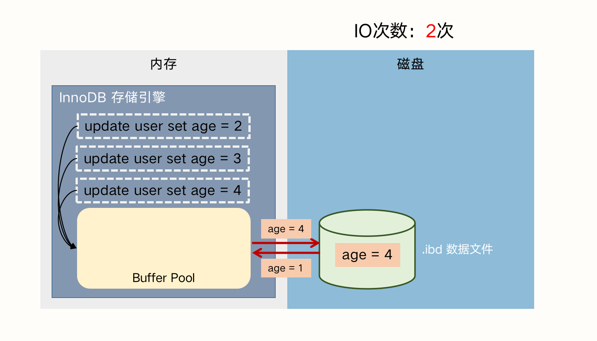
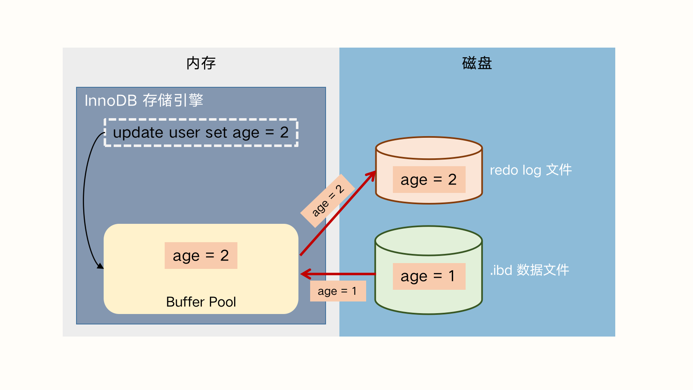
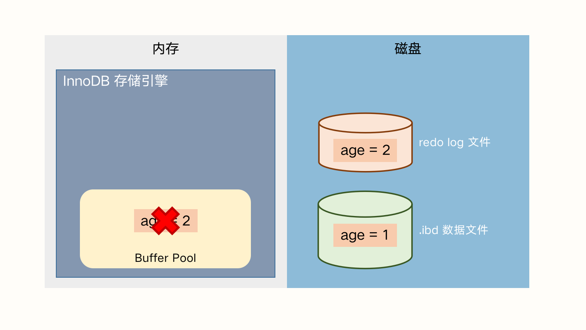
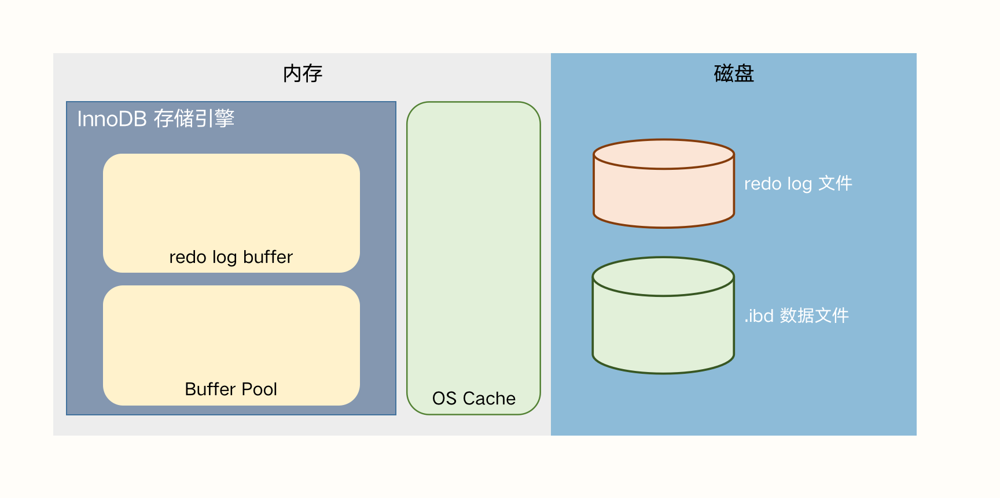
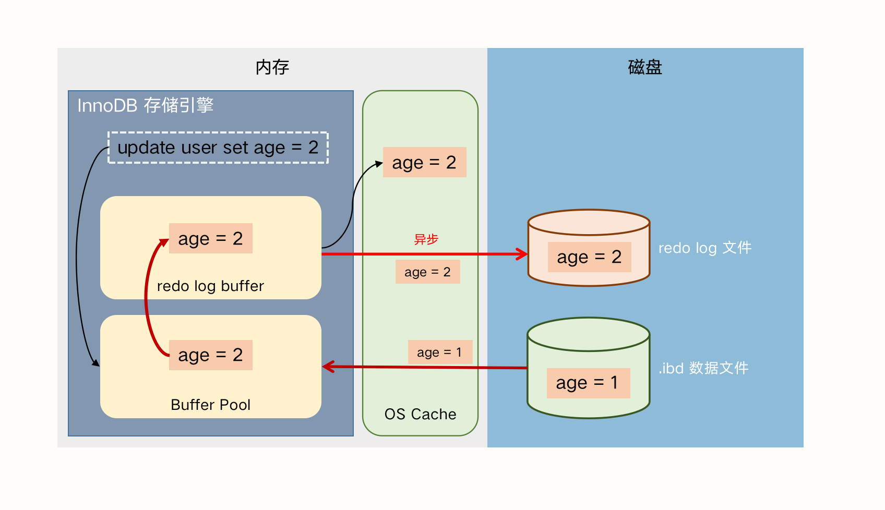
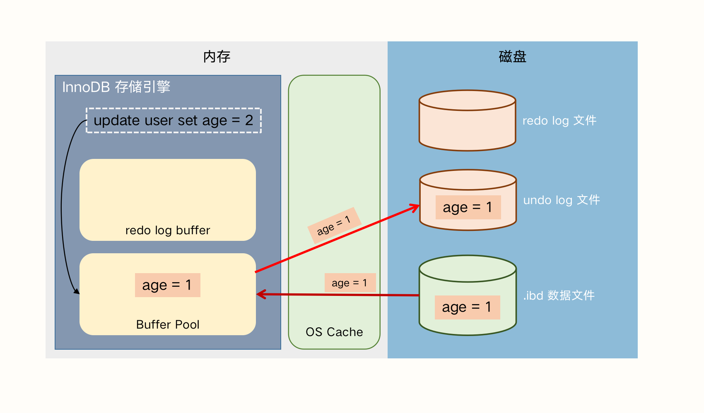
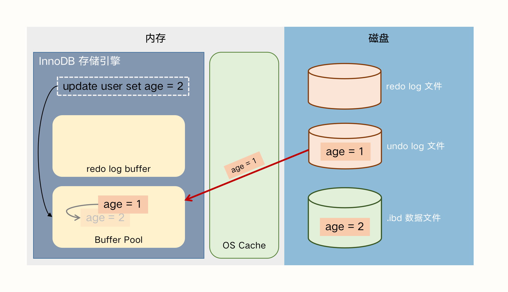

## MySQL（InnoDB）日志：redo log、undo log 和 binlog

> 本文以MySQL常用的存储引擎之一 InnoDB 为例来分析。

### 一、Buffer Pool

在 InnoDB 中，有一块非常重要的区域，是 Buffer Pool。它就是一块用于缓存MySQL磁盘数据的内存空间。那么为什么需要用到这个内存空间呢？

假设没有 Buffer Pool，user表中只有一条记录，记录为 ``age = 1`` ，此时需要执行下面3个事务：

1. 事务A：update user set age = 2;
2. 事务B：update user set age = 3;
3. 事务C：update user set age = 4;

若没有 Buffer Pool，执行流程大致如下：

1. 事务A：InnoDB从磁盘中读取1次数据，在内存中进行修改，将结果写入磁盘文件，一共2次IO：
2. 事务B：同事务A，进行2次IO；
3. 事务C：同事务B，进行2次IO，最后的结果如下：

从上图和流程可以看出，每次InnoDB都从磁盘读取数据，修改完又重新写入，那么3个事务就需要6次IO，而磁盘中的随机访问十分消耗时间，这会大大降低InnoDB存储引擎的执行效率。

若我们引入了 Buffer Pool，那么执行过程就变成：

1. 事务A：Buffer Pool 从磁盘中读取1次数据，并进行修改；
2. 事务B：Buffer Pool 执行修改；
3. 事务C：Buffer Pool 执行修改；
4. 根据配置，定时或满足条件时 Buffer Pool 将修改同步到磁盘数据文件中：

引入缓存，必定会带来一个新的问题：若 Buffer Pool 出现异常，没有及时同步到磁盘中导致数据丢失。这个问题如何解决呢？

### 二、 redo log

#### 1、解决高可用

为了解决 Buffer Pool 高可用的问题，我们引入了 redo log。顾名思义，redo 是重做的意思，redo log 就是当出现了问题，则使用 redo log 重放以恢复丢失的数据。

大致的流程如：在 Buffer Pool 修改之后，将修改后的 **记录值** 记录到磁盘的 redo log 中，假设此时突然断电或出现异常，Buffer Pool 中的数据全部丢失，重新恢复时也可根据 redo log 恢复 Buffer Pool。

以上面的事务A为例模拟异常情况：

1. InnoDB 从磁盘中读取数据文件的内容，并写入 Buffer Pool；
2. Buffer Pool 修改数据并提交事务；
3. InnoDB 将修改后的结果值写入 redo log；
4. 【异常】InnoDB 内部异常，导致 Buffer Pool 数据丢失；
5. InnoDB 异常恢复，Buffer Pool 重启，并从 redo log 中读取结果值；
6. 根据配置，定时或满足条件时 Buffer Pool 将修改同步到磁盘数据文件中；

以上，就是用 redo log 模拟数据丢失时如何恢复的场景。

> 为什么 redo log 和 数据文件都是存储在磁盘上，引入 Buffer Pool 就是为了解决磁盘IO次数过高的问题，那么 redo log 不也增加了磁盘IO的次数么？
>
> 答：因为 redo log 时磁盘顺序写，数据文件时随机写，顺序写入比随机写入高效很多，而且文件系统也有缓存机制，帮助随机写入提高效率。

引入 redo log 虽然满足了 Buffer Pool 高可用的场景，但顺序写入也带来了一定的磁盘IO消耗，我们如何进行优化？答案是，消防 Buffer Pool，给 redo log 加一个 buffer：**redo log buffer**，用套娃的方式进一步提高效率。

#### 2、进一步提升效率

在描述 redo log buffer 如何优化之前，我们先来看看MySQL和操作系统内存的关系：MySQL服务端是一个进程，它运行在操作系统之上，也就是说操作系统宕机了，MySQL一定宕机，但是MySQL宕机了，操作系统是不一定宕机的。

操作系统的内存缓存称为 OS Cache，我们得到以下2种情况：

1. MySQL宕机，操作系统也宕机，这时 Buffer Pool 和 OS Cache 的数据都会丢失；
2. MySQL宕机，操作系统正常，这时 Buffer Pool 数据会丢失，OS Cache 的数据仍然存在；

redo log buffer 在 InnoDB内部，而借助 OS Cache，我们可以利用操作系统的稳定性来进一步满足 redo log 的高可用性。

redo log 和 redo log buffer 之间同步的操作，我们简称为刷盘，刷盘的配置由  ``innodb_flush_log_at_trx_commit`` 控制，该参数有3个可配置值：

1. innodb_flush_log_at_trx_commit = 1：表示实时写 redo log buffer，实时刷到 redo log；
2. innodb_flush_log_at_trx_commit = 0：表示延迟写 redo log buffer，延迟刷到 redo log；
3. innodb_flush_log_at_trx_commit = 2：表示实时写 redo log buffer，延迟刷到 redo log；

这三种策略我们分别讨论，引入 redo log buffer 和 OS Cache 后，我们的模型如下所示：

##### a）innodb_flush_log_at_trx_commit = 1，实时写 实时刷

这种策略实际上并不会使用到 OS Cache，每次事务提交之前，都会将数据从 redo log buffer 刷到 redo log（磁盘），理论上只要磁盘不出问题，数据就不会丢失。这种策略效率很低，但丢失数据的风险也最低。

##### b）innodb_flush_log_at_trx_commit = 0，延迟写 延迟刷

这种策略也不会使用到 OS Cache。提交事务前，只会把数据写到 redo log buffer 中，然后让后台线程定时去将 redo log buffer 里的数据刷到 redo log 中。

这种异步的策略是最高效的，能很大程度提高 InnoDB 的性能。但我们知道定时任务是有间隙的，若事务提交后，后台线程没有来得及将 redo log buffer 刷到 redo log 中，这时候不管是 MySQL 进程挂掉，还是操作系统宕机，这一部分数据都会丢失。

总体而言，这种策略效率最高，但丢失数据的风险也最高。

##### c）innodb_flush_log_at_trx_commit = 2，实时写 延迟刷

在事务提交之前，会把在写入 redo log buffer 之后，同步写到 OS Cache 中，但不会实时地将 redo log buffer 刷到 redo log（磁盘）上，而是每秒执行一次刷新磁盘操作。这种策略下，如果 MySQL 进程挂掉，操作系统仍在运行，当 MySQL 重启时，会将 OS Cache 中的缓存刷到 redo log，Buffer Pool 再从 redo log 恢复。

仍然以事务A为例，正常情况下的执行流程如下：

1. InnoDB 从磁盘中读取数据文件的内容，并写入 Buffer Pool；
2. Buffer Pool 修改数据，并立即将修改后的结果值写入 redo log buffer；
3. redo log buffer 同步写入 OS Cache；
4. （异步）定时器每秒从 redo log buffer 刷新数据到 redo log 文件中；
5. Buffer Pool 提交事务；

所以这种策略折中上看是效率比较高，且丢数据比较明显的。绝大多数情况都推荐这种策略。

> OS Cache 的空间该如何申请？申请多大？沾满的情况下是否有清理策略？

总结：redo log 的作用是在 Buffer Pool 异常时恢复数据，redo log 写磁盘时是顺序写，innodb_flush_log_at_trx_commit 参数可以控制 redo log 的缓存和刷盘策略，推荐设置为 2。

### 三、undo log

我们知道，InnoDB 支持事务，而事务是可以 **回滚** 的。

以上面的场景继续探讨：假设有一个事务将 age = 1 修改为 age = 2，此时事务还未提交，后台线程已经将 Buffer Pool 中的修改刷入磁盘数据文件中。此时不管是内存还是磁盘，age 都修改为了 2，如果事务要回滚，就找不到修改之前的 age = 1，进而无法回滚了。

> PS：为何事务未提交，后台线程就能把未提交的刷新到缓存？是隔离级别设置得不合理？

因此我们引入了 undo log。 undo log 记录的是某些还未提交的事务，修改前的记录。引入 undo log 之后，InnoDB 执行事务A的流程如下：

1. 事务开始，Buffer Pool 加载磁盘数据 age = 1；
2. 基于 事务A 写一条 undo log，把修改前 age = 1 记录下来；
3. Buffer Pool 修改为 age = 2；
4. （异步）定时程序将 Buffer Pool 中的内容刷到磁盘中；
5. 事务A回滚，Buffer Pool 从 undo log 中读取要回滚的记录，主动或定时写入磁盘中；

需要注意的是，undo log 默认存在全局表空间内，可以简单地理解成 undo log 也是一个记录在 MySQL 的表里，插入一条 undo log 和 插入一条普通数据是类似的。也就是说，写 undo log 也伴随着 redo log 的写入。

> 存疑，为什么要这么设计呢，写 undo log 也要写 redo log？那么 redo log 是在事务提交之前写，还是提交之后呢？如果是提交之前写 redo log，若事务回滚，岂不是也要再写一次 redo log 来更新记录？

### 四、binlog

undo log 和 redo log，都是基于 InnoDB 存储引擎的，undo log 记录的是修改前的数据，提供事务回滚的能力；redo log 记录的是修改后的数据，提供崩溃恢复的能力。那么我们频繁接触的 binlog 又有什么作用呢？

binlog 是记录所有数据库表结构变更（例如 Create、Alter...）以及表数据的修改（Insert、Update、Delete...）的二进制日志。不会记录 Select 和 Show 这类操作，因为这类操作对数据本身并没有修改，但可以通过查询通用日志来查看 MySQL 执行过的所有语句，**且 binlog 是由 MySQL 服务层处理的**。

> 需要注意一点：即便 Update 操作没有造成数据变化，也会记录 binlog

binlog 有两个常见的使用场景：

1. **主从复制**：MySQL Replication 在 master 端开启 binlog，master 把它的二进制日志传递给 slaves 来达到 master-slave 数据一致的目的；
2. **数据恢复**：通过 mysqlbinlog 工具来恢复某个时间段或全量的数据；

binlog 和 redo log 都是记录修改之后的值，那么两者有什么区别呢？为什么不能只保留一个呢？

首先我们看一下二者的区别：

1. binlog 是逻辑日志，记录的是对哪一个表的哪一行进行了什么修改；redo log 是无力日志，记录的是对哪个数据页中的记录做了什么修改；
2. binlog 是追加写，而 redo log 有大小限制，若顺序写满后将循环至文件头继续写入，旧的数据会被覆盖；
3. binlog 是 MySQL Server 层提供的日志能力，而 redo log 是 InnoDB 存储引擎为了满足事务需求而实现的日志，若不使用 InnoDB，则不会有 redo log；

但说实话，这并不算 redo log 不能取代 binlog 的原因。从 MySQL 历史发展的角度看，有两点：

第一，binlog 的生态在 InnoDB 引入前就已经建立起来，MySQL 的高可用主要就是依赖 binlog 复制，而且还有很多公司的数据分析系统和数据处理系统，也都依赖 binlog。取代 binlog 去改变一个生态，是费力不讨好的。

第二，binlog 并不是 MySQL 的核心瓶颈，花时间在没有瓶颈的地方得不偿失。

