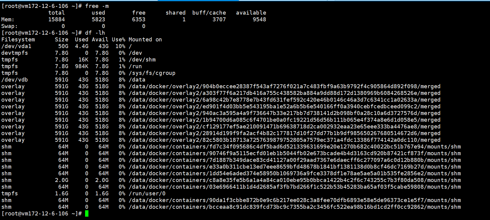

### 一、问题描述

**表象**：系统无法正常登录

**日志**：

``` log
2021-11-14 21:45:18.467 [ERROR] [callin-web] [com.zhuiyi.callin.common.redis.cache.RedisUtil][168] - 
org.springframework.data.redis.RedisSystemException: Error in execution; nested exception is io.lettuce.core.RedisCommandExecutionException: MISCONF Redis is configured to save RDB snapshots, but is currently not able to persist on disk. Commands that may modify the data set are disabled. Please check Redis logs for details about the error.
	at org.springframework.data.redis.connection.lettuce.LettuceExceptionConverter.convert(LettuceExceptionConverter.java:54)
	at org.springframework.data.redis.connection.lettuce.LettuceExceptionConverter.convert(LettuceExceptionConverter.java:52)
	at org.springframework.data.redis.connection.lettuce.LettuceExceptionConverter.convert(LettuceExceptionConverter.java:41)
	at org.springframework.data.redis.PassThroughExceptionTranslationStrategy.translate(PassThroughExceptionTranslationStrategy.java:44)
	at org.springframework.data.redis.FallbackExceptionTranslationStrategy.translate(FallbackExceptionTranslationStrategy.java:42)
	at org.springframework.data.redis.connection.lettuce.LettuceConnection.convertLettuceAccessException(LettuceConnection.java:257)
	at org.springframework.data.redis.connection.lettuce.LettuceStringCommands.convertLettuceAccessException(LettuceStringCommands.java:718)
	at org.springframework.data.redis.connection.lettuce.LettuceStringCommands.set(LettuceStringCommands.java:143)
	at org.springframework.data.redis.connection.DefaultedRedisConnection.set(DefaultedRedisConnection.java:231)
	at org.springframework.data.redis.connection.DefaultStringRedisConnection.set(DefaultStringRedisConnection.java:917)
	at org.springframework.data.redis.core.DefaultValueOperations$3.inRedis(DefaultValueOperations.java:202)
	at org.springframework.data.redis.core.AbstractOperations$ValueDeserializingRedisCallback.doInRedis(AbstractOperations.java:59)
	at org.springframework.data.redis.core.RedisTemplate.execute(RedisTemplate.java:224)
	at org.springframework.data.redis.core.RedisTemplate.execute(RedisTemplate.java:184)
	at org.springframework.data.redis.core.AbstractOperations.execute(AbstractOperations.java:95)
	at org.springframework.data.redis.core.DefaultValueOperations.set(DefaultValueOperations.java:198)
	at com.zhuiyi.callin.common.redis.cache.RedisUtil.set(RedisUtil.java:164)
	at com.zhuiyi.callin.service.manager.LoginAccountManager.setAiforceLoginAccountInfo(LoginAccountManager.java:192)
	at com.zhuiyi.callin.service.manager.LoginAccountManager.validAiforceLoginAccountInfo(LoginAccountManager.java:110)
	at com.zhuiyi.callin.service.manager.LoginAccountManager.validLoginAccountInfo(LoginAccountManager.java:36)
	at com.zhuiyi.callin.common.interceptor.auth.AiforceHandlerInterceptor.validCookieToken(AiforceHandlerInterceptor.java:181)
	at com.zhuiyi.callin.common.interceptor.auth.AiforceHandlerInterceptor.preHandle(AiforceHandlerInterceptor.java:127)
	at org.springframework.web.servlet.HandlerExecutionChain.applyPreHandle(HandlerExecutionChain.java:136)
	at org.springframework.web.servlet.DispatcherServlet.doDispatch(DispatcherServlet.java:986)
	at org.springframework.web.servlet.DispatcherServlet.doService(DispatcherServlet.java:925)
	at org.springframework.web.servlet.FrameworkServlet.processRequest(FrameworkServlet.java:974)
	at org.springframework.web.servlet.FrameworkServlet.doGet(FrameworkServlet.java:866)
	at javax.servlet.http.HttpServlet.service(HttpServlet.java:635)
	at org.springframework.web.servlet.FrameworkServlet.service(FrameworkServlet.java:851)
	at javax.servlet.http.HttpServlet.service(HttpServlet.java:742)
	at org.apache.catalina.core.ApplicationFilterChain.internalDoFilter(ApplicationFilterChain.java:231)
	at org.apache.catalina.core.ApplicationFilterChain.doFilter(ApplicationFilterChain.java:166)
	at org.apache.tomcat.websocket.server.WsFilter.doFilter(WsFilter.java:52)
	at org.apache.catalina.core.ApplicationFilterChain.internalDoFilter(ApplicationFilterChain.java:193)
	at org.apache.catalina.core.ApplicationFilterChain.doFilter(ApplicationFilterChain.java:166)
	at org.springframework.web.filter.RequestContextFilter.doFilterInternal(RequestContextFilter.java:99)
	at org.springframework.web.filter.OncePerRequestFilter.doFilter(OncePerRequestFilter.java:107)
	at org.apache.catalina.core.ApplicationFilterChain.internalDoFilter(ApplicationFilterChain.java:193)
	at org.apache.catalina.core.ApplicationFilterChain.doFilter(ApplicationFilterChain.java:166)
	at org.springframework.web.filter.HttpPutFormContentFilter.doFilterInternal(HttpPutFormContentFilter.java:109)
	at org.springframework.web.filter.OncePerRequestFilter.doFilter(OncePerRequestFilter.java:107)
	at org.apache.catalina.core.ApplicationFilterChain.internalDoFilter(ApplicationFilterChain.java:193)
	at org.apache.catalina.core.ApplicationFilterChain.doFilter(ApplicationFilterChain.java:166)
	at org.springframework.web.filter.HiddenHttpMethodFilter.doFilterInternal(HiddenHttpMethodFilter.java:81)
	at org.springframework.web.filter.OncePerRequestFilter.doFilter(OncePerRequestFilter.java:107)
	at org.apache.catalina.core.ApplicationFilterChain.internalDoFilter(ApplicationFilterChain.java:193)
	at org.apache.catalin
```

### 二、排查思路

#### 1、磁盘

由日志中可以看出，可能是由于磁盘空间不够导致，但是使用了 ``free`` 命令 和 ``df -sh *`` 命令查看吸盘空间，显示都是空间足够的：



#### 2、stop-writes-on-bgsave-error

参考 [stop-writes-on-bgsave-error |Redis持久化相关问题](https://blog.csdn.net/qq_43178138/article/details/119144986) 这篇文章，可能是由于这个配置设置为 yes 导致的，尝试将这个配置设置为 no，并重启Redis，并未生效。

#### 3、Copy-On-Write内存分配

在上一篇文章中看到，Redis 在写时复制需要依赖系统分配的内存空间，可能由于这部分的空间分配不足导致失败。参考了 [【Redis运维】vm.overcommit_memory内存分配控制](http://www.linuxe.cn/post-633.html) 这篇文章后，调整了 ``vm.overcommit_memory`` 这个配置，让系统合理的分配了内存空间，重启 Redis 后生效。

