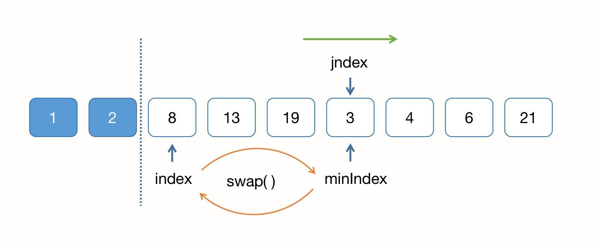
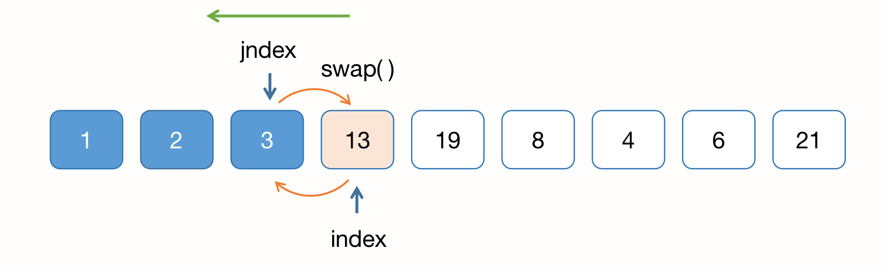
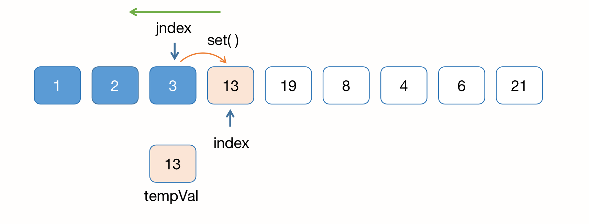
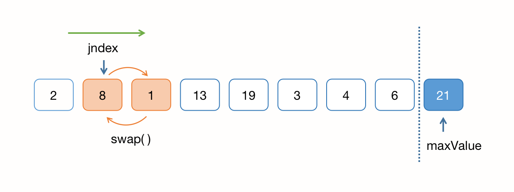

## 排序算法 -- 基础排序

### 一、选择排序 Selection Sort

算法思想：每次从未排序的元素中找到最小（或最大）的一个，并将其添加到已排序的部分列表的末尾。

从第一个元素开始遍历整个列表，并将当前元素与未排序部分中的所有元素进行比较。如果当前元素是最小（或最大）的，则将其添加到已排序的部分列表的末尾；



时间复杂度：O(n^2)

算法实现（Java）：

``` java
/**
 * 选择排序，asc
 * @param nums 数组
 * @param n 需要排序的区间 [0, n]
 */
private void selectionSort(int[] nums, int n) {
	if (nums.length <= 1) {
		return;
	}
	n = n > nums.length ? nums.length : n;
	// 外层循环
	for (int index = 0; index < n; index++) {
		int minIndex = index;
		// 内层循环，寻找 [i, n) 区间中的最小值
		for (int jndex = index + 1; jndex < n; jndex++) {
			if (nums[jndex] < nums[minIndex]) {
				minIndex = jndex;
			}
		}
    // 交换 index 和 minIndex，交换后最小值在 index
		swapArray(nums, index, minIndex);
	}
}

/**
 * 交换数组中对应位置的值
 * @param nums 数组
 * @param x 坐标x
 * @param y 坐标y
 */
private static void swapArray(int[] nums, int x, int y) {
	int xVal = nums[x];
	nums[x] = nums[y];
	nums[y] = xVal;
}
```


### 二、插入排序 Insertion Sort

#### 1、基础版本

算法思想：将一个元素插入到已经排序好的部分列表中，以形成一个新的、更大的已排序的列表。

从第二个元素开始遍历整个列表，并将每个元素与前面已经排序好的部分列表中的元素进行比较。如果当前元素比前面的元素小，则将其向前移动，直到找到合适的位置为止。



时间复杂度：O(n^2)

算法实现（Java）：

``` java
/**
 * 插入排序，asc
 * @param nums 数组
 * @param n 需要排序的区间 [0, n]
 */
public void insertionSort1(int[] nums, int n) {
	if (nums.length <= 1) {
		return;
	}
	n = n > nums.length ? nums.length : n;
	// 外层循环从第2个元素开始
	for (int index = 1; index < nums.length; index++) {
		// 里层循环当前元素开始向前比较
		for (int jndex = index; jndex > 0 && nums[jndex] < nums[jndex - 1]; jndex--) {
			swapArray(nums, jndex, jndex - 1);
		}
	}
}
```

#### 2、优化版本

算法思想：从一端开始，取一个元素N，从当前索引位置index开始依次向前比较，若当前元素与所比较的元素小，则将索引位置的值填为所比较的元素，并将索引位置向前移动，直到当前元素与所比较的元素大位置。其优化思路为：不再进行数组交换，而是直接赋值（减少内存寻址的耗时）。



时间复杂度：O(n^2)

算法实现（Java）：

``` java
/**
 * 插入排序，asc
 * @param nums 数组
 * @param n 需要排序的区间 [0, n]
 */
private void insertionSort2(int[] nums, int n) {
	if (nums.length <= 1) {
		return;
	}
	n = n > nums.length ? nums.length : n;
	// 外层循环从第2个元素开始
	for (int index = 1; index < n; index++) {
		int tempVal = nums[index];
		int jndex = index;
		// 里层循环当前元素开始向前比较
		for (; jndex > 0 && nums[jndex - 1] > tempVal; jndex--) {
			nums[jndex] = nums[jndex - 1];
		}
		nums[jndex] = tempVal;
	}
}
```

> 注意：对于一个近乎有序的序列中，插入排序比选择排序的效率要高得多。


### 三、冒泡排序 Bubble Sort

算法思想：从一端开始，重复地遍历要排序的元素列表，并比较每对相邻的元素。如果这对元素的顺序错误（例如，它们应该按照升序排列，但是较大的元素在前面），则交换它们的位置。



时间复杂度：O(n^2)

算法实现（Java）：

``` java
/**
 * 冒泡排序，asc
 * @param nums 数组
 * @param n 需要排序的区间 [0, n]
 */
void bubbleSort(int[] nums, int n) {
	if (nums.length <= 1) {
		return;
	}
	n = n > nums.length ? nums.length : n;
  // 外层循环区间 [0,n-1]，因为里层循环会+1判断，这里只需要到n-1
	for (int index = 0; index < n - 1; index++) {
    // 里层循环区间 [0, n-1 -index]，因为外层循环每次结束，数组倒数第index个元素就是最大的，所以这里需要逐次缩小范围
		for (int jndex = 0; jndex < n - 1 - index; jndex++) {
      // 如果当前元素比下一个元素大，则交换位置
			if (nums[jndex] > nums[jndex + 1]) {
				swapArray(nums, jndex, jndex + 1);
			}
		}
	}
}
```


