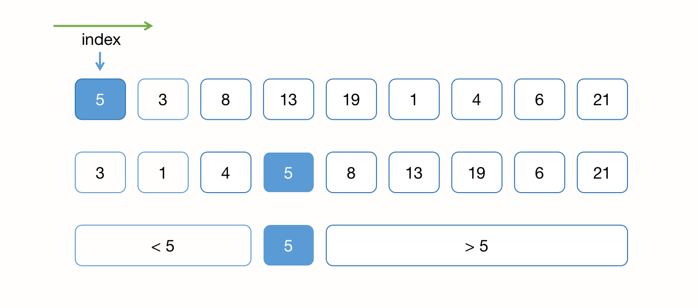
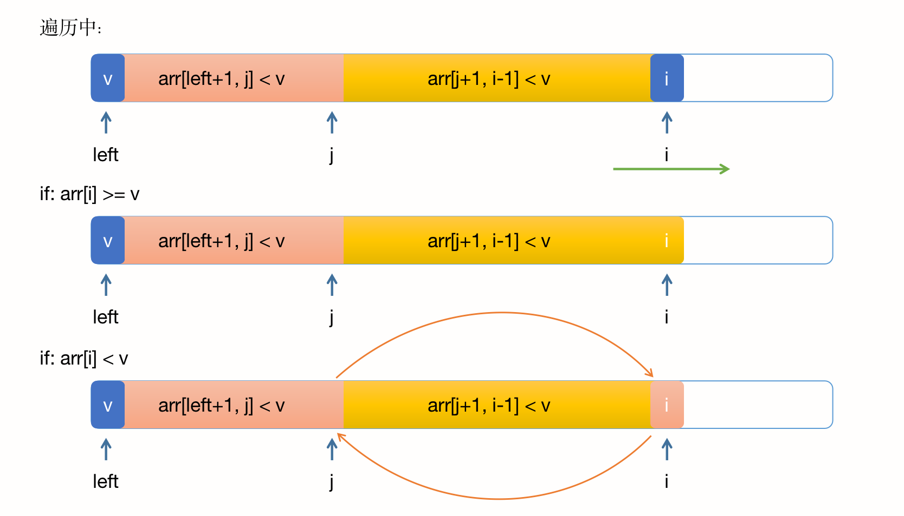
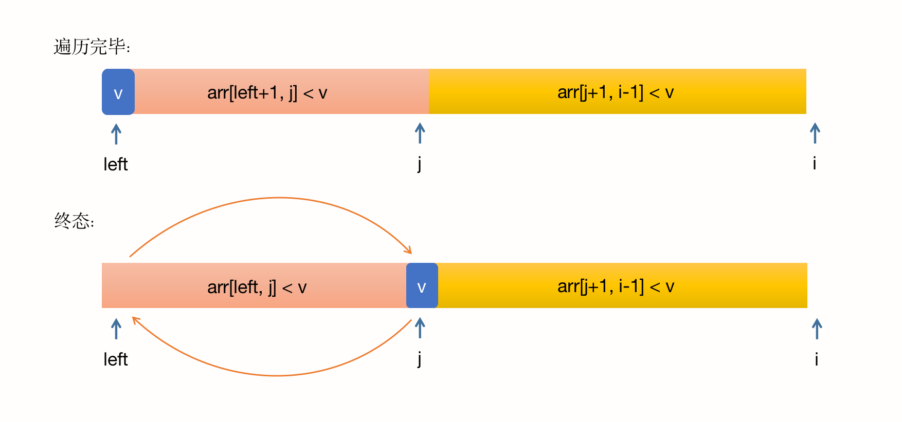
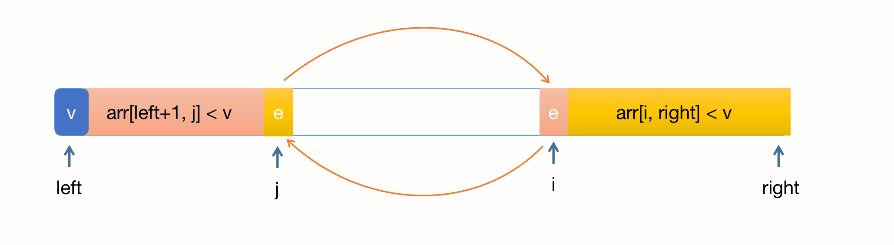
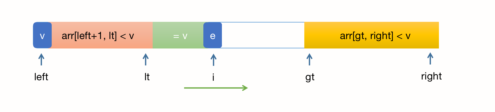

## 排序算法 -- 高级排序

### 一、归并排序 Merge Sort

#### 1、算法实现

算法思想：归并排序是一种基于分治策略的排序算法，它将一个大问题分解成两个或更多个相同或相似的小问题，并递归地解决这些小问题，然后将它们的结果合并起来，以解决原问题。在归并排序中，我们将一个大的元素列表划分为两半，分别对这两半进行排序，然后将它们合并成一个有序的列表。

时间复杂度：O(nlogn)

算法实现（Java）：

``` java
/**
 * 归并排序，asc
 * @param nums 待排序数组
 */
void sort(int[] nums) {
	// 对 [0, n) 范围内的数组元素进行排序
	if (nums.length <= 1) {
		return;
	}
	// 将待排序的区间划分为2个，以mid中间值作为划分点
	int mid = nums.length / 2;
	int[] leftArr = Arrays.copyOfRange(nums, 0, mid);
	int[] rightArr = Arrays.copyOfRange(nums, mid, nums.length);
	// 分别对两边进行排序
	sort(leftArr);
	sort(rightArr);
  // 优化，判断两端结束和开始的元素大小，如果两个数组在合并前，就天然“有序”，则不再归并，直接返回即可
  if (nums[mid] < nums[mid + 1]) {
    return;
  }
	// 将两个数组进行合并
	merge(nums, leftArr, rightArr);
}

/**
 * 合并
 * @param nums 待排序数组
 * @param leftArr 左半边
 * @param rightArr 右半边
 */
private void merge(int[] nums, int[] leftArr, int[] rightArr) {
	int index = 0, leftIndex = 0, rightIndex = 0;
	while (leftIndex < leftArr.length && rightIndex < rightArr.length) {
		// 对比大小，将小的那个赋值给nums
		if (leftArr[leftIndex] < rightArr[rightIndex]) {
			nums[index++] = leftArr[leftIndex++];
		} else {
			nums[index++] = rightArr[rightIndex++];
		}
	}
	// 处理剩余元素
	while (leftIndex < leftArr.length) {
		nums[index++] = leftArr[leftIndex++];
	}
	while (rightIndex < rightArr.length) {
		nums[index++] = rightArr[rightIndex++];
	}
}


```

#### 2、优化

​		当归并的递归层数逐渐向下时，元素个数也会越来越少，此时当小于某个数值时，可以使用 **插入排序** 来代替小量元素的排序，因为元素个数越少，数组“近乎有序”的概率也会越大，此时插入排序可能退化到 O(n) 级别的时间复杂度，因此时间消耗和空间消耗将远小于归并排序。

改造后的排序终止条件修改为：

``` java
void sort(int[] nums) {
	// 当元素个数小于15时，可以使用插入排序来代替
	if (nums.length <= 15) {
		insertSort(nums);
	}
  // ......
}
```

#### 3、自底向上的归并

​		自底向上的归并是一种变体，与传统的自顶向下递归不同。自底向上的归并中，算法不再递归地划分原始数组，而是通过迭代从底层开始合并相邻的元素，然后逐渐扩大合并范围，直到整个数组有序。

算法描述：

1. **初始步骤**：将原始数组视为n个长度为1的有序子数组；
2. **迭代合并**：从底层开始，每次将相邻的有序子数组合并为更大的有序子数组。合并完成后，将子数组的大小翻倍，继续合并直到整个数组有序；
3. **重复合并**：重复执行合并操作，每次将有序子数组的大小翻倍；
4. **完成**：当合并的子数组大小达到整个数组的大小时，排序完成。

算法实现（Java）：

``` java
/**
 * 自底向上的归并排序，asc
 * @param nums 待排序数组
 */
@Override
void sort(int[] nums) {
  // 外层循环，依次从 1、2、4、8... 逐渐加大跨度
	for (int size = 1; size < nums.length; size *= 2) {
    // 里层循环，合并 nums[index, index + size -1] 和 nums[index + size, index + 2*size -1]
		for (int index = 0; index < nums.length; index += 2 * size) {
			int mid = Math.min(index + size - 1, nums.length - 1);
			int right = Math.min(index + 2 * size - 1, nums.length - 1);
			merge(nums, index, mid, right);
		}
	}
}
/**
 * 合并
 * @param nums 待排序数组
 * @param left 左半边
 * @param mid 左半边
 * @param right 右半边
 */
private void merge(int[] nums, int left, int mid, int right) {
	int index = left, leftIndex = 0, rightIndex = 0;
	// 拷贝数组
	int n1 = mid - left + 1;
	int n2 = right - mid;
	// 创建临时数组
	int[] leftArr = new int[n1];
	int[] rightArr = new int[n2];
	// 将数据复制到临时数组
	System.arraycopy(nums, left, leftArr, 0, n1);
	System.arraycopy(nums, mid + 1, rightArr, 0, n2);
	while (leftIndex < leftArr.length && rightIndex < rightArr.length) {
		// 对比大小，将小的那个赋值给nums
		if (leftArr[leftIndex] < rightArr[rightIndex]) {
			nums[index++] = leftArr[leftIndex++];
		} else {
			nums[index++] = rightArr[rightIndex++];
		}
	}
	// 处理剩余元素
	while (leftIndex < leftArr.length) {
		nums[index++] = leftArr[leftIndex++];
	}
	while (rightIndex < rightArr.length) {
		nums[index++] = rightArr[rightIndex++];
	}
}
```

#### 4、求逆序对的个数

​		逆序对是指一个数组中，如果两个元素 a[i] 和 a[j]，且满足 i<j 和 a[i] < a[j]，那么这两个元素就构成一个逆序对。逆序对的个数表示数组的有序程度，个数越多表示数组约无序。逆序对的个数为0，表示这个数字是顺序有序的。

​		以下用分治归并的思想来求逆序对的个数：

``` java
/**
 * 求数组中逆序对的个数
 * @param nums 数组
 * @return 逆序对的个数
 */
private int countInversions(int[] nums) {
	// 对 [0, n) 范围内的数组元素进行排序
	if (nums.length <= 1) {
		return 0;
	}
	// 创建一个临时数组用来存储归并过程中查找到的逆序对的个数
	int[] count = new int[1];
	// 开始归并
	mergeSort(nums, count);
	// 返回逆序对的个数
	return count[0];
}

/**
 * 归并排序
 * @param nums 待排序的数组
 * @param count 临时存储逆序对个数的数组
 */
private void mergeSort(int[] nums, int[] count) {
	// 对 [0, n) 范围内的数组元素进行排序
	if (nums.length <= 1) {
		return;
	}
	// 将待排序的区间划分为2个，以mid中间值作为划分点
	int mid = nums.length / 2;
	int[] leftArr = Arrays.copyOfRange(nums, 0, mid);
	int[] rightArr = Arrays.copyOfRange(nums, mid, nums.length);
	// 分别对两边进行排序
	mergeSort(leftArr, count);
	mergeSort(rightArr, count);
	// 将两个数组进行合并
	merge(nums, leftArr, rightArr, count);
}

/**
 * 归并过程
 * @param nums 数组
 * @param leftArr 左数组
 * @param rightArr 右数组
 * @param count 临时存储逆序对个数的数组
 */
private void merge(int[] nums, int[] leftArr, int[] rightArr, int[] count) {
	int index = 0, leftIndex = 0, rightIndex = 0;
	while (leftIndex < leftArr.length && rightIndex < rightArr.length) {
		// 对比大小，将小的那个赋值给nums
		if (leftArr[leftIndex] < rightArr[rightIndex]) {
			nums[index++] = leftArr[leftIndex++];
		} else {
			nums[index++] = rightArr[rightIndex++];
			// 【关键步骤】
			// 左边比右边大，说明左边未遍历的数组的元素，都比右边的大
			// 那么可以把计数器直接增加对应数量
			count[0] += leftArr.length - leftIndex;
		}
	}
	// 处理剩余元素
	while (leftIndex < leftArr.length) {
		nums[index++] = leftArr[leftIndex++];
	}
	while (rightIndex < rightArr.length) {
		nums[index++] = rightArr[rightIndex++];
	}
}
```


### 二、快速排序 Quick Sort

​		算法思想：基于分治策略的高效排序算法。选择一个基准元素，讲数组分为两部分，使得左边的元素都小于基准，右边的元素都大于基准，然后对左右两部分分别递归的重复上述步骤。



1. **选择基准元素**：从数组中选择一个元素作为基准（pivot），通常选择第一个或最后一个或中间，或者随机选择；
2. **分割**（Partition）：将数组中小于基准的元素移到左边，大于基准的元素移到右边
3. **递归**：对左右两个子数组分别递归的进行步骤1和步骤2；
4. **合并**：递归的基本步骤是对子数组进行排序，直到整个数组有序；

其核心在于第二步，快速排序的几个变种的差异都在步骤二。

#### 1、单路快排



​		每次选第一个元素作为基准元素（v），游标 i 记录向右遍历时的当前元素，游标 j 记录分割点。

1. 若 arr[i] >= v，则 i++ 即可；
2. 若 arr[i] < v，则需要将 i 所在元素放到左边小于v的数组中，需要将 j+1 位置的元素 与 i 位置的元素进行交换，并且 j++；
3. 当所有元素遍历完毕，v 仍在最左侧，此时需要将 v 与 j 位置的元素进行交换；



 算法实现（Java）：

``` java
/**
 * 快速排序，asc
 *
 * @param nums 数组
 */
@Override
public void sort(int[] nums) {
	quickSort(nums, 0, nums.length - 1);
}

/**
 * 对 nums[left, right] 区间内的元素进行快速排序
 *
 * @param nums  数组
 * @param left  左下标
 * @param right 右下标
 */
private void quickSort(int[] nums, int left, int right) {
	if (left >= right) {
		return;
	}
	int p = partition(nums, left, right);
	quickSort(nums, left, p - 1);
	quickSort(nums, p + 1, right);
}

/**
 * 对 nums[left, right] 区间内的元素进行分割排序
 *
 * @param nums  数组
 * @param left  左下标
 * @param right 右下标
 * @return 分割点
 */
private int partition(int[] nums, int left, int right) {
	int temp = nums[left];
	int jndex = left;
	// 开始遍历
	for (int index = left + 1; index <= right; index++) {
		if (nums[index] < temp) {
			// 交换 i 和 j + 1
			swapArray(nums, jndex + 1, index);
			jndex++;
		}
	}
	// 交换 left 和 j
	swapArray(nums, left, jndex);
	return jndex;
}
```

#### 2、单路快排的优化

##### a）插入排序

​		与归并排序相似，当元素个数小于某个临界值时，可以选择用插入排序来代替快速排序，原理也是一样的，当元素个数较少时，近似有序的概率很大，此时插入排序将达到 O(n) 的时间复杂度。

##### b）近乎有序的数组

​		在近乎有序的数组中，当前实现的单路快排比归并排序慢很多，因为归并排序是以中间点作为分割点，而目前快排使用的是**左侧首个元素**，当数组近乎有序时，快排每次选取的第一个元素都比右边的小，那么快排将退化到 O(n^2) 的时间复杂度。

​		在partition取 temp 元素时，我们可以随机选一个坐标（或者直接一些用中间位置），并将该坐标与left交换，后续仍然用 left，可以最小程度的修改算法：

``` java
private int partition(int[] nums, int left, int right) {
  // 随机交换一个元素的值到最左端
  Random random = new Random();
	int randomIndex = random.nextInt(right - left) + left;
	swapArray(nums, left, randomIndex);
  
	int temp = nums[left];
	int jndex = left;
	// 开始遍历
	for (int index = left + 1; index <= right; index++) {
  	// ......
```

​		此时，快排最差的时间复杂度仍然是退化到 O(n^2)，但这个概率是很低的，可以用数学来证明。

#### 3、双路快排

​		若待排序的数组是稀疏数组，即数组中有很多的元素都是重复的，此时的排序算法又将退化到 O(n^2) 的时间复杂度。双路快排是对单路快排的一种优化，在partition时使用两个指针，从数组的两端同时向中间的扫描。

​	

算法实现（Java）：下面的实现主要针对 partition

``` java
/**
 * 对 nums[left, right] 区间内的元素进行分割排序
 *
 * @param nums  数组
 * @param left  左下标
 * @param right 右下标
 * @return 分割点
 */
private int partition(int[] nums, int left, int right) {
	// 随机交换一个坐标的值到最左端
	Random random = new Random();
	int randomIndex = random.nextInt(right - left) + left;
	swapArray(nums, left, randomIndex);

	int temp = nums[left];
	// nums[left, i]
	int i = left + 1;
	int j = right;
	while (true) {
		while (i <= right && nums[i] < temp) {
			// nums[left + 1, i) <= temp
			i ++;
		}
		while (j >= left + 1 && nums[j] > temp) {
			// nums(j, right] <= temp
			j --;
		}
		// 如果循环到头了，就结束
		if (i > j) {
			break;
		}
		// 上面的两个while结束，表示需要交换数组位置
		swapArray(nums, i, j);
		// 继续触发循环
		i ++;
		j --;
	}
	// 最后，把temp放到整理好的数组中
	swapArray(nums, left, j);
	return j;
}
```

#### 4、三路快排

​		基于双路快排的算法，我们仍然可以进行优化，即对等于 temp 的元素，再开辟一个中间的空间来存放，小于 temp 的元素仍然放在左侧，大于 temp 的元素仍然放在右侧，此时只有 i 在向右移动，lt 和 gt 只有发生交换时才会自增。



1. 当 nums[i] < temp 时，交换 lt+1 和 i，i++，lt++；
2. 当 nums[i] == temp 时，i ++；
3. 当 nums[i] > temp 时，交换 gt-1 和 i，gt--，i不变（因为gt-1是未被遍历的元素）

​		三路快排的关键在于保持指针的正确位置，确保数组被正确的分为三个部分。且三路快排的时间复杂度仍然是 **O(nlogn)**，但在处理大量相同元素的数组（稀疏数组）时，相较于传统的快排，它的表现更出色。

算法实现（Java）：

``` java
/**
 * 对 nums[left, right] 区间内的元素进行快速排序
 *
 * @param nums  数组
 * @param left  左下标
 * @param right 右下标
 */
private void quickSort(int[] nums, int left, int right) {
	if (left >= right) {
		return;
	}
	// partition
	// 随机交换一个坐标的值到最左端
	Random random = new Random();
	int randomIndex = random.nextInt(right - left) + left;
	swapArray(nums, left, randomIndex);
	// 选一个标定元素
	int temp = nums[left];
	// 初始化游标
	int lt = left;
	int gt = right + 1;
	int i = left + 1;
	// nums[left + 1, lt] < temp, nums[lt + 1, i) = temp, nums[gt, right] > temp
	while (i < gt) {
		if (nums[i] < temp) {
			swapArray(nums, lt + 1, i);
			lt++;
			i++;
		} else if (nums[i] > temp) {
			swapArray(nums, gt - 1, i);
			gt--;
		} else {
			i++;
		}
	}
	swapArray(nums, left, lt);
	// 递归
	quickSort(nums, left, lt - 1);
	quickSort(nums, gt, right);
}
```

#### 5、求数组中第m大的元素

##### a）暴力解法 O(n*m)

​		将题干所求退化到 求数组中最大或最小的元素，那么遍历数组即可，此时时间复杂度是 O(n)，而求第m大的元素，需要遍历m次，因此时间复杂度是 O(n*m)。

##### b）排序

​		若使用 O(nlogn) 的排序算法，现将数组进行排序，再排序后遍历一次数组，即可得到第m大的元素，此时相比遍历数组，排序更花时间，因此该解法的时间复杂度是 O(nlogn)。

##### c）快速选择算法

​		使用快排的思想，当某个元素被安放在某个位置时，表示它是数组中第n大的元素，若此时 n == m，那么第m大的元素就是这个元素。

​		快排的时间复杂度是 O(nlogn)，但是每次排序时，我们判断 n == m，即可终止查找过程，且每次都在 partition 后的两个数组范围中取一个（不是大于就是小于），因此其时间复杂度是 `` O = n + n/2 + n/4 + n/8 + ... + 1 = O(2n)``，即其时间复杂度是 O(n)。

