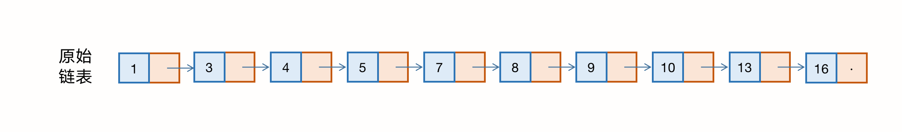
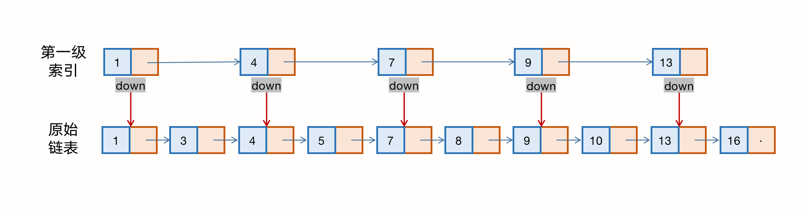
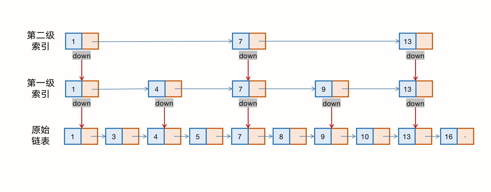
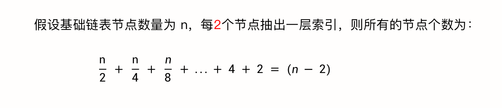
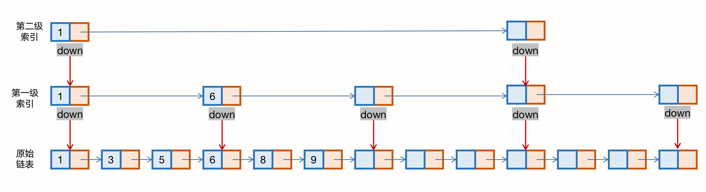
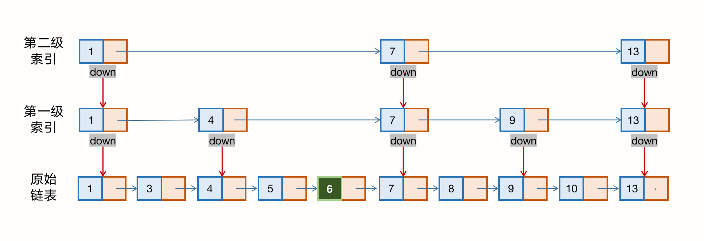
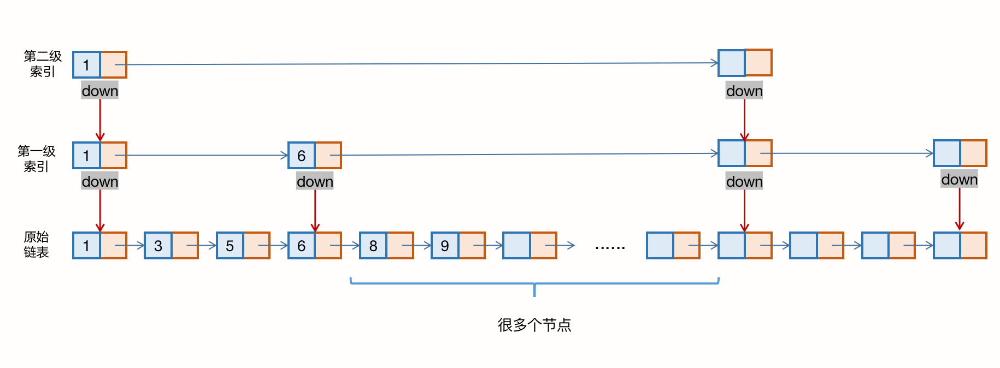
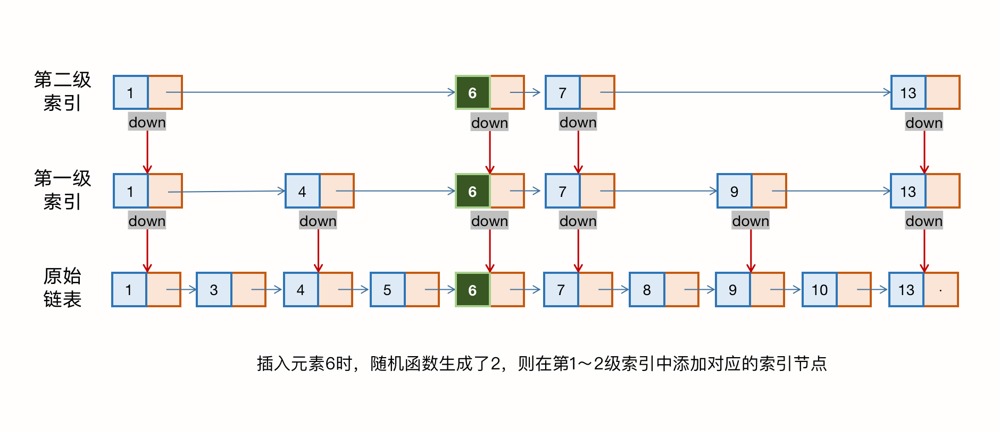

### 第十三章、跳跃表

> 为什么 Redis 要用跳跃表来实现 zset（有序集合），而不是红黑树？

#### 一、如何理解“跳跃表”

对于一个单链表来说，即便链表中存储的数据是有序的，如果我们要想在其中查找某个数据，也只能从头遍历链表，这样查找效率很低，时间复杂度很高（ O(n) ）。

如果像上图那样，对链表建立一级“索引”，查找起来是不是就会快一些呢？每两个节点提取一个节点到上级，我们把抽出来的那一级叫做 **索引** 或 **索引层**，如下图所示：

上图中的 down 表示 down 指针，指向下一级节点。如果我们要查找某个节点，比如 10，我们可以先在索引层便利，当遍历到索引层中 值为 9 的节点时，我们发现下一个节点时 13，那么要查找的节点 10 肯定在这两个节点之间。然后我们通过索引层节点的 down 指针，下降到原始链表着一层，继续遍历，这个时候我们只需要再遍历 2 个节点，就可以找到值等于 10 的节点了。这样，我们原来需要遍历 8 次，现在只需要遍历 6 次。

从这个例子中，我们看出，**加一层索引后，查找一个节点需要遍历的节点个数见着了，也就是提高了查找效率。**

跟前面建立第一级索引的方式相似，我们在第一级索引的基础上，每两个节点就抽出一个节点到第二级，我们得到下面的结构：

现在我们来查找 16，只需要遍历 6 次，而按照原始链表，需要遍历 10 次。

上面的例子量级不大，所以即便加了两级索引，查找效率的提升也不太明显，但假设链表的结构包含了成百上千个节点，按照前面的思路建立更高级的索引，则查找效率就十分明显了。例子中的这种链表加多级索引的结构，就是跳跃表。

#### 二、时间复杂度

我们知道，在一个单链表中查询某个数据的时间复杂度是 O(n)，那如果我们用跳跃表来存储并查询，如何分析它的时间复杂度呢？

假设链表有 n 个节点，按照我们所讲，每两个节点会抽出一个节点作为上一级索引的节点，那么第一级索引的节点个数约为 n/2，第二级则是 n/4，第 h 级 就是 n/(2^h)。

假设索引有 h 级，最高的索引有2个节点，通过上面的公式我们得到 n/(2^h) = 2，则得到 h=log2(n-1)。如果包含原始链表着一层，整个跳跃表的高度就是 log2n。我们在跳跃表中查询某个数据的时候，如果每一层都要遍历 m 个节点，那么在跳跃表中查询一个数据的时间复杂度就是 O( m*logn )。

假设我们要查找的数据是 x，在第 k 级索引中，我们遍历到 y 节点之后，发现 x 大于 y，小于后面的节点 z，所以我们通过 y 的 down 指针，从第 k 级索引下降到 k-1 级索引。在 k-1 级索引中，y和z之间只有3个节点（包含 y 和 z），所以在 k-1 级索引中，最多只需要遍历3个节点，以此类推，每一级索引最多只需要遍历3个节点。因此 m = 3。

既然m是一个固定的数值，那么跳跃表的时间复杂度就是 O(logn)。但是因为增加了索引层，所以空间复杂度就会变高。

#### 三、空间复杂度

比起单纯的单链表，跳跃表需要存储多级索引，肯定要消耗更多的粗处空间。那么到底需要消耗多少额外的存储空间呢？

假设原始链表的大小是 n，那么第一级索引的节点个数是 n/2，第二级是 n/4，以此类推，第 h 层索引的节点个数是 n/(2^h)，直到最顶层的 2个节点。那么这其实是一个等比数列，其空间复杂度就是等比数列的和：

所以，跳跃表的空间复杂度为 O(n)，也就是说，如果将包含 n 个节点的单链表构造成跳跃表，我们需要额外再用接近 n 个节点的存储空间。

到这里，我们都假设新建一级索引都是从上一级链表中每隔2个节点抽取一次，如果我们每3个或5个节点，抽一个节点到上级索引，是不是就不用那么多索引节点了呢？以3个为例，我们得到下图：

从图中可以看出，第一级索引大约需要 n/3 个节点，第二级索引大约需要 n/9 个节点。每往上一级，节点个数都除以3.为了方便计算，我们假设最高一级的索引节点个数是1，则得到其空间复杂度公式：

通过等比数列求和公式，得到其空间复杂度为 O(n)，尽管空间复杂度不变，但比上面的每两个节点抽1个节点的索引构建方法，要减少了一半的索引节点存储空间。

实际上，在软件开发中，我们不必太在意索引占用的额外空间。再将数据结构和算法时，我们习惯性地把要处理的数据看成整数，但实际上的软件开发中，原始链表中存储的有可能是很大的对象，而索引节点只需要存储关键值和几个指针，并不需要存储对象，所以当对象比索引节点大很多时，拿索引占用的额外空间就可以忽略了。

#### 四、高效地动态插入和删除

跳跃表实际上是个动态数据结构，不仅支持查找操作，还支持动态的插入、删除操作，而且插入和删除操作的时间复杂度也是 O(logn)。

我们知道，在单链表中，一旦定位好要插入的位置，插入节点的时间复杂度是很低的，就是 O(1)。但是，这里为了保证原始链表中数据的有序性，我们需要先找到要插入的位置，这个操作就比较耗时。

对于纯粹的单链表，需要遍历每个节点，来找到插入的位置。但是对于跳跃表来说，查找某个节点的时间复杂度是 O(logn)，所以这里查找某个数据应该插入的位置，方法也是类似的，时间复杂度也是 O(logn)，如下图所示：

删除时，如果这个节点在索引中也有出现，我们除了要删除原始链表中的节点，还要删除索引中的，因为单链表中的删除操作，需要拿到删除节点的前驱节点，通过指针操作完成删除。所以在查找要删除的节点时，一定要获取前驱节点。当然，如果我们选择使用双向链表，就不需要考虑这个问题。

#### 五、动态更新

当我们不停地往跳跃表里插入数据时，如果我们不更新索引，就有可能出现某 2 个索引节点之间的数据非常多，极端情况下就会退化成单链表。

作为一种动态数据结构，我们需要某种手段来维护索引和原始链表之间大小的平衡，也就是说，如果节点多了，索引节点就相应地增加一些，避免复杂度退化，以及查找、插入、删除操作性能下降。跳跃表是通过 **随机函数** 来维护这个“平衡性”的。

当我们往跳跃表中插入数据时，我们可以选择同时将这个数据插入到部分索引层中。我们通过一个随机函数，来决定插入到哪几级索引中。比如随机函数生成了值 K，那么我们就将这个节点添加到第一级到第K级的索引中。

随机函数的选择很有讲究，从概率上来讲，能够保证跳跃表的索引大小和数据大小平衡性，不至于性能果度退化。