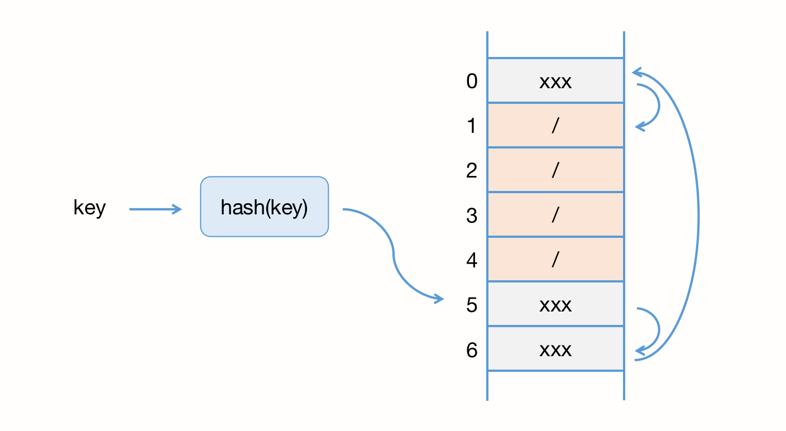

### 十四、散列表（Hash Table）

> Word文档中的单词拼写检查功能如何实现？

#### 一、散列思想

散列表 Hash Table，平时称呼为“哈希表”或者“Hash表”，因为单列表用的是数组支持随机访问数据的特性，所以散列表其实就是数组的一种扩展，有数组演变而来。

举个例子：已知89名选手参加校运会，为了方便记录成绩，给每个选手生成一个参赛号码，这89名选手编号依次从1到89，若要实现通过号码查找选手信息，将如何实现？

我们可以将89名选手的信息，存放在数组里，编号为1的选手放在下标为1的位置，以此类推，这样我们可以方便的随机访问任意一个选手的信息，这样的方式使得随机访问的时间复杂的是 O(1)。

实际上，这个例子已经用到了**散列思想**：参赛编号是自然数，并且与数组的下标形成一一映射，所以利用数组支持根据下表随机访问的时候，时间复杂度是O(1)这一特性，就可以实现快速查找编号对应的选手信息。

假设我们重新定义参赛编号：用6位数字来表示，比如 051167，其中，05表示年级，11表示班级，67表示实际的参赛编号，这时候如何存储选手的信息，才能支持堆积访问呢？其实本质是不变的，我们另外建立一个映射关系，将编号和选手对应起来即可。我们将建立映射关系的方法，叫做散列函数（或 “Hash函数“、“哈希函数”），而散列函数计算得到的叫做散列值（或”Hash值“、”Hash Code“、”哈希值“）。

#### 二、散列函数

从上面的例子中看到，散列函数在散列表中起着非常关键的作用。散列函数，顾名思义是一个函数，我们可以把它定义为 hash(key)，其中 key 表示元素的键，hash(key) 计算得到的值表示为散列值。以下是散列函数设计的基本要求？

1. 散列函数计算得到的散列值是一个非负整数；
2. 如果 key1 == key2，那么 hash(key1) == hash(key2)；
3. 如果 key1 != key2，那么 hash(key1) != hash(key2)；

因为数组下标从0开始，所以散列函数的散列值也是非负整数，第二点也很好理解，相同的key计算得到的散列值应该是相同的。

第三点，在理解上与第二点无异，但真实情况下很难做到，即使像 MD5、SHA、CRC 等哈希算法，也无法避免不同的 key 计算出相同的散列值，唯一能降低这种现象出现的方法，就是加大数组的大小和存储空间。所以我们几乎无法找到一个完美的无冲突的散列函数，即使能找到，付出的时间成本和计算成本也很大，所以解决冲突可以有特殊的处理办法。

#### 三、散列冲突

我们针对第三点原则产生的问题，叫 散列冲突，即不同的key计算出相同的散列值。常用的散列冲突解决方法有两类：开放寻址法（open addressing）和链表法（chaining）。

##### 1. 开放寻址法

其核心思想是，如果出现了散列冲突，我们就重新探测一个空闲的位置，将其插入。其中一个简单的探测方法叫 **线性探测**（linear probing）：当出现散列冲突时，就从当前位置开始，依次往后查找空闲位置，若找到则插入。



**查找**：从图中可以看出，散列表的大小是7，其中 0、5、6已经插入元素，一个新的key经过散列函数的计算，得到的散列值是 5，此时判断发生了散列冲突，则按顺序往后一个个找，看有没有空闲的位置，若到尾部都没有找到，则从头开始向后找，直到找到了 1 号位置。

**插入**：在散列表中查找元素的过程类似于插入的过程。我们通过散列函数求出要查找元素的散列值，然后比较数组中下标为散列值的元素和要查找的元素，如果想等则返回查找成功；狗泽就依次往后找。若遍历到空闲的位置，或遍历完整个数组都没有找到，说明查找的元素不在散列表中。

**删除**：我们不能单纯地把要删除的元素置空，而是标记这个元素为 deleted。那么查找时遇到 deleted 的元素就跳过。

到现在我们发现，线性探测法其实存在很大的问题，当散列表中插入的数据越来越多时，散列冲突发生的可能性就会越来越大，空闲的位置回越来越少，线性探测的时间就会越久。极端情况下，插入新元素时，我们可能需要探测整个散列表，所以时间复杂度是 O(n)。同理，在删除和查找时，也极有可能会线性查找整个散列表，才能找到目标元素。

对于开放寻址解决冲突的方法，除了线性探测外，还有两种比较经典的方法：二次探测（quadratic probing）和双重散列（double hashing）。

**二次探测**：

所谓二次探测，跟线性探测很想，线性探测每次探测的步长是1，那它探测的下标序列就是 hash(key)+0, hash(key)+1, hash(key)+2, hash(key)+3 ... ，而二次探测的步长变为原来的二次方，其探测的下标序列为：hash(key)+0, hash(key)+1^2, hash(key)+2^2, hash(key)+3^2 ... 

**双重散列**：

意思是不仅仅要使用一个散列函数，我们需要使用一组散列函数 hash1(key), hash2(key), hash3(key) ... 我们先使用第一个散列函数，若发生散列冲突，则使用第二个散列函数，以此类推，直到找到空闲的存储位置。

不管采用什么方法，当散列表中空闲位置不多时，散列冲突的概率就会大大提高。为了尽可能保证散列表的操作效率，一般情况下，我们会尽可能保证散列表中有一定比例的空闲槽位。

我们用 **装载因子（load factor）**来表示空位的多少。装载因子的计算公式如下：

``` 
散列表的装载因子 = 填入表中的元素个数 / 散列表的长度
```

**优缺点**：

开放寻址法将很多数据存储在数组中，可以有效的利用 CPU 缓存加快查询速度，而且这种方法实现的散列表，序列化起来比较简单。但是一旦产生冲突，解决冲突的代价就更高，这使得开放寻址法仅适用于数据量较小、装载因子不大的情况，例如 Java中的 ThreadLocalMap 就使用了开放寻址法来解决散列冲突。

##### 2. 链表法

链表法是一种更加常用的散列冲突解决办法，相比开放寻址法，它要简单很多。


如上图所示，在散列表中，每个“桶（bucket）”或者“槽（slot）”回对应一条链表，所有散列值相同的元素，都会放在相同槽位对应的链表中。

**插入**：我们只需要通过散列函数计算出对应的散列槽位，将其插入到对应的链表中即可，所以插入的时间复杂度是 O(1)。

**查找**：我们同样通过散列函数计算出对应的槽，然后遍历链表查找，删除也是同理。实际上，查找和删除的时间复杂度和链表的长度k成正比，也就是 O(k)。对于散列比较均匀的散列表来说，理论上 k = n/m，其中 n 表示散列中数据的个数，m表示散列表中槽的个数。

> Word单词拼写：
>
> 常用的英文单词约有20万个，假设单词的平均长度是10个英文字母，平均一个单词占用10个字节的内存空间，那么20万英文单词大约占用 2MB的存储空间，就算放大10倍就是20MB。对于现在的计算机来说，这个大小完全可以放在内存里，所以我们可以用散列表来存储整个英文单词词典。
>
> 当用户输入某个英文单词时，我们拿用户输入的单词去散列表中查找，如果查到，则说明拼写正确；如果没有查到，就说明拼写可能有误，给予提示。借助散列表这种结构，我们就可以轻松实现快速判断是否存在拼写错误。


散列表的查询效率，并不能笼统的说成是O(1)，他和散列函数、装载因子、散列冲突都有关系。如果散列函数设计得不好，或者装载因子过高，都可能导致散列冲突发生的概率升高，查询效率下降。

极端情况下，有些恶意的攻击者，还有可能通过精心构造的数据，使得所有的数据经过散列函数之后，都散列到同一个槽里。如果我们使用的是基于链表的冲突解决方法，那这个时候，散列表就会退化成链表，查询时间的复杂度就从 O(1) 急剧退化为 O(n)。

如果散列表中有10万个数据，退化后的散列表查询效率就下降了10万倍。更直接一点说，如果之前运行100次查询只需要0.1秒，那现在就需要1万秒。这样就有可能因为查询消耗大量的 CPU 或者线程资源，导致系统无法响应其他请求，从而达到拒绝服务攻击（DoS）的目的。这也就是散列表碰撞攻击的基本原理。

**优缺点**：

链表法比起开放寻址法，对大装载因子的容忍度更高。开放寻址法只适用于装载因子小于1的情况，接近1时，就会出现大量的散列冲突，导致大量的探测和再散列（rehash）等，性能会下降很多。但对于链表法来说，只要散列函数的值随机均匀，即便装载因子变成10，也就是链表长度变长，虽然影响查询效率，但比顺序查找还是快很多。

其次，链表要存储指针，所以对于较小的对象的存储，是比较消耗内存的，还有可能会让内存翻倍。而且链表中的节点是零散分布在内存中，不是连续的，所以对 CPU 缓存是不友好的，当然，如果我们存储的是大对象，其量级大于或远大于指针的大小，那链表的存储消耗也可以忽略了。

实际上，我们对链表稍加改造，将散列表指向的链表改为其他数据结构，如跳跃表、红黑树，则可以实现一个更高效的散列表。在出现散列冲突时，极端情况下所有的数据都散列在同一个桶（bucket）中，那最终退化成散列表的查询时间，也不过是 O(logn)。

所以链表法更加灵活，比较适合大数据量、存储大对象时的散列冲突方法，也支持更多的优化策略。

#### 四、如何设计散列函数

散列函数（Hash）设计的好坏，决定了散列表冲突的概率大小，也直接决定了散列表的性能。

##### 1. 简单

首先，散列函数的设计不能太复杂。过于复杂的散列函数，势必会消耗很多计算时间，也就间接影响到散列表的性能。

##### 2. 尽可能随机且均匀

随机性越大，散列表中的元素分布就越均匀，这样才能避免或最小化散列冲突，而且即使出现冲突，散列到每个槽的数据也会比较平均，不会出现某个槽内数据特别多的情况。

实际工作中，关键字长度、特点、分布，还有散列表的大小等，都需要综合考虑。

#### 五、装载因子过大

装载因子过大，说明散列表中的元素越多，空闲位置越少，散列冲突的概率就越大。不仅插入数据的过程要多次寻址，或者拉很长的链条（因为装载因子 = 散列表中填充的数据/散列表长度，散列表的长度是固定的，填充数据越多空闲空间越小，导致装载因子越接近1），查找的过程也会因此变得很慢。

对于没有频繁插入和删除的静态数据集合来说，我们很容易根据数据的特点、分布等，设计出完美的、极少冲突的散列函数，毕竟数据都是已知的。对于动态散列表来说，数据集合是频繁变动的，我们实现无法预估将要加入的数据个数，所以我们也无法事先申请一个足够大的散列表。随着数据慢慢加入，装载因子会慢慢变大。当装载因子达到一定程度后，散列冲突就会变得不可接受。

针对散列表，我们也可以模仿固定大小的数组、栈、队列，进行动态扩容，重新申请一个更大的散列表，将数据搬移到新的散列表中。假设每次扩容我们都申请一个原来2倍大小的空间。如果原来散列表的装载因子是0.8，扩容之后，新的散列表的装载因子就变成了0.4，是原来的一半。

针对数组的扩容，数据搬移操作比较简单，但针对散列表的扩容，数据搬移操作要复杂很多。因为散列表的大小变了，数据的存储位置也变了，所以我们需要通过散列函数重新计算每个数据的存储位置。

> 实际上，对于动态散列表，随着数据的删除，散列表中的数据会越来越少，空闲的空间会越来越多。如果我们对空间消耗非常敏感，我们可以在装载因子小于某个值之后，启动动态缩容。当然，如果我们更加在意执行效率，能够容忍多消耗一点内存空间，就可以不用这么费劲了。

当散列表的装载因子超过某个值时，就需要动态扩容，这个阈值的设置要权衡时间、空间复杂度。如果内存空间不紧张，对执行效率要求很高，可以降低装载因子的阈值，反之可以增加。

#### 六、避免低效的扩容

假设一个散列表已经存储了1GB的数据，此时进行动态扩容，需要额外申请2GB的空间，这使得扩容本身的成本变得很高。为了解决一次扩容耗时过多的情况，我们可以将扩容穿插在插入操作的过程中。

当有新数据要插入时，我们将新数据插入到新的散列表中，并且从老的散列表中拿出一个数据放到新散列表中。每次插入时都重复上述的过程，经过多次插入，老的散列表中的数据就一个个全部搬移到新的列表中了。


从上图中可以看到，从左到右，完成了数据迁移操作。对于查询操作，为了兼容新、老散列表中的数据，我们先从新散列表中查找，如果没有找到，再去老的散列表中查找。通过这样均摊的办法，将一次扩容的代价，均摊到多次插入操作中，就避免了一次性扩容耗时过多的情况。这种实现方式下，插入一个数据的时间复杂度都是 O(1)。

#### 七、工业级散列表举例

以 Java 中的 HashMap为例

##### 1. 初始大小

HashMap 默认的初始大小是 16，如果事先知道大概的数量级可进行修改，减少动态扩容的次数

##### 2. 装载因子

最大装载因子默认是 0.75，当 HashMap 中元素个数超过 0.75 * capacity 时（capacity表示散列表的容量），就会启动扩容，每次都会扩容到2倍大小。

##### 3. 散列冲突

HashMap 底层采用链表法来解决冲突，即使装载因子和散列函数设计得再合理，也避免不了出现链表过长的情况，一旦链表过长（TREEIFY_THRESHOLD，默认是8），就会影响 HashMap 的性能。于是在 JDK 1.8 版本中引入了红黑树。我们可以利用红黑树快速增删改查，提高 HashMap 的性能。当红黑树节点个数少于 6 时（UNTREEIFY_THRESHOLD），又会将红黑树转化为链表。

##### 4. 散列函数

散列函数的设计并不复杂，如下所示：

``` java
/**
 * Computes key.hashCode() and spreads (XORs) higher bits of hash
 * to lower.  Because the table uses power-of-two masking, sets of
 * hashes that vary only in bits above the current mask will
 * always collide. (Among known examples are sets of Float keys
 * holding consecutive whole numbers in small tables.)  So we
 * apply a transform that spreads the impact of higher bits
 * downward. There is a tradeoff between speed, utility, and
 * quality of bit-spreading. Because many common sets of hashes
 * are already reasonably distributed (so don't benefit from
 * spreading), and because we use trees to handle large sets of
 * collisions in bins, we just XOR some shifted bits in the
 * cheapest possible way to reduce systematic lossage, as well as
 * to incorporate impact of the highest bits that would otherwise
 * never be used in index calculations because of table bounds.
 */
static final int hash(Object key) {
    int h;
    return (key == null) ? 0 : (h = key.hashCode()) ^ (h >>> 16);
}
```

其中，hashCode() 返回的是 Java对象的 hash code，这是一个本地方法，也可以重写。

#### 八、组合拳

##### 1. LRU 缓存淘汰算法

借助散列表，我们可以把 LRU 缓存淘汰算法的时间复杂度降低到 O(1)，下面我们看看如何做到。首先回顾下 LRU（最近最少使用）如何通过链表来实现：

使用一个链表来维护访问过的数据，越靠前表示越早访问。当有新的访问需要加入时，首先查找链表中是否已存在，若存在，则移到链表尾部。当需要淘汰时，从链表头部开始删除节点。因为查找数据需要遍历链表，所以单纯用链表来实现LRU，时间复杂度是 O(n)。

一个简单的缓存系统，可以抽象出3个基本操作：添加、删除 和 查找。而这3个操作都涉及“查找”动作，我们用散列表和链表组合使用：

我们使用双向链表存储数据，链表中的每个节点分为4个部分：

1. prev：纵向前驱指针；
2. data：存储数据；
3. next：纵向后继指针；
4. hnext：横向后继指针，维护的是解决散列冲突时的单向链表；

我们可以从上图大致看出，左边是散列表，右边则由2类数据结构组成的复杂结构，横向看，是多个单向链表，这与我们之前解决冲突时使用的链表法结构无异；而其的双向链表，是将所有的数据顺序串联起来，来表征访问的时间顺序。

**查找**：

散列表中查找数据的时间复杂度本身就接近O(1)，在 LRU 中，我们查找到这个元素后，还需要将它移动到双向链表的尾部。

**删除**：

我们需要找到数据所在的节点，然后将节点删除。借助散列表，我们可以在 O(1) 的时间复杂度下快速找到要删除的节点；其次，借助双向链表，可以在 O(1) 的时间复杂度下找到他的前驱节点，所以删除时只需要将前驱节点指向后继节点即可，时间复杂度也是 O(1)。

**添加**：

添加数据时，首先检查是否已经在散列表中，若已存在，则将其移动到链表的尾部。若不存在，首先检查散列表是否已满，若已满，则将双向链表头部的节点删除，然后再将数据放到链表尾部。

这整个过程涉及的查找操作，都可以借助散列表来完成，其他的操作，比如删除头节点、链表尾部插入等，都可以借助双向链表在 O(1) 的时间复杂度内完成。

##### 2. Redis zset（有序集合）

在有序集合中，每个成员对象有两个重要属性，**key**（键值）和 **score**（分值）。不仅需要通过score来查找数据，还会通过key来查找数据。举个例子：用户积分排行榜有一个功能：通过用户id来查找积分信息，也可以通过积分区间来查找用户id或姓名，这其中的id、姓名和积分的用户信息，就是成员对象，用户id就是 key，积分就是 score。

所以 Redis 有序集合应该具备以下的基本操作：

1. 添加一个成员对象；
2. 按照 key 来删除成员对象；
3. 按照 key 来查找成员对象；
4. 按照 score 区间查找数据，比如查找 score 在 [0, 100] 之间的成员对象；
5. 按照 score 顺序或逆序排列；

如果我们仅仅按照 score 将成员对象组织称跳跃表的结构，那按照键值来删除、查找就会变得很慢，解决方法和 LRU 缓存淘汰算法的解决方法类似。我们可以在按照键值构建一个散列表，这样按照 key 来删除、查找一个成员对象的时间复杂度就变成 O(1)。同时借助跳跃表，其他操作也非常高效。

Redis 有序集合的操作还有另一类，即查找对象的排名（Rank）或者根据排名区间查找成员对象，这个功能单纯用刚刚讲的组合就无法高效地实现了。

##### 3. Java LinkedHashmap

HashMap的底层是散列表，而 LinkedHashMap 的 “**Linked**” 却不仅仅表示它是通过链表法来解决散列冲突。我们看下面一段代码：

``` java
HashMap<Integer, Integer> m = new LinkedHashMap<>();
m.put(3, 11);
m.put(1, 12);
m.put(5, 23);
m.put(2, 22);

for (Map.Entry e : m.entrySet()) {
  System.out.println(e.getKey());
}
```

执行上述代码，控制台将会按插入顺序依次打印：3、1、5、2。我们可以猜到，LinkedHashMap 的底层是用散列表+链表组合实现的。实际上，它不仅仅支持按照顺序遍历数据，还支持按照访问顺序来遍历数据，看下面一段代码：

``` java
// 10是初始大小，0.75是装载因子，true是表示按照访问时间排序
HashMap<Integer, Integer> m = new LinkedHashMap<>(10, 0.75f, true);
m.put(3, 11);
m.put(1, 12);
m.put(5, 23);
m.put(2, 22);

m.put(3, 26);
m.get(5);

for (Map.Entry e : m.entrySet()) { 
  System.out.println(e.getKey());
}
```

执行上述代码，控制台将打印 1、2、3、5。每次调用 put() 方法，往 LinkedHashMap 中添加数据时，都会将数据添加到双向链表的尾部，所以在前四个操作完成之后，链表中的数据如下所示：


接下来将 (3, 26) 插入到链表中，此时发现这个键值已经存在，则首先将 (3, 11) 删除，然后将新数据插入到队尾，这时链表状态如下：


当所有的元素都插入完毕，此时调用 get() 方法，查询 5 时，将其移动到队尾，此时链表状态如下：


所以最后打印出来的数据是 1、2、3、5。可以看出，按照访问时间排序的 LinkedHashMap 就可以实现一个 LRU 缓存淘汰算法，“Linked” 实际上指的就是双向链表，而并非指链表法解决散列冲突。


