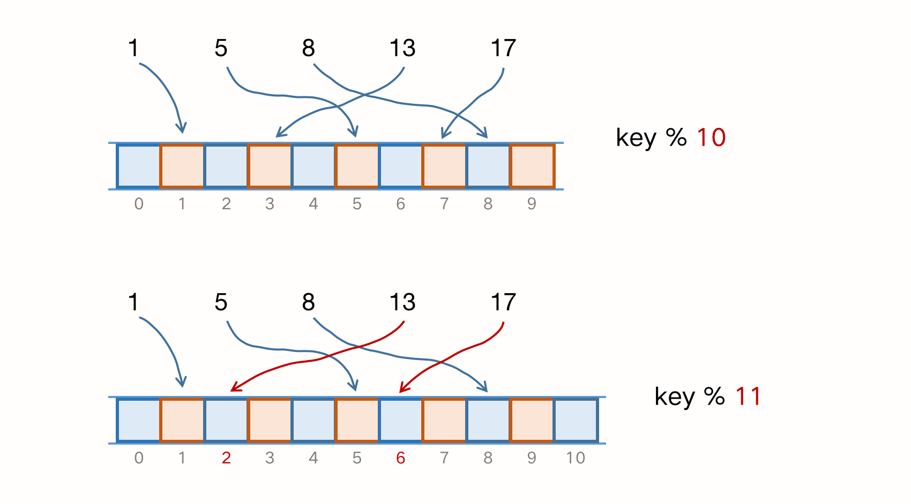

### 十五、哈希算法

> 2011年，CSDN 网站被黑客攻击，超过 600万用户的注册邮箱和密码被泄漏，很多网友对 CSDN 明文保存用户密码的行为产生了不满。如果你是一名工程师，你会如何存储用户密码？仅仅用 MD5 加密是否就可以了？	

#### 一、什么是哈希算法

不管是散列，还是哈希，都是中文翻译的差别，英文都是“Hash”。**将任意长度的二进制值串映射为固定长度的二进制值串，这个映射的规则就是哈希算法**。通过原始数据映射之后，得到的二进制值串就是哈希值。根据经验，优秀的哈希算法需要满足以下几个要求：

1. 从哈希值不能反推原始数据（所以哈希算法也叫 单向哈希算法）；
2. 对输入数据非常敏感，只修改一个 Bit，得到的哈希值也不相同；
3. 散列冲突的概率要小，对于不同的原始数据，需要降低哈希值相同的概率；
4. 哈希算法的执行效率尽可能高，针对长文本，也能快读的计算出哈希值；

我们用 MD5 距离说明。MD5 的哈希值是 128 位的 Bit 长度，为了方便表示，我们用 16 进制编码：

``` java
MD5("哈希算法") = bb4767201ad42c74e650c1b6c03d78fa;
MD5("哈希算法1") = 425f0d5a917188d2c3c3dc85b5e4f2cb;
MD5("lxmajs") = cd611a31ea969b908932d44d126d195b;
```

可以看出来，无论哈希文本有多长、多短，通过 MD5 哈希之后，得到的哈希值长度都相同，即使文本中有细微的差别（如第一个和第二个文本仅差了尾部的数字 1），得到的哈希值也完全不同。而由得到的哈希值也很难反推出原始的文本。

哈希算法要处理的文本可能是各种各样的，对于非常长的文本，如果哈希算法的计算时间很长，那就只能停留在理论研究的层面，很难应用到实际的软件开发中，比如一篇《西游记》，但是用 MD5 ，用不了 1ms。

#### 二、安全加密

哈希算法的第一个应用领域，就是安全加密，最常用于加密的哈希算法就是 **MD5**（Message-Digest  Algorithm，消息摘要算法）和 **SHA**（Secure Hash Algorithm，安全散列算法）。除了这两个之外，还有其他加密算法，如 **DES**（Data Encryption Standard，数据加密标准）和 **AES**（Advanced Encryption Standard，高级加密标准）。

对于加密的哈希算法，基本要求中的前两点尤为重要，即 不能反推原始数据 和 输入敏感。第一点很好理解，加密的目的就是防止原始数据泄漏。第二点，实际上不管是什么哈希算法，我们只能尽量减少碰撞冲突的概率，理论上是没办法做到完全不冲突的。

这里给予组合数学中一个非常基础的理论，鸽巢理论（也叫抽屉理论）：如果有10个鸽巢，有11个鸽子，那必定有一个鸽巢中的鸽子数量多于1个。基于这个原理，我们看看为什么哈希算法无法做到零冲突。

我们知道，哈希算法产生的哈希值长度是固定且有限的。比如 MD5，哈希值是固定的128位二进制串，能表示的数据是有限的，最多能表示 2^128 个数据，而我们要哈希的数据是无穷的。基于鸽巢原理，我们对 2^128 + 1 个数据求哈希值，必然会出现 至少2个数据的哈希值相同。

``` java
	2^128=340282366920938463463374607431768211456
```

但因为 1/2^128 是极其小的数，所以产生哈希冲突的概率极低。如果我们拿到一个 MD5 的哈希值，希望通过毫无规律的穷举，来找到跟这个 MD5 哈希值一样的另一个数据，那耗费的时间应该是个天文数字，所以，即便哈希算法存在冲突，但在有限的时间和资源下，哈希算法还是很难破解的。**一般情况下，哈希值越长的哈希算法，散列冲突的概率就越低**。

没有绝对安全的加密算法，越复杂、越难破解的加密算法，需要的计算时间也就越长。

#### 三、唯一标识

> 如果在海量的图库中，搜索一张图是否存在，我们不能单纯地用图片的元信息（比如图片名）来对比，因为有可能存在名称相同但图片内容不同，或者名称不同、图片内容相同的情况，那么我们如何处理？

任何文件在计算中都可以表示成二进制码串，所以针对上述情况，比较暴力的办法是比对两个图片的二进制码串，如果相同，则表示存在。但图片的大小不是固定的，如果比较大的图片（MB级别）转换成二进制码串再进行比较十分耗时。

此时，我们可以给每一个图片取一个唯一标识（或者信息摘要），如从图片的二进制码串的头100个字节、中间的100个字节和尾部的100个字节组成一个 300字节的码串，再通过哈希算法得到一个哈希串，用它表示该图片的唯一标识，则可以大大减少比对的时间。

将实际问题抽象化建立数学模型：将海量图片中搜索某个唯一的图片抽象成在哈希表中查询某个数据。这里的唯一标识是指哈希值，即使图片的唯一标识相同，也不代表两张图片完全相同，因为存在散列冲突。

#### 四、数据校验

> 我们从多个机器上并行下载一个大资源文件时，这个文件通常可能分割成多个文件快，比如2GB分割成100块，每块20MB。基于 P2P（Point to Point）的协议传输完，在组装成一个完整的资源文件。
>
> 网络传输是不安全的，下载的文件快有可能被宿主机恶意修改过，又或者在下载过程中出现了错误，所以下载的文件快有可能是不完整的。如何检测恶意修改或文件出错？

通过哈希算法，对所有的文件块分别取哈希值，并保存在种子文件中。利用哈希算法其中一个特点，即输入敏感，只要其中文件快的内容发生过改变，最后计算出的哈希值就不同。所以当文件快下载完成之后，计算出的哈希值与种子文件中的哈希值进行比对，如果不同则说明文件块不完整，或者被篡改，需要再从其他宿主机上下载。

#### 五、散列函数

实际上，散列函数也是哈希算法的一种应用。散列函数是设计一个散列表的关键，它直接决定了散列冲突的概率和散列表的性能。不过相对哈希算法的其他饮用，散列函数对于散列算法冲突的要求低很多，即便出现个别散列冲突，只要不是过于严重，我们都可以通过开放寻址法或者链表法来解决。

不仅如此，散列函数对于散列算法计算得到的值，是否能反向解密也并不关心。散列函数用到的散列算法，更加关注散列后的值能否均匀分布。

> 你知道区块链吗？能否描述下区块链用的是什么哈希算法，是为了解决什么问题而使用的？

#### 六、分布式之负载均衡

当有大量的网络请求打到某一个平台或集群系统时，我们需要一个先锋服务来帮我们作为第一道屏障，他需要解决的问题是让请求均匀地访问到集群中服务中。我们知道负载均衡的算法有很多，比如轮询、随机、加权轮询等，那么如何实现一个会话粘滞（Session Sticky）的负载均衡算法呢（同一个用户，同一个客户端，一次会话的所有请求都发送到同一个服务器上）？

最直接的方法就是维护一张映射表，key 是 客户端ip或者回话id，value是服务器编号，客户端每次发出的请求，都要先在映射表上查找应该路由到的服务器编号，在请求编号对应的服务器。这种方法比较直观，但有2个问题：

1. 客户端很多，映射表会变得庞大，比较浪费资源或内存空间；
2. 客户端下限、上线，服务端扩容、缩容都会导致映射失败，进而增加了映射表的维护成本；

我们通过哈希算法来解决：**对客户端ip地址或会话id计算哈希值，将取得的哈希值与服务器列表的大小进行取模运算，最终得到的这个值就是应该被路由到的服务器编号**。

#### 七、分布式之数据分片

##### 1. 如何计算“搜索关键词”出现的次数？

> 假如我们有 1T 的日志文件，这里面记录了用户的搜索关键词，我们想要快速地统计出每个关键词被搜索的次数，该怎么做呢？

这个问题有2个难点，第一是日志很大，没办法放到一台机器的内存中。第二个是单机处理的效率有限，只有一台机器处理，时间会很长。

针对此，我们可以先对数据进行分片，然后采用多机处理的方法来提高速度：我们用 n 台机器并行处理，从搜索记录的日志文件中，依次读出每个关键词，并通过哈希函数计算哈希值，再跟 n 取模，最终得到的值就是应该被分配到的机器的编号。哈希值相同的搜索关键词被分配到同一个机器上，每个机器分别计算关键词出现的次数，最终合并起来就是最终的结果。


这个处理过程，就是  **MapReduce** 的基本设计思想。

##### 2. 如何快速判断图片是否在图库中？

> 假设图库有1亿张图片，如何快速判断某张图片是否存在图库中？

同样地，我们对图片数据进行分片，然后采用多机处理。准备 n 台机器，让每台机器维护一部分图片对应的散列表。每次从图库中读取一张图片，计算唯一标识（哈希算法），然后与机器个数 n 求余，得到的值就是对应要分配的机器编号。将图片的唯一标识和机器编号构建一个散列表。

当要判断某个图片是否在图库中，通过同样的哈希算法，计算唯一标识后与机器个数 n 求余，再去目标机器上的散列表中查看图片的id是否存在，若存在，表示图片在图库中。


现在，我们估算一下大约需要多少台机器：散列表中的每个数据单元包含两个信息，哈希值和图片文件的路径。我们通过 MD5 来计算哈希值，那长度就是 128 Bit（16 Byte）。文件路径长度的上限是 256 Byte，我们可以假设平均长度是 128 Byte，如果用链表法解决冲突，还需要存储指针（8 Bytes）。所以散列表中每个数据单元大约需要 152 Byte。

假设一台机器的内存大小是 2GB，散列表的装载因子是 0.75，则一台机器最多可以存储的散列表数据量为 一千万（张）：

``` 
( 2GB * 0.75 ) / 152 Byte = 1000万
```

实际上，针对这种海量数据的处理问题，我们都可以采用多机分布式处理，借助这种思路，可以突破单机内存、CPU 等资源的限制。

#### 八、分布式之存储

当下，互联网面对的都是海量数据、海量用户，为了提高数据的读取和写入能力，一般都采用分布式的方式存储数据，比如分布式缓存。当数据存储的量级较大时，一个缓存机器肯定是不够的，于是我们需要将数据分布在多台机器上。

借助数据分片的思想，通过哈希算法对数据取哈希值，再对机器个数取模，这个最终值就是应该存储的缓存机器编号。但面对扩容或缩容时，这个方法就不能简单的应对了。

例如：有一张大小为10的散列表，hash(key) = key % 10，存储了 1、5、8、13、17 这几个元素，当扩容到11时，需要重新散列，如下图：



如果发生扩容和缩容，缓存中的数据就需要重新计算哈希值，那么缓存就会失效，若此时有请求到达服务器，缓存则会失效从而发生**缓存穿透**，当请求的量较大时，将会引发**雪崩**。

所以我们需要 [一致性哈希算法](https://www.zsythink.net/archives/1182)，使得在扩容和缩容时不需要做大量的数据迁移：假设我们有 k 个机器，数据的哈希值范围是 [0, MAX]。我们将整个范围划分成 m 个小区间（m远大于k)，每个机器负责 m/k 个小区间。当有新机器加入时，我们就将某几个小区间的数据，从原来的机器搬移到新的机器中。这样既不用全部哈希、搬移数据，也保持了各个机器上数据量的均衡。