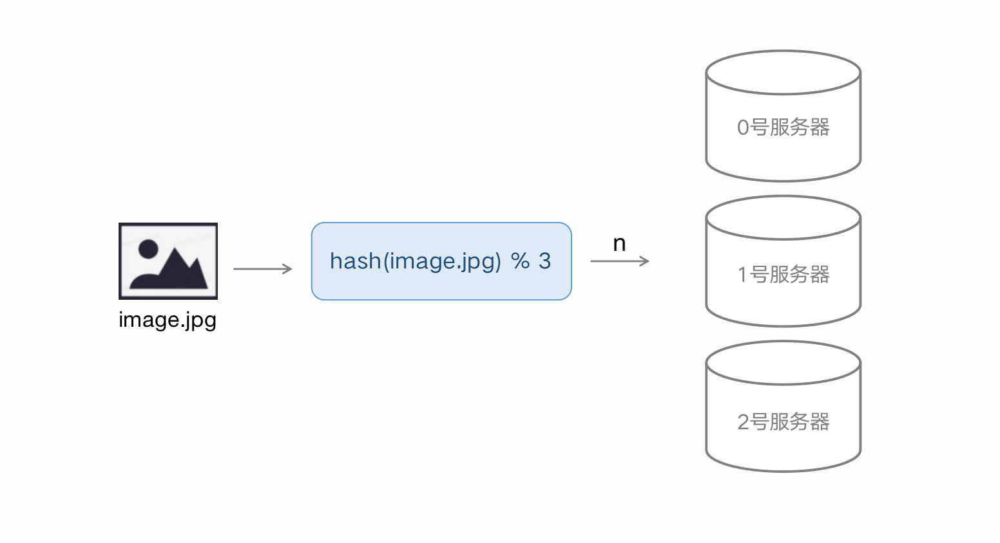
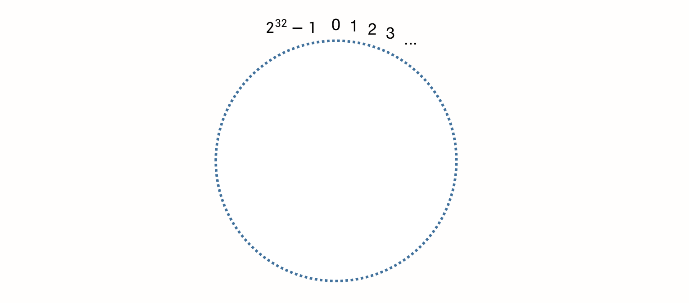
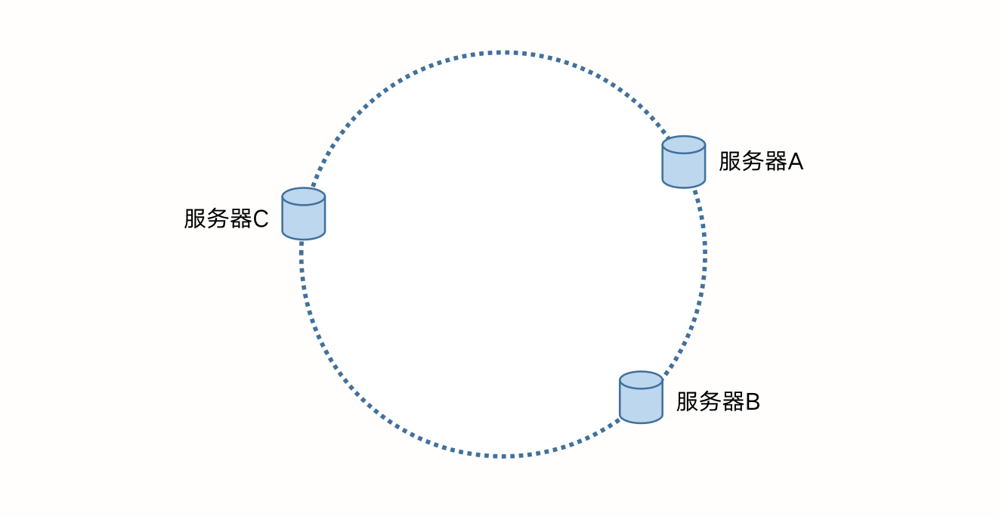
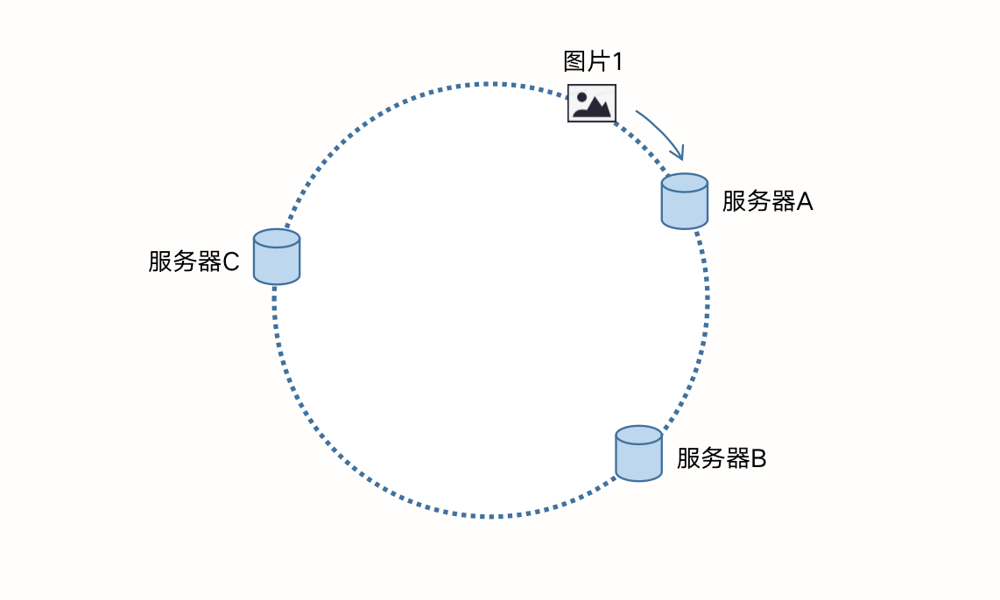
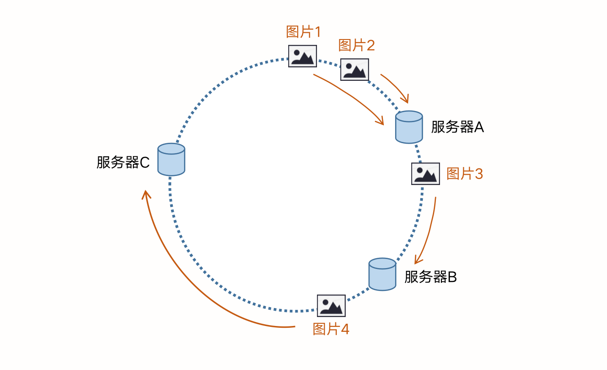
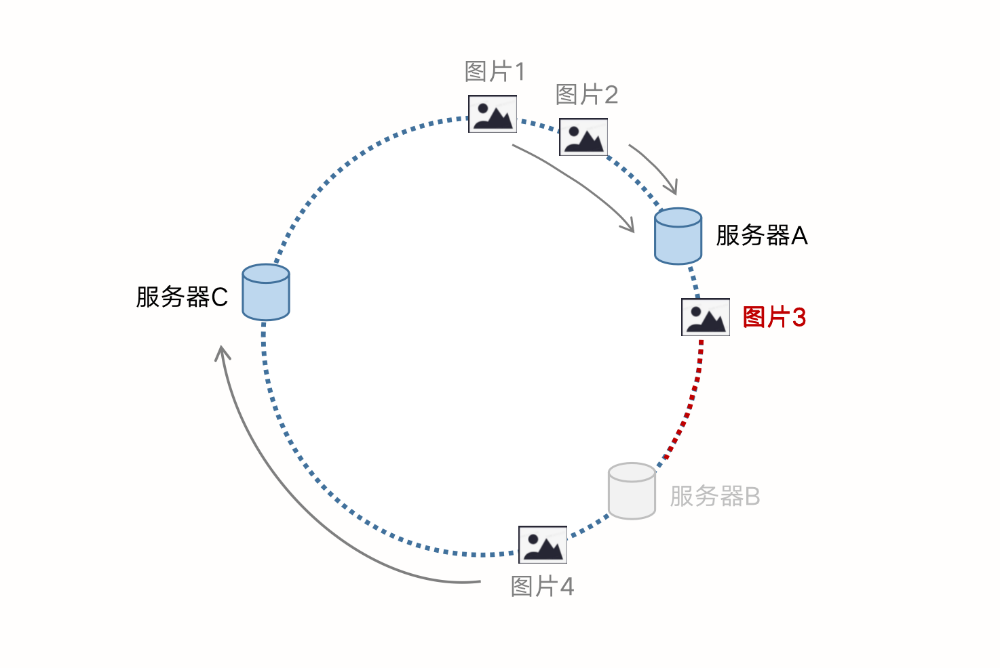
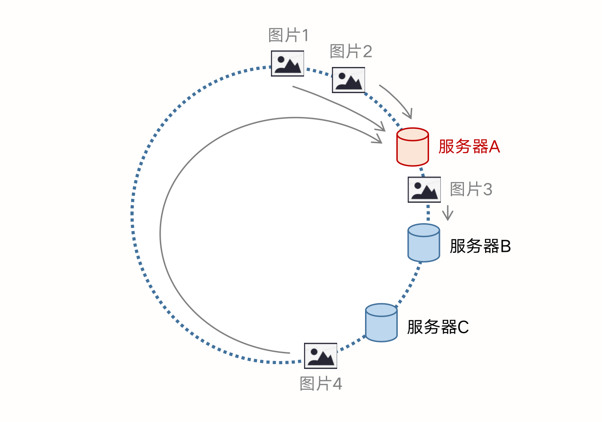
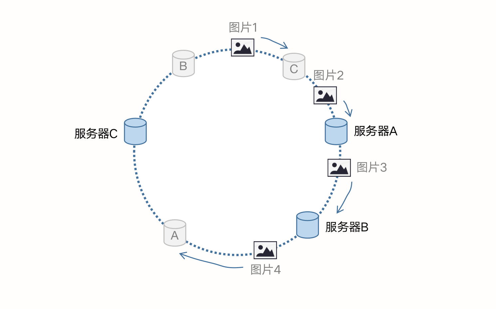

### 十六、一致性哈希算法

#### 一、背景

假设，我们有三台缓存服务器，用于缓存图片，我们认为这3台缓存服务器编号为 0号、1号、2号，现在有3万张图片需要均匀的缓存到这3台服务器上，以便它们能够分摊缓存的压力，那么每台服务器就需要缓存1万左右的图片。

这里我们直接提出一个方案：对缓存项（图片）做一次哈希，得到的哈希值将决定图片存储在哪一台服务器上，哈希函数可采用 

```
 server = hash(图片名) % n 
```

因为图片的名称是不重复的，所以当我们对同一个图片名乘坐相同的哈希计算时，得到的结果应该是不变的。如果我们有3台服务器，使用哈希后的结果对 3 求余，那么余数一定是 0、1或2，正好与服务器编号匹配。通过哈希函数的计算，就可以决定某张图片会缓存到哪台服务器上。当读取图片时，同样对图片名做一次哈希，就可以从对应的缓存服务器中读取到目标图片。其过程如下图所示：

但是当服务器进行扩容，或缩容时，求目标服务器编号 n 的算法就会失效。换句话说，当服务器数量发生变化时，所有缓存在一定时间内是失效的，应用无法从缓存中读取到正确的数据，会直接请求服务器获得数据，造成缓存穿透的问题，量大时将会引发雪崩。

综上，我们需要解决以下两个问题：

1. 当缓存服务器数量发生变化时，会引起缓存雪崩，可能导致整体系统压力过大而崩溃（大量缓存同一时间失效）；
2. 当缓存服务器数量发生变化时，优于哈希算法的改变，几乎所有缓存的位置都会发生变化，如何减少受影响的缓存数；

为了解决这两个问题，我们引入了**一致性哈希算法**。

#### 二、基本概念

一致性哈希算法也是使用取模的方法，只是刚才描述的取模法是对服务器数量进行取模，二一致性哈希算法是对 2^32 取模。

首先，我们把 2的32次方具象成一个类似钟表的圆，圆上均匀分布着 2^32 个点，圆的正上方表示0，0点右侧的第一个点代表1，第二个点代表2，以此类推，直到 2^32 -1，我们把这个圆称为 Hash 环，如下图所示：



仍然以上面的服务器例子展开，假设仍是3台服务器，分别为 服务器A、服务器B、服务器C，那么生产环境中，这3台服务器肯定有自己的 IP 地址，我们使用它们的 IP 地址进行哈希计算，使用哈希值对 2^32 取模：

``` mathematica
 hash (服务器IP地址) % 2^32
```

通过上述公式得到一个大小区间在 [0, 2^32-1] 内的整数，这个整数表示服务器所在 Hash环 中的位置。对服务器A、服务器B、服务器C都进行计算后，得到下图的 Hash环：



现在我们完成了将服务器映射到 Hash环 上，同样地，当有缓存对象到来时，可以用同样的方式计算缓存对象在 Hash环 上的位置。假设我们要使用服务器来缓存图片，上面的公式不变，仅将传入 hash() 方法的参数可以替换成图片名称或图片ID，计算后得到图片在 Hash环 上的位置。



如上图，从图片1的位置开始，顺时针遇到的第一个服务器是服务器A，我们就将图片1缓存到服务器A上。由此，我们得到一致性哈希算法的初始版本思想：**将服务器和被缓存的对象映射到 Hash环 上，从被缓存对象的位置出发，顺时针遇到的第一个服务器，就是当前对象要缓存的服务器**。由于被缓存对象和服务器 Hash 后的值是固定的，所以在服务器数量不变的情况下，一张对象必定会被缓存到固定的服务器上。查找对象时，使用相同的计算方法求得服务器编号，直接去对应的服务器上找目标对象即可。下图演示了更多的图片一和服务器的映射关系：



#### 三、缩容和扩容

假设，服务器B出现了故障，那么我们将服务器B从 Hash环 中移除即可：



移除服务器B后，按照之前的一致性算法，图片3应该被缓存到服务器C中，因为沿着图片3出发，顺时针遇到的第一个服务器就是图片C，但是图片4仍然会缓存到服务器C，图片1和图片2也仍然在服务器A中，这与服务器B一处之前并无区别。

这说明：**使用一致性哈希算法，针对扩容和缩容的情况，不会导致所有的缓存都失效，只有部分缓存会失效，这使得访问压力不会在同一时间就集中到后端服务器上**。

#### 四、Hash环倾斜

在上图中，服务器A、B、C 在Hash环山的分布是不均匀的，理想情况下，A、B、C 若能均匀分布（在 Hash环 上形成等边三角形），这样任何一个服务器能被缓存的数据趋于均匀，缓存压力也不会倾斜到任何一个服务器上。但现实有可能出现下面的情况：

上图中，1、2、4 号图片，都被缓存到服务器A上，只有3号缓存在服务器B，而服务器C没有缓存任何图片。如果出现上图的情况，A、B、C没有被合理地平均地利用，导致缓存分布不均匀，若此时服务器A发生故障，那么失效的缓存的数量将会是最大的，在极端情况下，仍有可能引起系统崩溃。我们称这种情况为 **Hash环倾斜**。

#### 五、虚拟节点

要解决 Hash环倾斜的问题，有很多方案和切入点。若我们不改变服务器的哈希方法，如果想要均衡的将缓存分布到服务器上，最好能让服务器尽量多、均匀地出现在 Hash环 上，但是真实的服务器只有3台，我们怎样凭空让它们多起来呢。

若没有真实的物理服务器节点，我们就只能将现有的物理节点通过虚拟的方法复制出来，这些由实际节点虚拟复制而来的节点被称为**“虚拟节点”**。加入虚拟节点后的 Hash环 如下所示：



“虚拟节点”是物理节点在 Hash环 上的复制品，一个物理节点可以对应多个虚拟节点。从上图中看出，A、B、C 三台服务器分别虚拟出一个虚拟节点，如果需要，可以虚拟出更多的节点。引入虚拟节点后，缓存的分布就均衡多了，上图中，1号图片被缓存到服务器C，2、4号图片被缓存到服务器A，3号图片被缓存到服务器B。

虚拟节点的个数在一定范围内可以减少 Hash环倾斜 带来的影响，虚拟节点越多，Hash环上的节点就越多，缓存被均匀分布的概率就越大，但这也增加了维护成本，需要权衡。


参考原文：[白话解析：一致性哈希算法 Consistent Hashing](https://www.zsythink.net/archives/1182)