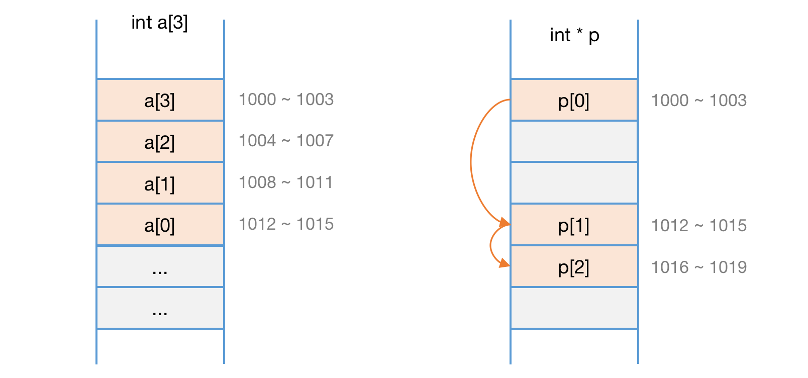
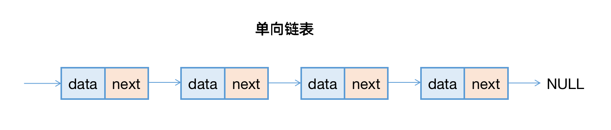
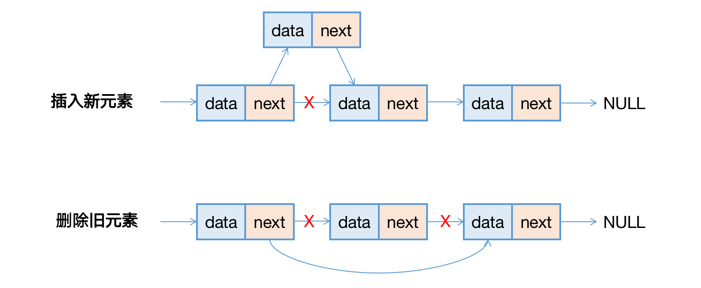
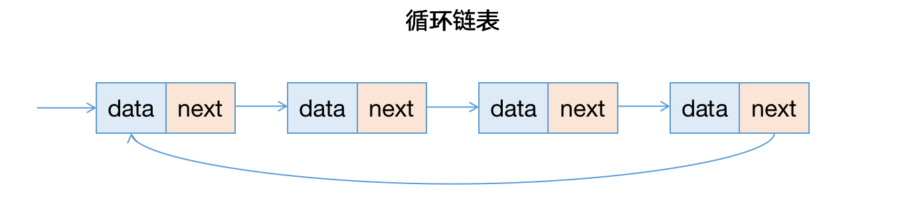
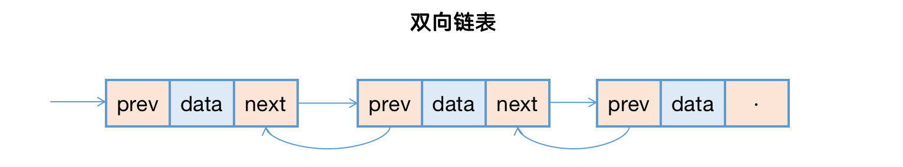
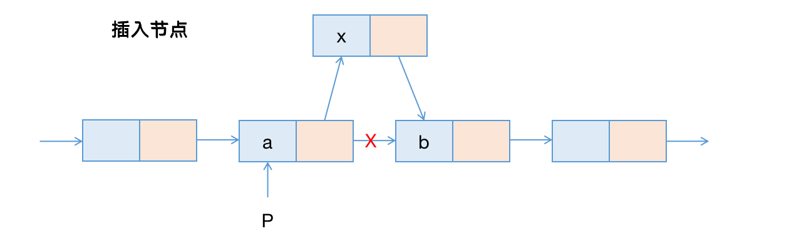

### 第五章、链表

> 如何实现 LRU 缓存淘汰算法？https://github.com/wangzheng0822/algo

链表也是由一个个基础元素组成的线性结构，但与数组相比，它并不需要连续的内存空间。每个链表的元素我们称其为节点，每个节点维护指针，由这些指针的相互引用，将零散的节点串联起来组成链表。链表和数组的内存分布如下图所示：



链表节点的指针有很多种方式，所以链表有很多演变类型，我们将着重介绍：单向链表、双向链表、循环链表。

#### 一、单向链表

单向链表的内存模型就如上图的例子，每个节点维护一个数据部分和指针部分，指针指向下一个节点，Java示例代码参考如下：

``` java
public class SingleLinkedList {
	public class ListNode {
		// 数据部分
		private Object data;
		// 指向下个节点的指针
		private ListNode next;
	}
	private ListNode first;
  private int size;
}
```

``ListNode`` 表示链表节点，节点由 ``data``  和 ``next`` 共同组成，而链表需要头节点和链表大小即可，其余操作均是针对头节点展开。一个简单的链表结构如下图所示：



在数组进行插入、删除时，为了保证数组的内存连续性，需要做大量的数据搬移，因此时间复杂度是 O(n)，而单向链表中插入和删除非常的快速，并不需要维护内存的连续性，我们只考虑相邻节点的指针变更，所以对应的时间复杂度是 O(1)。如下图所示：



但是单向链表想要访问第 k 个元素时，不能如数组一样高效，因为链表的数据并非连续存储的，所以不能通过寻址公式直接进行随机访问，而需要根据指针一个个向后遍历，直到找到对应的节点。

#### 二、循环链表

开局一张图，演示循环链表的结构图：



循环链表是单向链表的变体，尾节点的指针不再指向 NULL（空值），而是指向头节点。和单向链表相比，循环链表的优点是从尾部到头部比较方便，当处理的数据具有环形结构特点时，比较适合采用虚幻链表。比如著名的 [约瑟夫问题](https://baike.baidu.com/item/%E7%BA%A6%E7%91%9F%E5%A4%AB%E9%97%AE%E9%A2%98/3857719?fr=aladdin)。尽管用单向链表也能实现，但是用循环链表就会简单很多。

#### 三、双向链表

双向链表需要额外两个空间，来存储后继结点和前驱节点的地址。所以如果存储同样多的数据，双向链表需要占用更多的存储空间。其结构如下图所示：



对然两个指针比较浪费存储空间，但是可以支持双向遍历，这样也增加了双向链表的灵活性。从结构上看，双向链表可以支持 O(1) 时间复杂度的情况下找到前驱节点，这样可以使得插入和删除都比单向链表要简单。双向链表的Java代码示例如下：

``` java
public class DoubleLinkedList {
	public class ListNode {
		// 数据部分
		private Object data;
		// 指向上个节点的指针
		private ListNode prev;
		// 指向下个节点的指针
		private ListNode next;
	}
	private ListNode first;
  private int size;
}
```

比如删除，在实际的软件开发中，从链表中删除一个数据，一般会有2种情况：

1. 删除节点中值为给定结果的节点，如：在一个整数链表中，删除值是 1 的节点；
2. 删除给定指针指向的节点，如：在一个链表中，删除第 1 个节点；

针对第一种情况，无论是单向链表还是双向链表，为了查找到值等于给定值的节点，都需要从头节点开始遍历，因此删除的时间复杂度是 O(n)。

对于第二种情况，我们已经知道要删除的节点指针，但是删除节点时需要修改前驱结点的指针，指向其后继结点，就要先找到前驱结点。而单向链表并不支持向前遍历，为了找到前驱结点，单向链表还是需要从头开始遍历，使得单向链表删除操作的时间复杂度是 O(n)，但双向链表不需要这部分检索，因此双向链表的时间复杂度是 O(1)。插入操作同理。

#### 四、LRU

维护一个有序单向链表，越靠近链表尾部的节点就是越早访问的，当有新的数据被访问，则从链表头开始顺序遍历链表。

1. 如果此数据已经被缓存到链表中，则遍历得到这个节点并将其从原位置删除，并插入到链表头部；
2. 如果此数据没有缓存到链表中，又可以分为两种情况处理：
   a）如果此时缓存未满，则将节点直接插入到链表头部；
   b）如果此时缓存已满，则删除尾节点，匠心数据插入到链表头部；

这样我们就实现了一个LRU缓存（未考虑执行性能）。但不管缓存是否已满，我们都需要遍历一遍链表，所以时间复杂度是 O(n)。

#### 五、数组 VS 链表

我们通过删除和插入的时间复杂度来对比一下两个结构的性能：

| 时间复杂度 | 数组 | 链表 |
| :--------- | ---- | ---- |
| 插入/删除  | O(n) | O(1) |
| 随机访问   | O(1) | O(n) |

但数组和链表的对比不能局限于时间复杂度，而且实际开发中不能仅仅用复杂度分析就决定哪个数据结构来存储数据。

数组简单易用，在实现上使用连续的内存空间，可以借助 CPU 的缓存机制，预读取数组中的数据，所以访问效率更高，而链表在内存中并不是连续存储的，所以对 CPU 缓存不友好，没办法有效预读取。

> CPU 从内存中读取数据时，并不是一个一个读取的，而是每次从内存中读取一个数据块并保存到 CPU 缓存中，然后下次访问内存数据时会优先从 CPU 缓存开始查找，如果找不到会再去内存中取。这样就实现了比内存访问速度更快的机制，也就是 CPU 缓存存在的意义：弥补内存访问速度过慢 和 CPU 执行速度快 之间的差异而引入。
>
> 因为数组是连续存储的，所以在加载某个下标的时候，可以连续的把后面几个下标的元素也加载到 CPU 缓存中，这样可以利用 CPU 缓存加快数组读取，这样会快于存储空间不连续的链表存储。

数组的缺点是大小固定，一经声明就要占用整块连续的内存空间。如果声明的数组过大，系统没有足够的连续存储空间会导致内存不足，如果过小，可能出现不够用的情况，而动态申请内存和拷贝数组又十分耗时。链表本身没有大小限制，天然支持动态扩容。

除此之外，如果你的代码对内存的使用非常咳咳，那数组就更适合，因为例如单向链表，每个节点都需要消耗额外的存储空间去存储一份指向下个节点的指针，所消耗的内存会饭呗，而且对链表进行频繁的插入和删除，还会导致频繁的内存申请和释放，容易产生内存碎片，如果是 Java 语言，就有可能造成频繁的 GC（垃圾回收）。

#### 六、链表实现

##### 1、理解指针或引用的含义

将某个变量（对象）赋值给指针（引用），实际上就是将这个变量的地址赋值给指针。

``` C++
p->next = q; // 将p节点的后继指针存储q节点的内存地址
p->next = p->next-next; // 将p节点的后继指针存储p节点的下下个节点的内存地址
```

##### 2、警惕指针丢失和内存泄露（单链表）

a）插入节点



在a节点和b节点之间插入x节点，b是a的下一个节点，p指针
