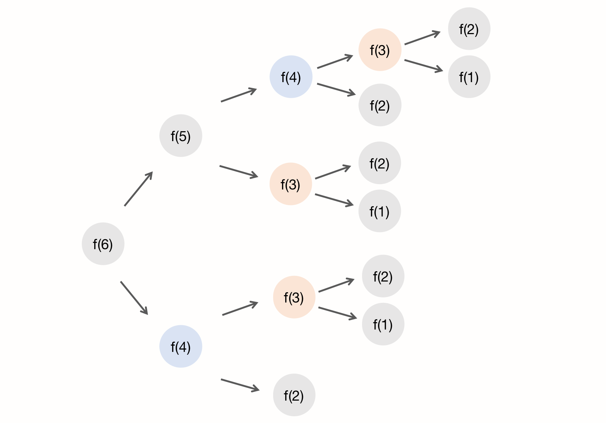

### 第八章、递归

> 如何用三行代码找到『最终推荐人』？

现在很多 App 都有一个功能，就是推荐新用户注册就会返还一部分红包，这个功能中，用户A 推荐了 用户B 注册，用户B 推荐了 用户C 注册，我们可以说，用户C 的最终推荐人是 用户A，用户B 的最终推荐人 也是用户A。

一般来说，我们会用数据库来记录这种推荐关系。在数据库表中，我们设计两个字段，actor_id 表示用户id，referrer_id 表示推荐人id。表结构和数据内容如下所示：

| actor_id | referrer_id |
| -------- | ----------- |
| B        | A           |
| C        | B           |
|          |             |

基于这个背景，请问给定一个用户Id，如何找到这个用户的『最终推荐人』？

#### 一、递归

学数据结构和算法，其中比较难理解的知识点，就是动态规划和递归。

递归是一种应用非常广泛的算法（或者说编程技巧）。比如 DFS深度优先搜索、前中后序二叉树遍历等，都需要用到递归，所以搞懂递归非常重要。

我这里有一个例子：一辆载满人的公交车，你勉强从后门挤了上去 ，这时候你从包里掏出公交卡，跟你前面的人说『帮忙刷下卡』，你前面的人就逐个往前递，直到靠近刷卡机的人刷了卡，这时候你的公交卡又依次往回传，直到传回你手里。这就是递归。我们用数学公式表示公交卡传递次数的数学模型：

``` mathematica
f(n) = f(n-1) + 1，其中 f(1) = 1
```

f(n) 表示你自己，f(n-1) 表示你前面的人，f(1) 表示离刷卡机最近的人。有了这个递推公式，我们就可以更轻松的将它改为递归代码：

``` java
int f(int n) {
  if (n == 1) {
    return 1;
  }
  return f(n-1) +1;
}
```

#### 二、满足递归的3个条件

刚刚这个例子非常典型，它也包含了满足递归需要的3个基本条件：

##### 1、一个问题的解可以分解为几个子问题的解

子问题就是数据规模更小的问题，比如，前面讲的公交车刷卡机距离的例子，你要知道公交卡被传递了多少次，你只需要知道前一个人被传递了多少次就行，这样一层层拆解。

##### 2、原问题 与 分解后的子问题，除了数据规模不同，求解思路完全相同

求解你与刷卡机的距离，和你前一个人与刷卡机的距离的思路，是一模一样的。

##### 3、存在递归终止条件

把问题分解为子问题，把子问题在分解为它的子问题，一层层分解下去，不可能存在无限循环。公交卡距离的终止条件，就是始终存在一个人离公交卡的距离只有1个单位，所以我们得到 f(1) = 1 的终止条件。

#### 三、递归代码编写

递归最关键的就是找到递归的**递推公式和终止条件**。下面我们用一个经典题目来举例：

> 假设有n个台阶，每次可以跨1个台阶或2个台阶，请问走到n个台阶一共有多少种走法？

##### 1、递推公式

实际上，可以根据第一步的走法，把所有走法分为2类，第一类是第一步走了1个台阶，第二类是第一步走了2个台阶。所以n个台阶的走法，等于先走了1阶后，n-1个台阶的走法，加上走了2阶后，n-2个台阶的走法，用公式表示：

``` mathematica
f(n) = f(n-1) + f(n-2)
```

##### 2、终止条件

当只有1个台阶时，我们不用继续递归，只有1种走法，因此 f(1) = 1。当只有2个台阶时，f(2) = f(1) + f(0)，如果终止条件只有一个 f(1)=1，则f(2) 就无法求解了，但 f(0) 实际并不存在，所以我们也把 f(2)=2 作为一个终止条件：

``` mathematica
f(1) = 1;
f(2) = 2;
```

结合第一步的递推公式，可以验证一下 n=3 和 n=4 时的能否满足。

##### 3、代码编写

由第一步和第二步，我们用简单的java代码将其翻译得到：

``` java
public static int f(int n) {
  if (n == 1) return 1;
  if (n == 2) return 2;
  return f(n-1) + f(n-2);
}
```

由此我们写出了一个递归。

#### 四、栈溢出

在实际的软件开发中，编写递归代码时我们会遇到很多问题，其中一个问题需要注意，就是 堆栈溢出。而堆栈溢出会造成系统性崩溃，且堆栈溢出在编码前不太容易预估。

在类似Java这样的开发语言中，函数调用会使用栈来保存临时变量。每调用一个函数，将会临时变量封装为栈帧并压入内存栈，等函数执行完成返回时，才出栈。系统栈或虚拟机栈空间一般都不大。如果递归求解的数据规模很大，调用层次很深，一直压入栈，当超过了初始设置的栈大小，就会有堆栈溢出的风险。

比如前面的例子中，如果我们将JVM的对战大小设置为 1KB，在求解 f(1000000) 时便会出现下面的报错：

``` java
Exception in thread "main" java.lang.StackOverflowError
```

我们可以通过在代码中主动设置其他终止条件，来限制递归调用的最大深度。比如我们设置一个临时的全局变量，用来计算栈深度，当超过1000时就不再继续递归下去了。我们可以将公交卡的例子改写成下面的伪代码：

``` java
// 全局变量，表示递归的深度。
int depth = 0;

int f (int n) {
  ++depth;
  if (depth > 1000) throw exception;
  if (n == 1) return 1;
  return f(n-1) + 1;
}
```

但这种做法并不能完全解决问题，因为最大允许的递归深度跟当前线程剩余的栈空间大小有关，这是运行时的变量，无法提前计算。如果实时计算，代码过于复杂，就会影响代码的可读性，所以如果最大深度比较小，比如10，50，就可以用这种方法，否则这种方法并不是很实用。

#### 五、警惕重复计算

我们用图来分析一下n个台阶走法这道题的递归过程，并假设n=6：




图中可以看到，在递归的过程中，f(4) 和 f(3) 都被计算过很多次，但实际上这些值可以在第一次计算就得到结果，后面的递归可以直接利用计算结果，减少递归的嵌套层数。

为了优化这个情况，我们可以用过一个数据结构（例如散列表）来保存已经求结果的 f(k) ，当递归调用到 f(k) 时，可以先看下是否已经求解过，若是，则直接取值返回。

按照上面的思路，我们得到下面优化后的伪代码：

``` java
HashMap<> hasSolvedList;

int f(int n) {
  if (n == 1) return 1;
  if (n == 2) return 2;
  // hasSolvedList的 key是n，value是f(k)
  if (hasSolvedList.containsKey(n)) {
    return hasSolvedList.get(n);
  }
  int res = f(n-1) + f(n-2);
  hasSolvedList.put(n, res);
  return res;
}
```

另外，在时间效率上，递归代码多了很多函数调用，当这些函数调用的数量比较大时，就会几句成一个可观的时间成本 。在时间复杂度上，因为递归调用会在内存栈中保存依次现场数据，所以在分析递归代码空间复杂度时，需要额外考虑这部分的开销，比如公交卡的例子，空间复杂度其实是 O(n)。

#### 六、递归改写为非递归

递归有利有弊，利是递归代码的表达力很强，写起来相对简洁，但空间复杂度高，有堆栈溢出的风险，存在重复计算、过多函数调用会耗时等诸多问题。所以在开发过程中，我们要根据实际情况来选择是否使用递归的方式来实现。

如果不用递归，我们仍可以使用循环的方式来解决问题，如公交卡的问题，我们由 `` f(n) = f(n-1) + 1`` 的公式，可以改写为下面的代码：

``` java
int f(int n) {
  int res = 1;
  for (int i = 2; i <= n; i++) {
    res += 1;
  }
  return res;
}
```

同样地，第二个n个台阶的问题也可以用非递归的方式实现：

``` java
int f(int n) {
  if (n == 1) return 1;
  if (n == 2) return 2;
  
  int res = 0;
  int pre = 2;
  int prepre = 1;
  for (int i = 3; i <= n; i++) {
    res = pre + prepre;
    prepre = pre;
    pre = res;
  }
  return res;
}
```

通俗地说，所有的递归都可以使用循环的方式改写，因为他们都有相类似的特性：都有终止条件。而且递归本身是借助栈来实现，循环也是使用栈来存储临时变量的。


