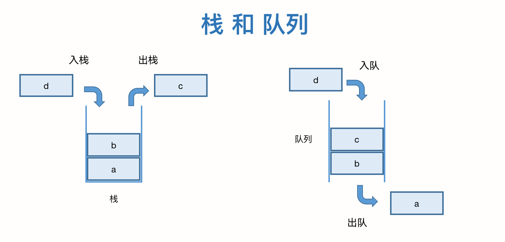

### 第七章、队列

> 当我们向固定大小的线程池中请求一个线程时，如果线程池中没有空闲资源，这时线程池如何处理这个请求？

#### 一、队列

队列和栈的模型很相似，不过队列是**先进先出（First In First Out）**的模型，有点像羽毛球球桶：


栈有2个基本操作：入栈 push() 和 出栈 pop()。队列的操作也很有限，最基本的操作也是两个：入队 enqueue()，在队尾添加一个元素；出队 dequeue()，从队头取出一个元素。



所以，队列和栈一样，也是一种 **操作受限的线性表数据结构**。队列的概念很好理解，基本操作也很容易掌握。作为一种非常基础的数据结构，队列的应用非常广泛，特别是一些具有额外特性的队列，比如循环队列、阻塞队列、并发队列等。他们在很多底层系统、框架、中间件的开发中，起到了关键性的作用。如高性能队列 Disruptor、Linux环形缓存，都用到了循环并发队列；Java Util Concurrent 并发包利用 ArrayBlockingQueue 来实现公平锁等。

#### 二、顺序队列

我们知道，队列和栈一样，也是一种抽象的数据结构。他具有 FIFO（First In First Out）的特性，支持在队尾插入元素，在队头删除元素。同样的，队列可以用数组来实现，称为**顺序队列**。也可以用链表来实现，称为**链式队列**。

下面我们基于数组来实现一个顺序队列：

``` java
/**
 * 顺序队列
 */
public class ArrayQueue<T> {
	// 存储元素的数组
	private Object[] items;
	// 队列的容量
	private int n;
	// 队头索引
	private int head;
	// 队尾索引
	private int tail;

	/**
	 * 构造方法
	 * @param capacity 初始容量
	 */
	public ArrayQueue(int capacity) {
		this.items = new Object[capacity];
		this.n = capacity;
		this.head = 0;
		this.tail = 0;
	}

	/**
	 * 入队操作
	 * @param data 入队的数据
	 * @return true则成功，false则失败
	 */
	public boolean enqueue(T data) {
		// 队列已满
		if (tail == n) {
			return false;
		}
		items[tail] = data;
		tail ++;
		return true;
	}

	/**
	 * 出队
	 * @return 队列中的元素
	 */
	@SuppressWarnings("unchecked")
	public T dequeue() {
		// 队头等于队尾，表示没有元素
		if (head == tail) {
			return null;
		}
		Object data = items[head];
		head ++;
		return (T) data;
	}

	/**
	 * 测试方法
	 * @param args 参数
	 */
	public static void main(String[] args) {
		ArrayQueue<String> ar = new ArrayQueue(2);
		System.out.println(ar.enqueue("lxmajs"));
		System.out.println(ar.enqueue("ddd"));
		System.out.println(ar.enqueue("test"));
		System.out.println(ar.dequeue());
		System.out.println(ar.dequeue());
		System.out.println(ar.dequeue());
	}
}
```

队列需要维护2个临时变量，head 用于表示队列的队头索引，它表示队头元素在数组中的索引下标；tail 用于表示队列的队尾索引，它表示队尾的索引下标。下图可以较清晰的表示队列：


我们设计的队列有一个弊端：随着不停的入队出队，head 和 tail 会持续的向后移动，直到 head 和 tail 都移动到最右边，这样会导致及时队列中有可用空间，但新的元素不能继续添加到队列中。

我们可以参考顺序栈的方法，当 tail 到了容量值，重新申请额外的空间，或进行一次数据搬移：

``` java
/**
 * 入队操作
 * @param data 入队的数据
 * @return true则成功，false则失败
 */
public boolean enqueue(T data) {
	// 队列已满
	if (tail == n) {
		// 判断head是否在队头，若不是，表示有空间进行数据搬移
		if (head == 0) {
			return false;
		}
		// 搬移数据
		for (int index = head; index < tail; index++) {
			items[head - index] = items[head];
		}
		// 设置游标
		tail = n - head;
		head = 0;
	}
	items[tail] = data;
	tail ++;
	return true;
}
```

从代码中可以看到，队列的 tail 指针移动到数组的最后边后，如果有新的元素入队，我们可以将 head 到 tail 之间的数据，整体搬移到数组 0 到 tail - head 的位置。搬移过程如下图所示：


在这种实现思路下，出队和入队的时间复杂度仍是O(1)。

#### 三、链式队列

基于链表的实现，我们同样需要2个指针 head 和 tail，head 指向第一个节点，但 tail 与顺序队列不同，它指向链表的最后一个节点。入队和出队的操作可以参考下图：


下面是具体的实现代码：

``` java
/**
 * 链式队列
 * @param <T>
 */
public class LinkedQueue<T> {
	// 队头
	private Node<T> head;
	// 队尾
	private Node<T> tail;

	/**
	 * 构造方法，初始化队列
	 */
	public LinkedQueue() {
		this.head = null;
		this.tail = head;
	}

	/**
	 * 入队
	 * @param data 队列元素
	 */
	public void enqueue(T data) {
		Node node = new Node(data);
		// 处理头节点
		if (null == this.head) {
			this.head = node;
			this.tail = this.head;
		} else {
			this.tail.next = node;
			this.tail = node;
		}
	}

	/**
	 * 出队
	 * @return 具体的数据
	 */
	public T dequeue() {
		// 队列为空
		if (null == this.head) {
			return null;
		}
		// 将头结点临时存储
		T h = this.head.getData();
		this.head = this.head.next;
		return h;
	}

	/**
	 * 定义队列的节点
	 * @param <E>
	 */
	public class Node<E> {
		// 当前节点的数据
		public Object data;
		// 下一个节点的指针
		public Node next;
		// 构造方法
		public Node(E d) {
			this.data = d;
			this.next = null;
		}
		// 获得具体的数据内容
		public T getData() {
			return (T) data;
		}
	}

	/**
	 * 测试方法
	 * @param args
	 */
	public static void main(String[] args) {
		LinkedQueue<String> ar = new LinkedQueue();
		ar.enqueue("lxmajs");
		ar.enqueue("ddd");
		ar.enqueue("test");

		System.out.println(ar.dequeue());
		System.out.println(ar.dequeue());
		System.out.println(ar.dequeue());
	}
}
```

#### 四、循环队列

在上面的顺序队列中，当空间不足时，我们会触发1次数据搬移，这样入队的操作性能会受影响。我们可以采用循环队列来优化。

顾名思义，循环队列的抽象模型是一个环。在初始的顺序队列中，数组有 head 和 tail，是一条直线，我们将首尾对接，形成一个环，如下图所示：


从图中可以看到，这个示例队列的大小是8，当前 head = 3，tail = 7。当有一个新的元素 e 入队时，我们放入下标为 7 的位置，同时将 tail 更新为 0。当再有一个新的元素 f 入队时，我们将 f 放在 0 的为止，然后 tail 向后移动到 1。依次加入队列后的示意图如下所示：


这样的实现我们可以避免数据搬移操作，但循环队列的实现相对复杂，核心的要点是 **确定好队空和队满的判定条件。**下图展示了一个队满情况下的循环队列示意图：


在用数组实现的非循环队列中，队满的判断条件是 tail == n，队空的判断条件是 head == tail。针对循环队列，队空的判断条件仍然是 head == tail，但队满时，tail 指针指向的元素将会是 head，即 tail + 1 == head，但这里个特殊情况，即 tail = 7，head = 0 时，tail + 1  = 8，因此需要对数组大小取余，我们得到 **(tail + 1)%n == head**。

另外我们发现 tail 指针指向的位置并没有存储数据，所以循环队列会浪费一个数组的存储空间。下面给出循环队列的示例代码：

``` java
/**
 * 循环队列
 */
public class CircularQueue<T> {
	// 存储元素的数组
	private Object[] items;
	// 队列的容量
	private int n;
	// 队头索引
	private int head;
	// 队尾索引
	private int tail;

	/**
	 * 入队
	 * @param data 元素数据
	 * @return true表示入队成功，false表示失败
	 */
	public boolean enqueue(T data) {
		// 判断队列是否已满
		if ((tail + 1) % n == head) {
			return false;
		}
		items[tail] = data;
		tail = (tail + 1 ) % n;
		return true;
	}

	/**
	 * 出队
	 * @return 弹出一个元素
	 */
	public T dequeue() {
		// 队头等于队尾，表示没有元素
		if (head == tail) {
			return null;
		}
		Object data = items[head];
		head ++;
		return (T) data;
	}

	/**
	 * 测试方法
	 * @param args 参数
	 */
	public static void main(String[] args) {
		ArrayQueue<String> ar = new ArrayQueue(2);
		System.out.println(ar.enqueue("lxmajs"));
		System.out.println(ar.enqueue("ddd"));

		System.out.println(ar.dequeue());

		System.out.println(ar.enqueue("test"));

		System.out.println(ar.dequeue());
		System.out.println(ar.dequeue());
	}
}
```

