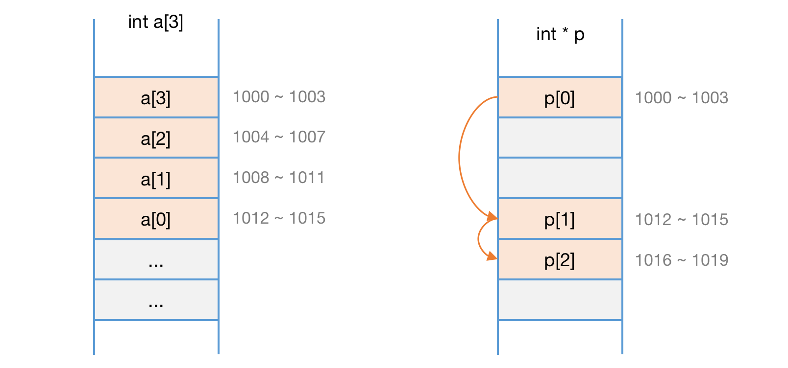
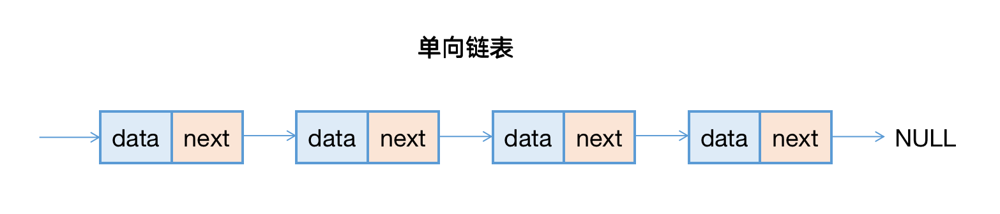
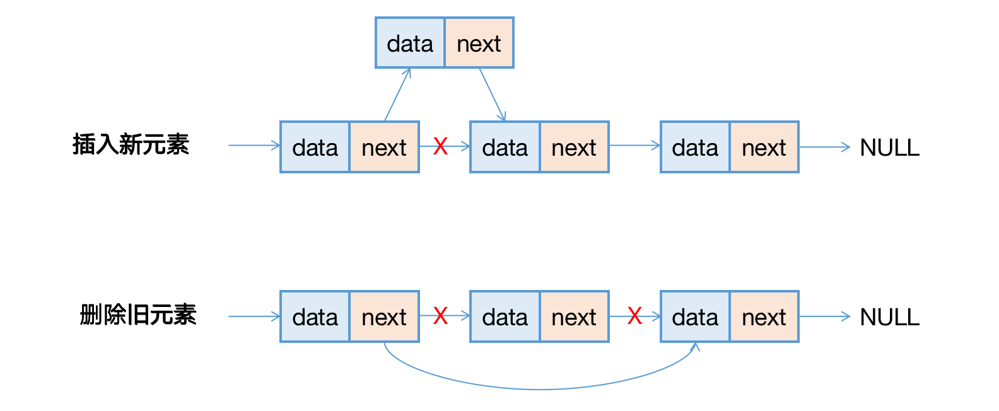
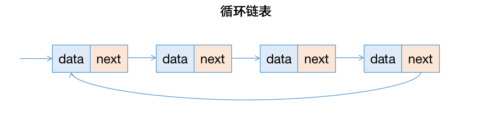

### 第五章、链表

> 如何实现 LRU 缓存淘汰算法？

链表也是由一个个基础元素组成的线性结构，但与数组相比，它并不需要连续的内存空间。每个链表的元素我们称其为节点，每个节点维护指针，由这些指针的相互引用，将零散的节点串联起来组成链表。链表和数组的内存分布如下图所示：



链表节点的指针有很多种方式，所以链表有很多演变类型，我们将着重介绍：单向链表、双向链表、循环链表。

#### 一、单向链表

单向链表的内存模型就如上图的例子，每个节点维护一个数据部分和指针部分，指针指向下一个节点，Java示例代码参考如下：

``` java
public class SingleLinkedList {
	public class ListNode {
		// 数据部分
		private Object data;
		// 指向下个节点的指针
		private ListNode next;
	}
	private ListNode first;
  private int size;
}
```

``ListNode`` 表示链表节点，节点由 ``data``  和 ``next`` 共同组成，而链表需要头节点和链表大小即可，其余操作均是针对头节点展开。一个简单的链表结构如下图所示：



在数组进行插入、删除时，为了保证数组的内存连续性，需要做大量的数据搬移，因此时间复杂度是 O(n)，而单向链表中插入和删除非常的快速，并不需要维护内存的连续性，我们只考虑相邻节点的指针变更，所以对应的时间复杂度是 O(1)。如下图所示：



但是单向链表想要访问第 k 个元素时，不能如数组一样高效，因为链表的数据并非连续存储的，所以不能通过寻址公式直接进行随机访问，而需要根据指针一个个向后遍历，直到找到对应的节点。

#### 二、循环链表

开局一张图，演示循环链表的结构图：



循环链表是单向链表的变体，尾节点的指针不再指向 NULL（空值），而是指向头节点。和单向链表相比，循环链表的优点是从尾部到头部比较方便，当处理的数据具有环形结构特点时，比较适合采用虚幻链表。比如著名的 [约瑟夫问题](https://baike.baidu.com/item/%E7%BA%A6%E7%91%9F%E5%A4%AB%E9%97%AE%E9%A2%98/3857719?fr=aladdin)。尽管用单向链表也能实现，但是用循环链表就会简单很多。


