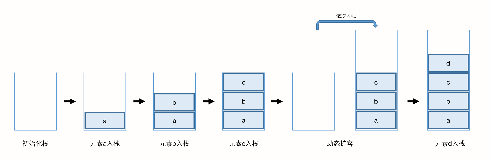
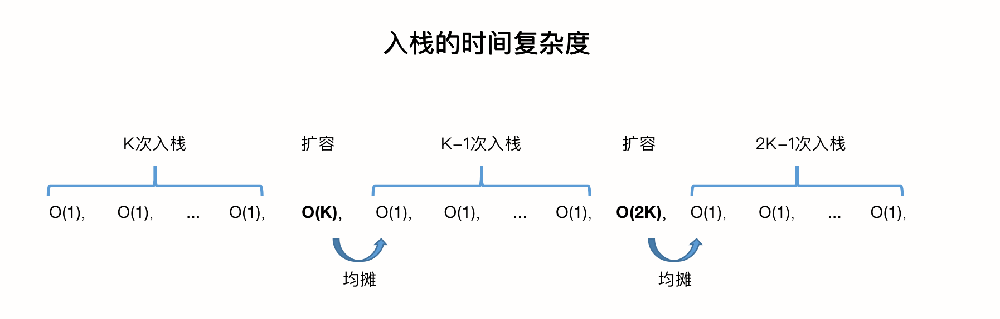
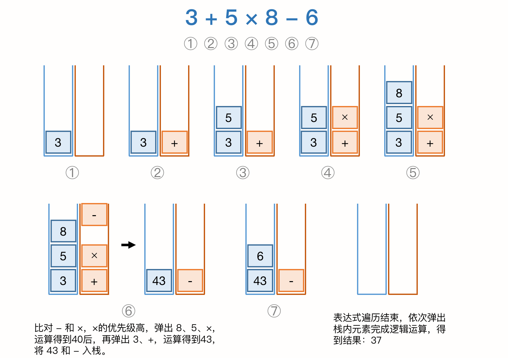

### 第六章 栈

> 如何实现浏览器的前进和后退？

超市里卖的桶装薯片，就是一个典型的栈的模型了。


从栈的操作特性上来看，他是一种『操作受限』的线性表，只允许在一端插入和删除数据。从功能上来说，数组或链表确实可以代替栈，但特定的数据结构是应对也定场景的抽象，而且数组或链表暴露了太多操作接口，灵活自由的同时也使得其不可控，自然也更容易出错。

**当某个数据集合只涉及在一端插入和删除数据，并且满足先进后出，后进先出的特性时，我们可以首选『栈』这个数据结构。**

#### 一、实现一个栈

从栈的基本操作上看，栈主要包含两个操作，入栈和出栈，也就是在栈顶插入和弹出一个数据。实际上，栈可以用数组来实现，也可以用链表来实现。用数组实现的栈称为**顺序栈**，用链表实现的栈称为**链式栈**。

这里我们用数组实现一个栈，并用Java语言表达出来：

``` java
/**
 * 自定义顺序栈
 * @param <T> 数据类型
 */
public class ArrayStack<T> {
	// 数据存储对象数组
	private Object[] items;
	// 栈中的元素总数
	private int count;
	// 栈的容量大小
	private int n;
	/**
	 * 初始化栈
	 */
	public ArrayStack (int n) {
		this.items = new Object[n];
		this.n = n;
		this.count = 0;
	}
	/**
	 * 插入元素
	 * @param item 数据
	 * @return 成功与否
	 */
	public boolean push(Object item) {
		// 如果数量超过容量，则直接返回false
		if (count >= n) {
			return false;
		}
		// 插入一个新元素
		items[count] = item;
		count++;
		return true;
	}
	/**
	 * 弹出一个元素
	 * @return 元素
	 */
	@SuppressWarnings("unchecked")
	public T pop() {
		if (count == 0) {
			return null;
		}
		count--;
		return (T) items[count];
	}
	// 测试方法
	public static void main(String[] args) {
		ArrayStack<String> as = new ArrayStack<>(1);
		System.out.println(as.push("lxmajs"));
		System.out.println(as.push("ddd"));
		System.out.println(as.pop());
		System.out.println(as.pop());
	}
}
```

不管是顺序栈还是链式栈，我们村出数据只需要一个大小为n的数组就足够，在入栈和出栈的过程中，只需要一两个临时变量存储空间，所以时间复杂度是 O(1)。

>  注意，这里存储数据需要一个大小为n的数组，并不是说空间复杂度是 O(n)，因为这个n必须是必须的，无法省掉。所以我们说空间复杂度的时候，是指除了原本的数据存储空间外，算法运行还需要的额外的存储空间。

另外，不管是入栈还是出栈，只涉及到栈顶个别数据的操作，所以时间复杂度都是 O(1)。

链式栈的实现如下：

``` java
/**
 * 链式栈
 * @param <T> 数据存储对象
 */
public class LinkedStack<T> {
	// 数据存储对象链表
	private LinkedStackNode<T> top;

	/**
	 * 构造方法
	 */
	public LinkedStack() {
		this.top = null;
	}

	/**
	 * 入栈
	 * @param data 数据内容
	 */
	@SuppressWarnings("unchecked")
	public void push(Object data) {
		LinkedStackNode node = new LinkedStackNode(data, null);
		if (null == this.top) {
			// 栈内无元素
			this.top = node;
		} else {
			node.next = this.top;
			this.top = node;
		}
	}

	/**
	 * 出栈
	 * @return 数据内容
	 */
	@SuppressWarnings("unchecked")
	public T pop() {
		if (null == this.top) {
			return null;
		}
		T data = this.top.getData();
		this.top = this.top.next;
		return data;
	}

	/**
	 * 实现一个打印所有栈内元素的方法
	 */
	public void printAll() {
		if (null == this.top) {
			System.out.println("Stack is empty.");
		}
		LinkedStackNode node = this.top;
		while (null != node) {
			System.out.println(node.getData());
			node = node.next;
		}
	}

	/**
	 * 定义链表结构
	 * @param <E>
	 */
	private class LinkedStackNode<E> {
		// 数据本体
		private Object data;
		// 下一个节点的指针
		private LinkedStackNode next;

		/**
		 * 构造方法
		 * @param data 数据本体
		 * @param next 下一个节点
		 */
		public LinkedStackNode(Object data, LinkedStackNode next) {
			this.data = data;
			this.next = next;
		}

		/**
		 * 获取数据内容
		 * @return 数据内容
		 */
		@SuppressWarnings("unchecked")
		public E getData() {
			return (E) data;
		}
	}

	public static void main(String[] args) {
		LinkedStack<String> ls = new LinkedStack<>();
		ls.push("lxmajs");
		ls.push("ddd");
		ls.printAll();
		System.out.println(ls.pop());
		System.out.println(ls.pop());
	}
}
```

也可以访问我的 [github仓库](https://github.com/LXMAJS/LeetCode/blob/master/src/main/java/temp/Algorithm/LinkedStack.java ) 查看。

#### 二、支持动态扩容的顺序栈

我们上面实现的栈，是一个固定大小的栈，栈的大小在初始化的时候就需要事先指定，当栈满的时候，无法继续插入数据。尽管链式栈的大小不受限，弹药存储 next 指针，内存消耗相对较多。

数组的动态扩容，是当空间不够时，重新申请一块更大的内存，将原来数组中的数据统统拷贝过去。类似的，要实现一个动态扩容的栈，我们需要底层一来一个支持动态扩容的数组即可。当栈满之后，就可以申请一个更大的数组，将原来的数据搬移到新数组中，扩容过程如下图所示：



因为出栈的操作不涉及动态扩容，所以我们来分析一下入栈的时间复杂度。为了方便分析，我们假设：

1. 动态扩容时，重新申请的栈大小是原来的2倍；
2. 定义不涉及内存半一的入栈操作为 simple-push 操作，时间复杂度为 O(1)；

若当前栈的大小是 K，并且已经满容，当有新元素要入栈时，就需要申请 2K 大小的内存，并将 K 个元素做数据搬移操作，然后新元素才能入栈，接下来可以进行 2K-1 次 simple-push 操作。而当第 2K 个元素入栈时，又需要进行一次扩容。下图可以直观的给出时间复杂度分析：



我们可以看到，以扩容作为分割点，第一阶段的入栈，都是 simple-push 操作，第一次扩容涉及到 K 个元素的数据搬移 和 K 次 simple-push 操作。以此类推，入栈操作的均摊时间复杂度就是 O(1)。

#### 三、表达式求值

对于四则运算，人脑可以很快的看到表达式并求值，但是对计算机来说，理解四则运算表达式本身就比较难。实际上编译器是通过2个栈来实现的。其中一个栈保存操作数，一个栈保存运算符，从左向右遍历表达式，遇到数字时压入操作数栈，遇到运算符，就与栈顶元素进行比较：

如果比运算符栈顶的优先级高，就将当前运算符入栈，如果低或相同，则从运算符栈中取出栈顶元素，从操作数栈取2个操作数，进行运算，再压入操作数栈。

我们用 **3 + 5 × 8 - 6** 来演示执行过程：



另外，我们还可以用一个栈来保存括号，并针对表达式的括号完整性做检查，示例代码如下（这里使用Java提供的Stack类）：

``` java
/**
 *
 * @param args
 */
public static void main ( String[] args ) {
    System.out.println (isValid ( "([]" ));
}
/**
 *
 * @param c
 * @return
 */
public static boolean isLeft(char c){
    if(c == '{' || c == '[' || c == '('){
        return true;
    } else {
        return false;
    }
}
/**
 *
 * @param c
 * @return
 */
public static boolean isRight(char c){
    if(c == '}' || c == ']' || c == ')'){
        return true;
    } else {
        return false;
    }
}
/**
 *
 * @param s
 * @return
 */
public static boolean isValid(String s) {
    boolean isValid = false;
    Stack<Character> stack = new Stack<Character> ();
    char[] charArray = s.toCharArray ();
    if(charArray.length <= 0)
        return true;
    int i = 0;
    for (; i < charArray.length; i++) {
        if (isLeft ( charArray[i] )) {
            stack.push ( charArray[i] );
        }
        else if(isRight ( charArray[i] )) {
            // 如果栈为空，却有右括号，那么一定没有左括号，直接返回失败
            if(stack.empty ())
                break;
            char popChar = stack.pop ();
            switch (charArray[i]) {
                case '}':
                    isValid = popChar == '{';
                    break;
                case ']':
                    isValid = popChar == '[';
                    break;
                case ')':
                    isValid = popChar == '(';
                    break;
                default:
                    break;
            }
            if (!isValid)
                break;
        } else{
            // 不是左括号也不是右括号，是别的字符，直接跳过
            continue;
        }
    }
    if(i < charArray.length){
        return false;
    }
    return isValid;
}
```

#### 四、浏览器前进和后退

我们可以使用2个栈，当用户访问一个新站点时，压入栈1。当使用后退功能时，从栈1弹出站点，并压入栈2中。使用前进功能时，从栈2弹出站点，压入栈1，以此实现前进和后退。


