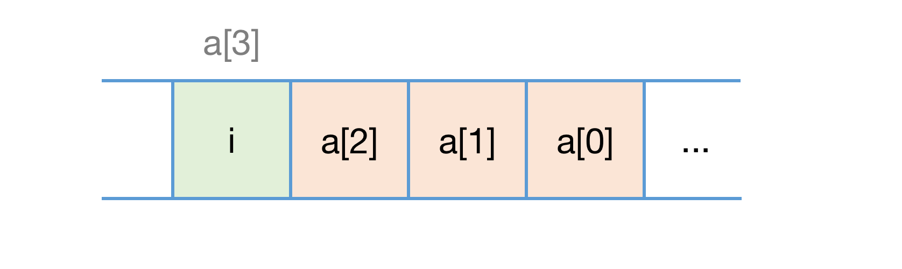

### 第四章、数组

> 为什么很多编程语言中，数组都是从 0 开始编号？

#### 一、如何实现随机访问？

数组（Array），是一种线性表数据结构，它用一组连续的内存空间，来存储一组具有相同类型的数据。其中，线性表（Linear List），是数据排成一条线一样的结构。每个线性表的数据最多只有前和后两个方向。除了数组以外，链表、队列、栈 等也是线性表结构，而二叉树、堆、图 等都是非线性结构，因为在非线性表中，数据值见并不是简单的前后关系。

在初始化数组时，计算机会为数组分配连续的内存空间，当计算机需要访问某个元素时，会先通过选址公式计算出元素的内存地址：

```mathematica
a[i]_address = base_address + (i * data_type_size)
```

其中，``data_type_size`` 表示数据元素的大小，假设数组的元素是 int，那么 data_type_size 就是 4个字节。数组适合查找操作，排好序的数组使用二分查找法，其时间复杂度是 O(nlogn)，使用数组下标随机访问数组的时间复杂度是 O(1)。

#### 二、低效的 "插入" 和 "删除"

为了使得上述的选址公式一直有效，在插入和删除数组元素时，必须将空位填补上，来保证数组在内存地址中的连续性。

假设数组的长度是n，往数组中第k个位置插入一个元素时，为了给新的元素腾地方，我们需要将 k~n 的元素都往后挪一位。如果在末尾插入，则不需要挪动元素，时间复杂度是 O(1)，如果在头部插入，则需要挪动整个数组，时间复杂度是 O(n)，按平均情况计算，其时间复杂度也是 O(n)。

如果数组元素是有序的，为了保证其顺序不变，在第k个位置插入时需要把挪动后面的数组后再执行插入。但如果是无序的数组，我们大可以将原来的第k个元素放到末尾，再直接插入新的元素就好。利用这种技巧，我们可以把插入的时间复杂度降低到 O(1)。

删除也是可以用类似的方法，如果我们要删除一些连续的元素，为了避免多次数据搬运，可以记录下删除的元素，在执行插入时可以替换原本被删除的元素即可，当没有更多的空间时，再触发执行一次真正的删除。JVM中的年轻代的标记清除算法，就是类似的处理。

#### 三、访问越界

在C语言中，数组越界通常是不容易被发现的错误，举个例子：

``` C
int main(int argc, char* argv[]) {
  int i = 0;
  int arr[3] = 0;
  for(; i<=3; i++) {
    arr[i] = 0;
    printf("hello world\n");
  }
  return 0;
}
```

因为数组的大小是3，坐标值范围在 [0, 2] 以内，而 for 循环的终止条件是  ``i<=3``，这使得循环体会执行4次，导致在执行到  ``arr[i] = 0`` 的时候，发生数组越界（ *此时会访问到变量 i* ），导致死循环，并无限输出 ``hello world``。在 C语言中，数组越界是一种未决行为，没有规定数组访问越界时编译器应该如何处理，因为访问数组本就是访问一段连续的内训，只要数组通过偏移计算得到的内存地址是可用的，那么程序就不会报错。这种情况下一般会出现一些逻辑错误，且Debug的难度很大，**一些计算机病毒就是利用了代码中的数组越界，来访问非法地址进而攻击系统**。

而 Java语言在运行时会做越界检查，若发生越界会抛出 ``java.lang.ArrayIndexOutOfBoundsException`` 的异常。

> 在Lunix进程的内存布局中，栈区在高地址空间，从高地址向低地址增长。变量 i 和 arr 在相邻地址，且 i 比 arr 的地址大，所以 arr越界的时候，刚好访问到 i 。当然，这里的前提是 arr 的类型 和 i 是一样的，否则这段代码仍然是未决行为。
>
> 另外，因为例子中刚好数组是3个元素，加上一个变量 a，4个整数刚好满足8字节对齐，所以 i 的地址刚好跟在 a[2] 后面，导致 a[3] = 0 这个赋值语句执行后，变成了 i = 0，此时重置了循环条件，让 for 循环无法终止，变成死循环。
>
> 

#### 四、容器与数组

针对数组类型，有很多语言提供了容器类，比如 Java的 ArrayList、C++ STL中的 vector，容器有很多优势，它把对数组的操作都封装起来，比如数组插入、删除数组需要搬移数据，动态扩容等。数组本身在定义时需要指定大小，因为需要分配连续的内存空间。若原来的数组大小不够，就需要动态申请内存，将原来的数组搬运到新的数组中。但如果使用容器类，就不需要担心底层的扩容逻辑，比如 ArrayList会在内存不够时自动扩容到 1.5 倍大小。不过扩容仍然十分耗时，所以在使用容器时也最好先指定大小。

比如，我们用 Java中的 ArrayList 存储 100w个数字，ArrayList 在 JDK1.8版本中的默认初始容量是10，我们对比在提前设置容器大小 和 不设置容器大小时的插入耗时：

``` java
public static void main(String[] args) {
	long beginTime = System.currentTimeMillis();
	System.out.println("Begin : " + beginTime);
	ArrayList<Integer> arr = new ArrayList<>(); // 未指定大小
	// ArrayList<Integer> arr = new ArrayList<>(1000000); // 指定大小
	for (int index = 0; index < 1000000; index ++) {
		arr.add(index);
	}
	long endTime = System.currentTimeMillis();
	System.out.println("End : " + endTime);
	System.out.println("Gap : " + (endTime - beginTime));
}
```

两次的执行结果：

``` shell
-- 未指定大小
Begin : 1637724847428
End : 1637724847468
Gap : 40

-- 指定大小
Begin : 1637724871878
End : 1637724871903
Gap : 25
```

可以看到指定大小时的执行时间少于动态内存申请，若量级再大些这个差距将会更明显。

综上，我们对比容器和数组，得到下面几点经验：

1. Java ArrayList 无法存储基本类型，比如 int、long，需要封装为对应的 Integer、Long类，而装箱和拆箱有一定的性能消耗，若对性能十分关注，或希望使用基本类型，可以选择数组；
2. 如果数据大小事先已知，且对数组的操作十分轻量，可以选择数组；
3. 若表示多维数组时，编码上使用数组更简洁直观，比如：``Object[][] array`` 和 ``ArrayList<ArrayList<Object>> array``；

对于业务开发，使用容器省时省力，因为一点点的性能损耗完全不会直接影响整体系统性能。但如果是底层开发，如网络框架，性能的优化需要做到极致，有时候数组会优于容器，成为首选。

#### 五、数组编号

从数组的内存模型上看，『下标』最确切的定义应该是『偏移量(offset)』。若用 a 表示数组的首地址，a[0] 就是偏移为 0 的位置，也就是首地址，a[k] 就表示偏移了 k 个 type_size 的位置，那么计算 a[k] 的内存地址的公示可表示为：

``` mathematica
a[k]_address = base_address + k * type_size
```

但是如果数组从1开始计算，那么我们计算数组元素的内存地址就会变为：

``` mathematica
a[k]_address = base_address + (k-1) * type_size
```

对比两个公式，从 1 开始计算下表，每次随机访问数组元素会多一次减法操作，对于 CPU 来说是多一次减法指令。而数组作为很基本且常用的数据结构，效率的优化需要尽可能做到极致，所以为了减少一次减法，数组选择从 0 开始编号。

而这应该是出于历史原因考虑的，且在早期对计算机的数据结构设计十分严苛。而 C语言设计者作为最初且最底层的语言设计者选择从 0 开始后，Java、JavaScript 等语言的设计都效仿了 C语言，一定程序为了减少学习成本。但很多语言也并非从0开始，Python更是支持负下标。
