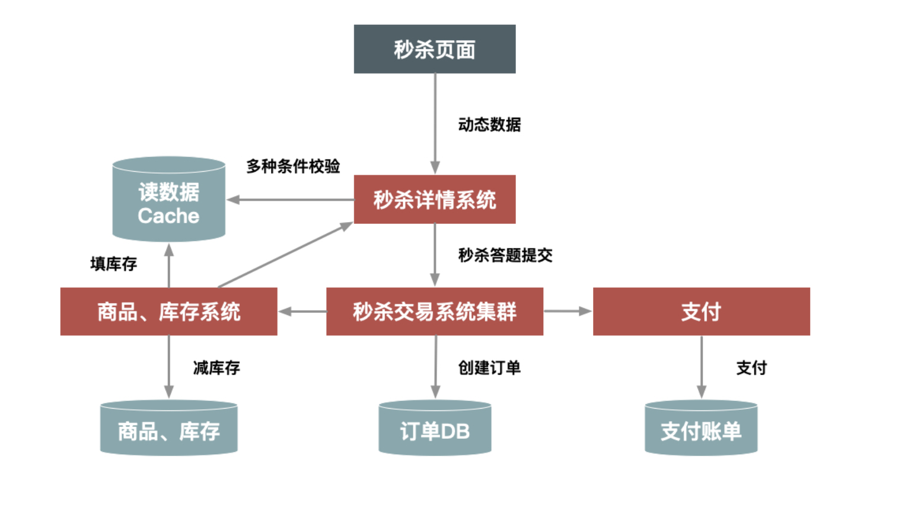
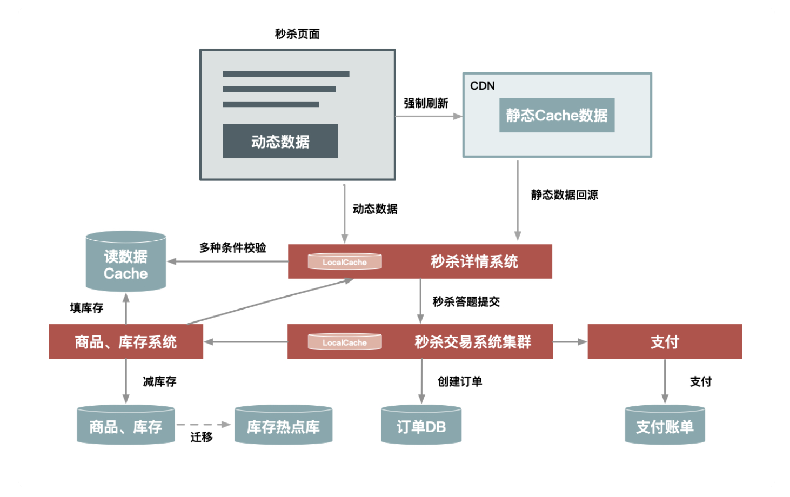

### 第一章 设计秒杀系统时应该注意的5个架构原则

如果你是一个架构师，首先要勾勒出一个轮廓，想一想如何构建一个超大流量并发读写、高性能、高可用的系统，这几种有哪些要素需要考虑。我把这些要素总结为“4要1不要”

#### 一、架构原则：4 要 1 不要

##### 1. 数据要尽量少

作为“数据要尽量少”，首先时之用户请求的数据能少就少。请求的数据包括上传给系统的数据和系统返回的数据（通常就是网页）。

为什么呢？因为首先这些数据在网络上传输需要时间，其次不管是请求数据还是返回数据都需要服务器做处理，而服务器在写网络时通常都要做压缩和字符编码，这些都非常消耗 CPU，所以减少传输的数据量可以显著减少 CPU 的使用。例如，我们可以简化秒杀页面的大小，去掉不必要的页面装修效果，等等。

其次，还要求系统依赖的数据能少就少，包括系统完成某些业务逻辑需要读取和保存的数据，这些数据一般是和后台服务以及数据库打交道的。调用其他服务会设计数据序列化和反序列化，而这也是 CPU 的一大杀手，同样也会增加延时。而且，数据库本身也容易成为一个瓶颈，所以和数据库打交道越少越好，数据越简单越小则越好。

##### 2. 请求数要尽量少

用户请求的页面返回后，浏览器渲染这个页面还要包涵其他的额外请求，比如说，这个页面依赖的 CSS/Javascript、图片、以及 Ajax 请求等等都定义为额外请求，这些额外请求应该尽量少。因为浏览器每发出一个请求都多少会有一些消耗，例如建立连接要做三次握手，有的时候有页面依赖或者连接数限制，一些请求（例如 Javascript）还需要串行加载等。另外，如果不同请求的域名不一样的话，还涉及这些域名的 DNS 解析，可能会消耗更久。所以你要记住的是，减少请求数可以显著减少以上因素导致的资源消耗。

例如：减少请求数最常用的一个实践就是合并 CSS 和 Javascript 文件，把多个 Javascript 文件合并成一个文件，在URL中用逗号隔开。这种方式在服务端仍然是单个文件各自存放，只是服务端会有一个组件解析这个 URL，然后动态把这些文件合并起来一起返回。

##### 3. 路径尽量要短

所谓“路径”，就是用户发出请求到返回数据这个过程中，需求经过的中间的节点数。

通常，这些节点可以表示为一个系统或者一个新的 Socket 连接（比如代理服务器只是创建一个新的 Socket 连接来转发请求）。每经过一个节点，一般都会产生一个新的 Socket 连接。

然而每增加一个连接都会增加新的不确定性。从概率统计上来说，假如一次请求经过5个节点，每个节点的可用性是 99.9% 的话，那么整个请求的可能性就是 99.9% 的5次方，约等于 99.5%。

要缩短请求路径不仅可以增加可用性，同样可以有效地提升性能（减少中间节点可以减少数据的序列化和反序列化），并减少延时（可以减少网络传输耗时）。

要缩短访问路径有一种办法，就是多个相互依赖的应用合并部署在一起，把远程过程调用（RPC）变成 JVM 内部之间的方法调用。在《大型网站技术架构演进与性能优化》一书中，我也有一章介绍了这种技术的详细实现。

##### 4. 依赖要尽量少

所谓依赖，指的是要完成一次用户请求，必须依赖的系统或者服务，这里的依赖指的是强依赖。

举个例子，比如说你要展示秒杀页面，而这个页面必须强依赖商品信息、用户信息，还有其他如优惠券、成交列表等这些对秒杀不是非必要的信息（弱依赖），这些依赖在紧急情况下可以去掉。

要减少依赖，我们可以给系统进行分级，比如 0 级系统、1 级系统、2 级系统、3 级系统。0 级系统如果是最重要的，那么 0 级系统强依赖的系统也同样是最重要的，以此类推。

注意，0 级系统要尽量减少对 1 级系统的强依赖，防止重要的系统被不重要的系统拖垮。例如支付系统是 0 级系统，而优惠券是 1 级系统的话，在极端情况下，可以把优惠券给降级，防止支付系统被优惠券这个 1 级系统给拖垮。

##### 5. 不要有单点

系统中的单点可以说是系统架构上的一个大忌，因为单点意味着没有备份，风险不可控，我们设计分布式系统最重要的原则就是“消除单点”。

这其中的关键点是避免将服务的状态和机器绑定，即把服务无状态化，这样服务就可以在机器中随意移动。其实现方式也有很多种，比如把和机器相关的配置动态化，这些参数可以通过配置中心来动态推送，在服务启动时，动态拉取下来，我们在这些配置中心设置一些规则来方便地改变这些映射关系。

应用无状态化，是有效避免单点的一种方式，但是像存储服务本身很难无状态化，因为数据要存储在次盘上，本身就要和机器绑定，那么这种场景一般要通过冗余多个备份的方式来解决单点问题。

前面介绍的这些设计上的一些原则，都用了“尽量”，而不是“绝对”，架构是一种平衡的艺术，而最好的架构一旦脱离了它所适应的场景，一切都将是空谈。这里所说的几点，都只是一个方向，我们应该尽量往这些方向上去努力，但也要考虑平衡其他因素。

#### 二、不同场景下的不同架构案例

如果你想快速搭建一个简单的秒杀系统，只需要把你的商品购买页面，增加一个“定时上架”的功能，仅在秒杀开始时才让用户看到购买按钮，当商品的库存卖完了也就结束了。这就是当时第一个版本的秒杀系统实现方式。

但随着请求量的加大（比如从 1w/s 增加到 10w/s 的量级），这个简单的架构很快就遇到了瓶颈，因此需要做架构改造来提升系统性能：

1. 把秒杀系统独立出来单独打造一个系统，这样可以有针对性地做优化；
2. 在系统部署上也独立做一个机器集群，这样秒杀的大流量就不会影响到正常商品购买集群的机器负载；
3. 将热点数据（例如库存数据）单独存放在一个缓存系统中，以提高“读性能”；
4. 增加秒杀答题，防止有秒杀器抢单；

此时的系统架构变成了这样：

最重要的就是，秒杀详情成立为一个独立的新系统，另外核心的一些数据放到了缓存（Cache）中，其他的关联系统也都可以独立集群的方式进行部署。

然而这个架构仍然支持不了超过 100w/s 的请求量，所以为了进一步提升秒杀系统的性能，我们又对架构做进一步升级，比如：

1. 对页面进行彻底的动静分离，使得用户秒杀时不需要刷新整个页面，而只需要点击抢宝按钮，借此把页面刷新的数据降到最少；
2. 在服务端对秒杀商品进行本地缓存，不需要再调用依赖系统的后台服务获取数据，甚至不需要去公共的缓存集群中查询数据，这样不仅可以减少系统调用，还能避免压垮公共缓存集群；
3. 增加系统限流保护，防止最坏情况发生；

经过这些优化，系统架构变成了这样：

在这里，我们对页面进行了进一步的静态化，秒杀过程中不需要刷新整个页面，而只需要向服务端请求很少的动态数据。而且，最关键的详情和交易系统都增加了本地缓存，来提前缓存秒杀商品的信息，热点数据库也做了独立部署。

从前面几次升级来看，其实越到后面需要定制的地方越多，也就是越不够“通用”，例如，把秒杀商品缓存在每台机器的内存中，这种方式显然不合适太多的商品同时进行秒杀的情况，因为单机的内存始终有限，所以要取得极致的性能，就要在其他地方（比如 通用性、易用性、成本等方面）有所牺牲。

