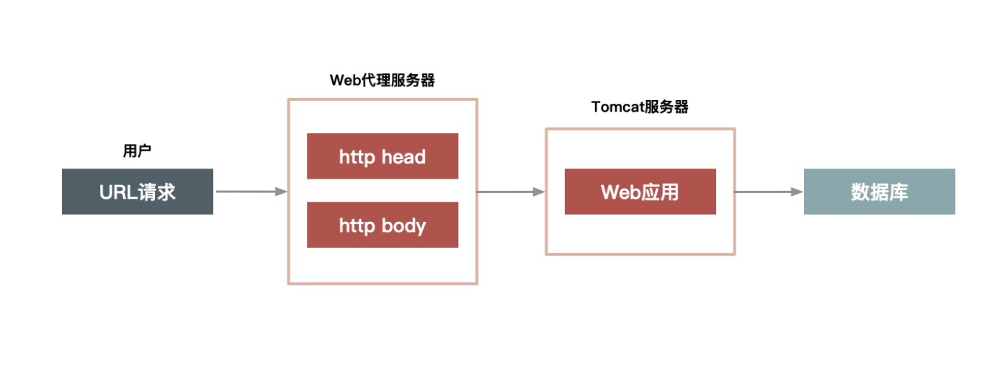

### 第二章 如何做好动静分离

上一章中我们提到的5个原则，其实都为了秒杀系统的根本要求：快、准、稳，那么怎样才能”快“起来？抽象地说，只有2点：

1. 提高单次请求的效率
2. 减少没必要的请求

而能做好这两点，离不开 **“动静分离”**。

#### 一、何为动静数据

所谓动静分离，其实是把用户请求的数据（如 HTML页面、CSS、数据）划分为动态数据和静态数据。简单来说，**二者的区别在于页面中输出的数据，是否和 URL、浏览者、实践、地域相关，以及是否含有 Cookie 等私密数据**。比如说：

1. 很多媒体类网站，某一篇文档的内容，不管是你访问还是我访问，都是一样的，所以它就是一个典型的静态数据，但是它是一个动态页面；
2. 我们如果现在访问淘宝的首页，每个人看到的页面可能都是不一样的，淘宝首页中包含了很多根据访问者特征推荐的信息，而这些个性化的数据就可以理解为动态数据；

强调一下，我们所说的静态数据，不能仅仅理解为传统意义上完全存在磁盘上的 HTML 页面，它也可能是经过 Java 系统产生的页面，但是它输出的页面本身不包含上面所说的那些因素。也就是所谓“动态”还是“静态”，并不是说数据本身是否动静，而是数据中是否含有访问者相关的个性化数据。

还有一点要注意，就是页面中“不包含”，指的是“页面的 HTML 源码中不含有”，这一点务必要清楚。

理解了静态数据和动态数据，我估计你很容易就能想明白“动静分离”这个方案的来龙去脉了。分离了动静数据，我们就可以对分离出来的静态数据做缓存，有了缓存之后，静态数据的“访问效率”自然就提高了。

要对静态数据做缓存，有几个重点：

1. **应该把静态数据缓存到离用户最近的地方。**静态数据就是那些相对不会变化的数据，因此我们可以把他们缓存起来，比如 用户浏览器、CDN 或者 服务端的 Cache中。
2. **静态化改造就是要直接缓存 HTTP 连接**。相较于普通的数据缓存而言，系统的静态化改造也是一点。直接缓存 HTTP 连接，而不仅仅缓存数据。如下图所示：
   
   Web 代理服务器根据请求 URL，直接取出对应的 HTTP 响应头和响应体然后直接返回，这个响应过程简单得连 HTTP 协议都不用重新组装，甚至连 HTTP 请求头也不需要解析。
3. **让谁来缓存静态数据很重要**。不同语言写的 Cache 软件处理缓存数据的效率也各不相同。以 Java 为例，因为 Java 系统本身也有其弱点（比如不擅长处理大量连接请求，每个连接消耗的内存较多，Servlet 容器解析 HTTP 协议较慢等），所以你可以不在 Java 层做缓存，而是直接在 Web 服务器上做，这样你就可以屏蔽 Java 语言层面的一些弱点；而相比起来，Web 服务器（如 Nginx、Apache、Varnish）

