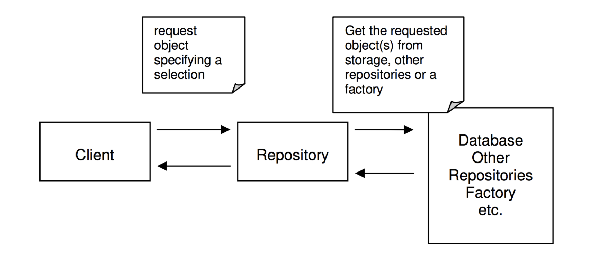

### 浅析DDD（领域驱动设计）

#### 一、What

软件开发不是一蹴而就的事，我们不可能在不了解产品或行业领域的前提下进行软件开发，在开发钱，通常需要进行大量的业务知识梳理，而后到达软件设计的层面，最后才开始开发。

在业务知识梳理的过程中，我们必然会形成某个领域知识，根据领域知识来一步步驱动软件设计，这就是 领域驱动设计的基本概念（Domain Driven Design）。

##### 1、软件开发 VS DDD

一般软件设计或软件开发分为两种形式：``瀑布式``，``敏捷式`` 。

**瀑布式**

项目经理经过大量业务分析后，基于现有需求整理出一个基本模型，再将结果以需求文档的形式传递给开发人员，开发只需要照此开发即可。在这种模式下，很难频繁的从用户侧得到反馈，因此前期分析和整理需求时，就已经默认这个业务模型是正确且不会改变的，这样就不能根据用户的实时需求来变更，或者可能和客户的预期差距较大。

**敏捷式**

敏捷在瀑布的基础上进行了改进，也会进行大量的需求分析，范围会涉及到更精细的业务模块，它是小步迭代、周期性交付，那么获取客户的反馈就比较频繁和及时。可是敏捷也不能将业务中的方方面面考虑到，并且敏捷是拥抱变化的，大量的需求或者业务模型变更，必将带来不小的维护成本，对开发人员的要求也会更高。

**DDD**

更小粒度的迭代设计，最小范围是 **领域模型（Domain Model）**，所谓的领域模型就是能够精确反馈领域中某一个知识元素的载体，这种知识的获取需要通过和**领域专家（Domain Expert）**进行频繁的沟通，才能将专业知识转化为领域模型。

领域模型与技术无关，具有高度的业务抽象性，它能够精确的描述领域中的知识体系；同时他也是独立的，我们还需要学会如何让它具有表达性，让模型彼此之间建立关系，形成完整的领域架构。通常，我们可以用象形图或一种 **通用的语言（Uniqutous Language）** 去描述它们之间的关系。在此之上，我们就可以进行 **领域中的代码设计（Domain Code Design）**。

如果将软件设计比做造房子，那么领域代码设计就好比是贴壁纸。前者已经将房子的蓝图框架规划好，后者只是一个小部分的设计。如果墙纸贴错了，我们可以重来，可如果房子的结构设计错了，那可就悲剧了。

#### 二、建立领域知识（Build Domain Model）

以飞机航行为例：

现在将要为航空公司研发一款能为飞机提供导航、保证无线路冲突的监控软件。根据DDD思路，第一步是 **建立领域知识**：作为平时管理和维护机场飞行秩序的工作人员来说，他们就是领域专家，在和他们沟通过程中，可能会听到诸如 起飞、着陆、飞行冲突、延误 等领域名词，那么我们会逐步建立模型，例如：

**· 起飞 -> 飞机 -> 终点**

这个模型很直接，但过于简单，无法看出飞机在空中有什么操作，也无法得知飞机如何从起点到终点，也无法涵盖如 飞行冲突 等概念，那么修改如下：

**· 飞机 -> 路线 -> Points（含起点、终点） **

这个过程，我们不断建立领域知识的过程，其中的重点就是寻找领域专家频繁的沟通，从中提炼必要的领域元素。

尽管看起来最后的模型有点简单，但已经逐步地建立出领域对象和领域模型了。

#### 三、通用语言（Ubiquitous Language）

上面的例子的确看起来简单，但过程并非容易：我们（开发人员）和领域专家在沟通的过程中是存在天然屏障的：开发人员只有 类、方法、设计模式、算法、集成、封装、多态 和 如何面向对象等，这些名词是领域专家不懂的，他们只知道飞机故障、经纬度、航班路线等专业术语。

所以，在建立领域知识的时候，我们（开发人员和领域专家）必须要交换知识，知识的范围设计领域模型的各个元素，如果一方对模型的描述领对方感到困惑，那么应该理科换一种描述方式，直到双方都能够接受并理解为止，在这一个过程中，我们就需要建立一种通用语言，作为开发人员和领域专家的沟通桥梁。

##### 1、UML

利用UML可以清晰的表现类，并且展示他们之间的关系。但是一旦聚合关系复杂，UML叶子节点将会变得十分庞大，可能就没那么直观易懂了。重要的是，它无法精确的描述类的行为。为了弥补这种缺陷，可以为具体的行为补充必要的说明（可以是标签或者文档），但这往往又很耗时，而且更新维护十分不便。

##### 2、伪代码

极限编程是推荐这么做的，这个办法对程序员固然好，可立刻就要将现有模型映射到代码层面，这对人的要求也是不低，且不容易实现的。

#### 四、模型驱动设计（Model Driven Design）

领域驱动设计中的模型关系图如下：

层结构图如下：

1. User Interface：向用户展示信息，并且会解析用户行为，即常说的展现层；
2. Application Layer：应用层没有任何业务逻辑代码，它很简单，主要为程序提供任务处理；
3. Domain Layer：包含有关领域的信息，是业务的核心，领域模型的状态都直接或间接（持久化至数据库）的存储在这一层；
4. Infrastructure Layer：为其他层提供底层依赖操作；

层结构的划分很重要，只有清晰的结构，那么最终的领域设计才宜用，比如用户要预订航班，向 Application Layer 的 Service 发起请求，而后 Domain layer 从 Infrastructure Layer 获取领域对象，校验通过后会更新用户状态，最后再次通过 Infrastructure Layer 持久化到数据库中。

#### 五、实体（Entity）&值对象（Value Object）

##### 1、实体

与面向对象中的概念雷系，在这里再次提出是因为它是领域模型的基本元素。在领域模型中，实体应该具有唯一标识符，从设计的一开始就应该考虑实体，决定是否建立一个实体十分重要。

##### 2、值对象

它于编程中的数值类型的变量是不同的，它仅仅是没有唯一标识符的实体，比如有两个收货地址的信息完全一样，那它就是值对象，并不是实体。值对象在领域模型中是可以被共享的，他们应该是『不可变的』（只读的），当有其他地方需要用到值对象时，可以将它的副本作为参数传递。

#### 六、服务（Services）

当我们在分析某一领域时，一直在尝试如何将信息转换为领域模型，但并非所有的点，我们都能用 Model 来覆盖。对象应当有属性、状态和行为，但有时领域中有一些行为是无法映射到具体的对象中，我们也不能强行将其放入某一个模型对象中，而将其单独作为一个方法有没有地方，此时就需要 **服务**。

服务是无状态的，对象是有状态的。所谓状态，就是对象的基本属性：高矮胖瘦、年轻或年老。服务本身也是对象，但它没有属性，只有行为，因此说是无状态的。

> 这与我们常说的服务器的状态是两个概念，无状态的服务器是指，对服务器来说每次接受的Http请求都像是客户端第一次发送一样；而有状态的服务器就会存储客户端的状态，常见的就是 Cookie 或 Session。

服务训在的目的就是为领域提供简单方法的，为了提供大量便捷的方法，自然要关联许多领域模型，所以说，行为（Action）天生就应该存在于服务中。

服务具有以下特点：

1. 服务中体现的行为一定是不属于任何实体和值对象的，但它术语领域模型的范围内；
2. 服务的行为一定涉及其他多个对象；
3. 服务的操作是无状态的

> 不要随意放置服务，如果该行为是属于应用层的，那就应该放在那；如果它为领域模型服务，那它就应该存储在领域层中，要避免业务的服务直接操作数据库，最好通过 DAO。

#### 七、模块（Modules）

对于一个复杂的应用来说，领域模型讲会变得越来越大，以至于很难去描述和理解，更别提模型之间的关系了。模块的竖线，就是为了组织统一的模型概念，来打到减少复杂性的目的。而另一个原因，是模块可以提高代码质量和可维护性，比如我们常说的 ``高内聚，低耦合`` 就是要提倡将相关的类内聚在一起实现模块化。

模块应当有对外的统一接口供其他模块调用，比如有三个对象在模块A中，那么模块B不应该直接操作这三个对象。模块的命名也很有讲究，最好能深层次反映领域模型。

#### 八、聚合（Aggregates）

聚合被看作是多个模型单元间的组合，它定义了模型的关系和边界。每个聚合都有一个根，根是一个实体，并且是唯一可被外访问的。正是如此，聚合可以保证多个模型单元的不变性，因为其他模型都参考聚合的根。所以要想改变其他对象，只能通过聚合的根去操作。根如果没有了，那么聚合中的其他对象也将不存在。

例如上图，customer是该聚合的根，其他的都是内部对象，如果外部需要用户地址，拷贝一份传递出去即可。显而易见，如果用户不存在，其他信息均无意义。

#### 九、工厂（Factories）

在大型系统中，实体和聚合通常是很复杂的，这就导致了很难去通过构造器来构造对象。``工厂`` 就可以解决这个问题，它把创建对象的细节封装起来，巧妙地实现了依赖反转。当然对聚合也适用（当建立了聚合根时，其他对象可以自动创建）。工厂时最早被大家熟知可能还是在设计模式中。

但不要盲目地去应用工厂，以下场景不需要工厂：

1. 构造器很简单；
2. 构造对象时不依赖于其他对象的创建；
3. 用策略模式就可以解决；

#### 十、仓库（Respository）

仓库封装了获取对象的逻辑，领域对象无需和底层数据库交互，它只需要从仓库中获取对象即可。仓库可以存储对象的引用，当一个对象被创建后，它可能会被存储到仓库中，那么下次就可以从仓库取。如果用户请求的数据没在仓库中，则会从数据库里取，这就减少了底层交互的次数。当然，仓库获取对象也是有策略的，如下：

PS：仓库看起来有点像 Infrastructure Layer 的东西，但其实不然，仓库更像是本地缓存，需要时才会访问数据库。
