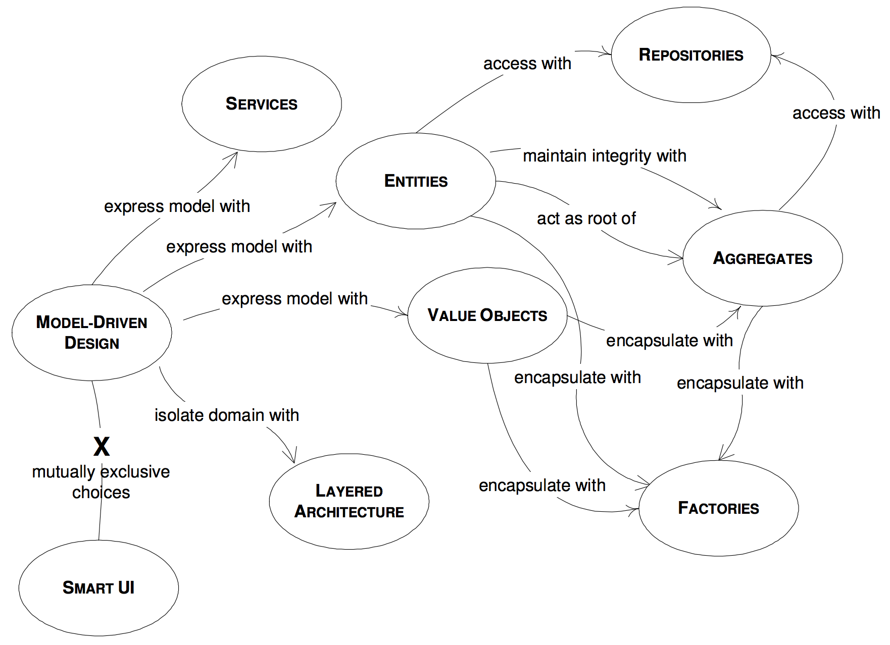
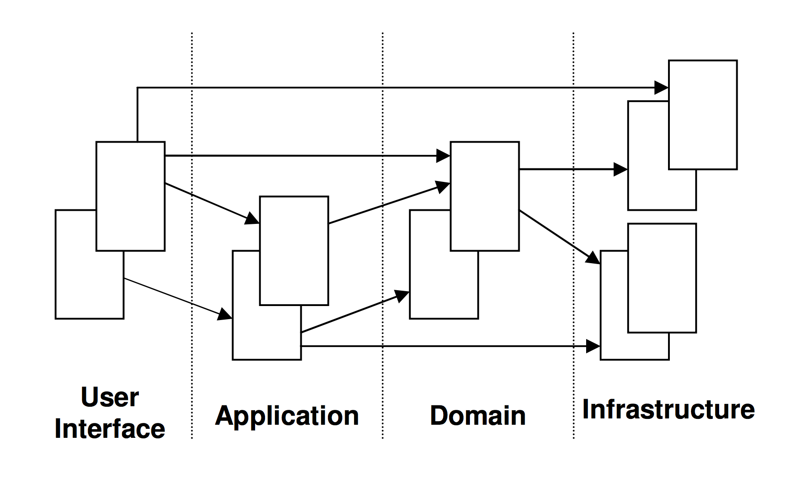

### 浅析DDD（领域驱动设计）

#### 一、What

软件开发不是一蹴而就的事，我们不可能在不了解产品或行业领域的前提下进行软件开发，在开发钱，通常需要进行大量的业务知识梳理，而后到达软件设计的层面，最后才开始开发。

在业务知识梳理的过程中，我们必然会形成某个领域知识，根据领域知识来一步步驱动软件设计，这就是 领域驱动设计的基本概念（Domain Driven Design）。

##### 1、软件开发 VS DDD

一般软件设计或软件开发分为两种形式：``瀑布式``，``敏捷式`` 。

**瀑布式**

项目经理经过大量业务分析后，基于现有需求整理出一个基本模型，再将结果以需求文档的形式传递给开发人员，开发只需要照此开发即可。在这种模式下，很难频繁的从用户侧得到反馈，因此前期分析和整理需求时，就已经默认这个业务模型是正确且不会改变的，这样就不能根据用户的实时需求来变更，或者可能和客户的预期差距较大。

**敏捷式**

敏捷在瀑布的基础上进行了改进，也会进行大量的需求分析，范围会涉及到更精细的业务模块，它是小步迭代、周期性交付，那么获取客户的反馈就比较频繁和及时。可是敏捷也不能将业务中的方方面面考虑到，并且敏捷是拥抱变化的，大量的需求或者业务模型变更，必将带来不小的维护成本，对开发人员的要求也会更高。

**DDD**

更小粒度的迭代设计，最小范围是 **领域模型（Domain Model）**，所谓的领域模型就是能够精确反馈领域中某一个知识元素的载体，这种知识的获取需要通过和**领域专家（Domain Expert）**进行频繁的沟通，才能将专业知识转化为领域模型。

领域模型与技术无关，具有高度的业务抽象性，它能够精确的描述领域中的知识体系；同时他也是独立的，我们还需要学会如何让它具有表达性，让模型彼此之间建立关系，形成完整的领域架构。通常，我们可以用象形图或一种 **通用的语言（Uniqutous Language）** 去描述它们之间的关系。在此之上，我们就可以进行 **领域中的代码设计（Domain Code Design）**。

如果将软件设计比做造房子，那么领域代码设计就好比是贴壁纸。前者已经将房子的蓝图框架规划好，后者只是一个小部分的设计。如果墙纸贴错了，我们可以重来，可如果房子的结构设计错了，那可就悲剧了。

#### 二、建立领域知识（Build Domain Model）

以飞机航行为例：

现在将要为航空公司研发一款能为飞机提供导航、保证无线路冲突的监控软件。根据DDD思路，第一步是 **建立领域知识**：作为平时管理和维护机场飞行秩序的工作人员来说，他们就是领域专家，在和他们沟通过程中，可能会听到诸如 起飞、着陆、飞行冲突、延误 等领域名词，那么我们会逐步建立模型，例如：

**· 起飞 -> 飞机 -> 终点**

这个模型很直接，但过于简单，无法看出飞机在空中有什么操作，也无法得知飞机如何从起点到终点，也无法涵盖如 飞行冲突 等概念，那么修改如下：

**· 飞机 -> 路线 -> Points（含起点、终点） **

这个过程，我们不断建立领域知识的过程，其中的重点就是寻找领域专家频繁的沟通，从中提炼必要的领域元素。

尽管看起来最后的模型有点简单，但已经逐步地建立出领域对象和领域模型了。

#### 三、通用语言（Ubiquitous Language）

上面的例子的确看起来简单，但过程并非容易：我们（开发人员）和领域专家在沟通的过程中是存在天然屏障的：开发人员只有 类、方法、设计模式、算法、集成、封装、多态 和 如何面向对象等，这些名词是领域专家不懂的，他们只知道飞机故障、经纬度、航班路线等专业术语。

所以，在建立领域知识的时候，我们（开发人员和领域专家）必须要交换知识，知识的范围设计领域模型的各个元素，如果一方对模型的描述领对方感到困惑，那么应该理科换一种描述方式，直到双方都能够接受并理解为止，在这一个过程中，我们就需要建立一种通用语言，作为开发人员和领域专家的沟通桥梁。

##### 1、UML

利用UML可以清晰的表现类，并且展示他们之间的关系。但是一旦聚合关系复杂，UML叶子节点将会变得十分庞大，可能就没那么直观易懂了。重要的是，它无法精确的描述类的行为。为了弥补这种缺陷，可以为具体的行为补充必要的说明（可以是标签或者文档），但这往往又很耗时，而且更新维护十分不便。

##### 2、伪代码

极限编程是推荐这么做的，这个办法对程序员固然好，可立刻就要将现有模型映射到代码层面，这对人的要求也是不低，且不容易实现的。

#### 四、模型驱动设计（Model Driven Design）

领域驱动设计中的模型关系图如下：

层结构图如下：

1. User Interface：向用户展示信息，并且会解析用户行为，即常说的展现层；
2. Application Layer：应用层没有任何业务逻辑代码，它很简单，主要为程序提供任务处理；
3. Domain Layer：包含有关领域的信息，是业务的核心，领域模型的状态都直接或间接（持久化至数据库）的存储在这一层；
4. Infrastructure Layer：为其他层提供底层依赖操作；

层结构的划分很重要，只有清晰的结构，那么最终的领域设计才宜用，比如用户要预订航班，向 Application Layer 的 Service 发起请求，而后 Domain layer 从 Infrastructure Layer 获取领域对象，校验通过后会更新用户状态，最后再次通过 Infrastructure Layer 持久化到数据库中。

#### 五、实体（Entity）&值对象（Value Object）

##### 1、实体

与面向对象中的概念雷系，在这里再次提出是因为它是领域模型的基本元素。在领域模型中，实体应该具有唯一标识符，从设计的一开始就应该考虑实体，决定是否建立一个实体十分重要。

##### 2、值对象

它于编程中的数值类型的变量是不同的，它仅仅是没有唯一标识符的实体，比如有两个收货地址的信息完全一样，那它就是值对象，并不是实体。值对象在领域模型中是可以被共享的，他们应该是『不可变的』（只读的），当有其他地方需要用到值对象时，可以将它的副本作为参数传递。

#### 六、服务（Services）

