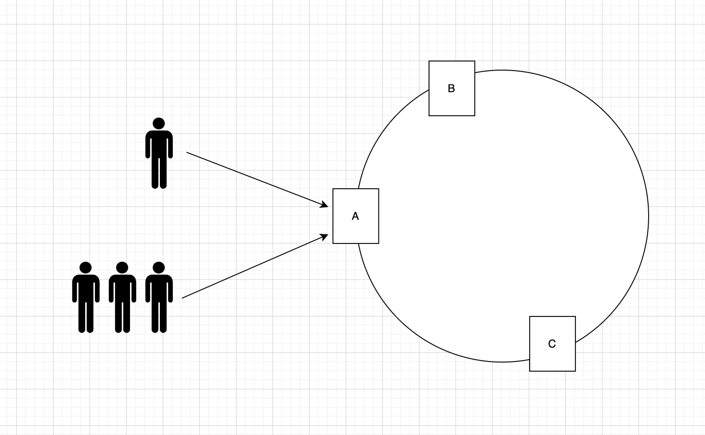
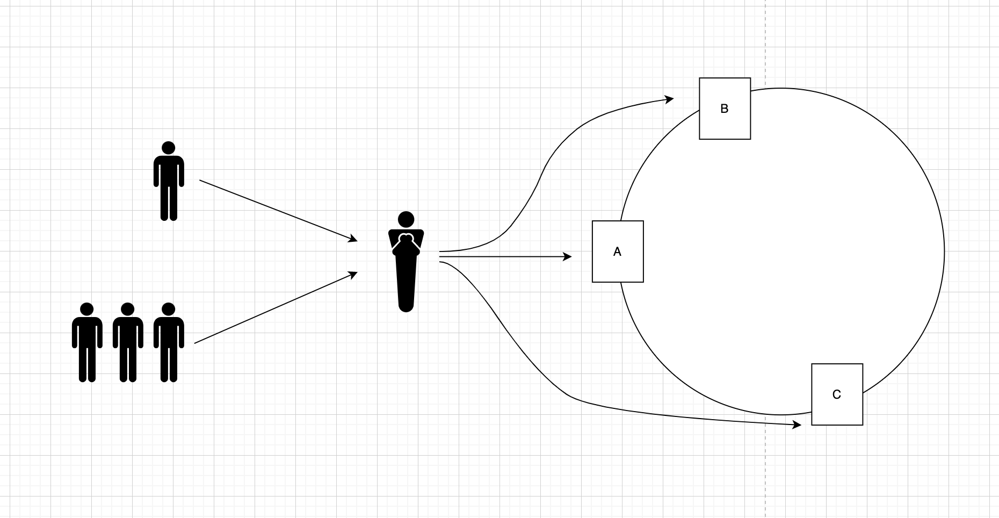
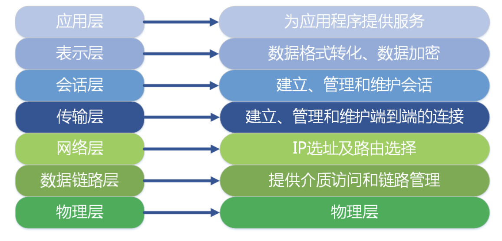

## 浅析负载均衡

### 一、什么是负载均衡？

Loading Balance，即负载均衡，是一种计算机技术，用在多个计算机（集群）、网络连接、CPU、磁盘驱动器或其他资源中分配负载，已达到最优化资源使用、最大化吞吐率、最小化响应时间、避免过载的目的。

### 二、为什么需要负载均衡？

日常生活中，我们经常需要去一些相对拥挤的地方，比如地铁站、火车站、电影院、银行等。无论是买票还是排队入场，这些场所一般都会设置多个服务点或入口。如果没有人引导，多数情况下，距离我们最近的入口会很拥挤，而那些距离较远的服务点或入口会很宽松。

这种情况下，会大大浪费资源，因为如果可以把这些人很好的分散到各个入口，会大大缩短排队的时间。其实网站建设也是一样的，为了提升网站的服务能力，很多网站采用集群部署，就像话剧院门口有多个入口一样，这时候，需要一个协调者，来均衡地分配这些用户的请求，可以让用户的请求均匀的派发到不通的服务器上。

负载均衡（Loading Balance）的本质在于将负载进行平衡、分摊到多个操作单元上进行，是解决高性能、高可用、水平伸缩扩展的终极方案。

### 三、负载均衡分配

我们根据 OSI 七层模型开设计负载均衡方案。OSI 是一个开放性的通信系统互连参考模型，它是一个协议规范，一共有七层，每层又可以分为很多个子层。大体上从上至下分为：应用层、表示层、会话层、传输层、网络层、链路层（数据链路层）、物理层。

>计算机网络相关概念：
>
>Telnet、HTTP、FTP、NFS、DNS等属于第七层应用层的概念。
>
>TCP、UDP、SPX等属于第四层传输层的概念。
>
>IP、IPX等属于第三层的概念。
>
>ATM、FDDI 等属于第二层数据链路层的概念。

负载均衡是要在网络传输中做文章的，所以根据 OSI 七层模型的不同层次，给负载均衡做了如下分类：

#### 二层负载均衡

负载均衡服务器对外提供一个VIP（虚拟IP），集群中不同的机器采用相同的IP地址，但是机器的MAC地址不一样。当负载均衡服务器姐收到请求后，通过改写保温的目标MAC地址的方式将请求转发到目标机器实现负载均衡。

#### 三层负载均衡

和第二层类似，负载均衡服务器对外依然提供一个VIP（虚拟IP），但是集群中不同的机器采用不同的IP地址。当负载均衡服务器姐收到请求后之后，根据不同的负载均衡算法，通过IP将请求转发至不同的真实服务器。

#### 四层负载均衡

四层负载均衡工作在传输层，而改层只有 TCP/UDP 协议，这两种协议中除了包含源IP、目标IP歪，还包含源端口和目标端口，四层负载均衡服务器在接受到客户端请求后，通过修改数据包的地址信息（IP+端口）将流量转发到应用服务器。

#### 七层负载均衡

七层负载均衡工作在应用层，应用层协议较多，常用HTTP、Radius、DNS等。七层负载均衡就可以基于这些协议来负载，比如同一个Web服务器的负载均衡，除了根据IP+端口进行负载外，还可根据七层的URL、浏览器类别、语言来决定是否进行负载均衡。

### 四、负载均衡工具

市面上有很多开源的负载均衡工具或软件，基本都是基于前面几种方案实现的，大多数是工作在第七层和第四层。Nginx/LVS/HAProxy 是目前使用最广泛的三种负载均衡软件。

#### 1、LVS：四层负载均衡

LVS（Linux Virtual Server），也就是 Linux 虚拟服务器，是一个有章文嵩博士发起的自由软件项目。使用 LVS 技术要达到的目的是，通过 LVS 提供的负载均衡技术和 Linux 操作系统实现一个高性能、高可用的服务器集群，它具有良好可靠性、可扩展性和可操作性。从而以低廉的成本实现最优的服务性能。

#### 2、Nginx：七层负载均衡

Nginx（发音同 engine x）是一个网页服务器，它能反向代理 HTTP、HTTPS、SMTP、POP3、IMAP 的协议链接，以及一个负载均衡器和一个HTTP缓存。

#### 3、HAProxy：七层负载均衡

HAProxy 是一个使用C语言编写的自由开源软件，其提供高可用性负载均衡以及基于TCP和HTTP的应用程序代理。

### 五、负载均衡算法

负载均衡服务器在决定将请求转发到哪台真实服务器时，是通过负载均衡算法来实现的，负载均衡算法是负载均衡服务器的核心，大致分为 **静态负载均衡算法** 和 **动态负载均衡算法**。

#### 1、静态负载均衡算法

包括 轮询、比率 和 优先权。

1. **轮询（Round Robin）**：顺序循环将请求依次顺序循环地连接每个服务器。当其中某个服务器发生第二到第七层的故障，BIG-IP 就把其从顺序循环队列中拿走，不参与下一次的轮询，直到其恢复正常。
2. **比率（Ratio）**：给每个服务器分配一个加权值为比例，根据这个比例，把用户的请求分配到每个服务器。当其中某个服务器发生发生第2到第7层的故障，BIG-IP 就把其从服务器队列拿出，不参加下一次的用户请求的分配，直到其恢复正常。
3. **优先权（Priority）**：给所有服务器分组，每个组定义优先权，BIG-IP 用户的请求分配给优先级最高的服务器组（同一个组内，采用轮询或比率算法来分配用户的请求）。当最高优先级中所有服务器都出现故障，BIG-IP 才将请求送给次优先级的服务器组。这种方式，实际是为用户提供一中热备份的方式。

#### 2、动态负载均衡算法

包括 最少连接数、最快响应速度、观察法、预测法、动态性能分配法、动态服务器补充法、服务质量、服务类型、规则模式。

1. **最少连接数（Least Connection）**：传递新的连接给那些进行最少连接处理的服务器。当其中某个服务器发生第2到第7层的故障，BIG-IP 就把其从服务器队列中拿出，不参加下一次的用户请求分配，直到其恢复正常；
2. **最快响应速度（Fastest）**：传递新的连接给那些响应最快的服务器；
3. **观察模式（Observed）**：连接数目和响应时间以这两项的最佳平衡为依据，为新的请求选择服务器；
4. **预测模式（Predictive）**：BIG-IP 利用收集到的服务器当做性能指标，进行预测分析，选择一台服务器在下一个时间片内，选择性能将达到最佳的服务器来处理用户的请求（被 BIG-IP 进行检测）；
5. **动态性能分配（Dymanic Ratio-APM）**：BIG-IP 收集到的应用程序和应用服务器的各项性能参数，动态调整流量分配；
6. **动态服务器补充（Dynamic Server Act.）**：当主服务器群中因故障导致数量减少时，动态地将备份服务器补充到主服务器群；
7. **服务质量（QoS）**：按不同的优先级对数据流进行分配；
8. **服务类型（ToS）**：按不同的服务器类型（在Type of Field中标识）负载均衡对数据流进行分配；
8. **规则模式**：针对不同的数据流设置导向规则，用户可自行分配；

以上，就是目前实现负载均衡的主流算法，不通的负载均衡服务器会选择不同的算法。就像电影院和火车站可能会选用不同的引导策略一样。火车站可能会把行李少的旅客分配到一个专门的入口，可能给即将发车的旅客分派到特快入口，手持可扫描车票的用户，单独分配到特殊入口等。

