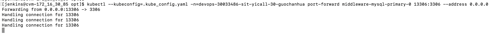

### 使用kubectl port-forward 快速连接k8s集群内的mysql

1、登录k8s集群跳板机（172.18.30.85）。

2、开启端口转发

```shell
[ops]$ alias k8s="kubectl -n devops-30005969-sit-env --kubeconfig=/data/jenkins/workspace/k8s-envs/devops-30005969-sit-env/opt/.kube_config.yaml"
[ops]$ k8s port-forward mysqlha-0 13306:3306 --address 0.0.0.0
Forwarding from 0.0.0.0:13306 -> 3306
Handling connection for 13306
```

3、使用mysql工具连接 **172.18.30.85** 的 **13306** 端口即可。



