## Call v3.0 Kubernetes 环境操作指引


说明：本文档意在说明和指引K8S环境如何进行简单操作，适用对象：开发、测试 和 运维型产品。

| 版本 | 维护人     | 时间       | 说明             |
| ---- | ---------- | ---------- | ---------------- |
| v1.0 | 黎进、徐灿 | 2022.04.09 | /                |
| v1.1 | 黎进       | 2022.04.25 | 增加故障排查说明 |

### 一、登录

Windows：使用XShell；MacOS：使用控制台执行 ssh 命令。依次执行以下指令登录服务器：

``` shell
ssh lxmajs@172.18.167.56  #密码：ZDY4MmM4YWYxNTg5
sudo su - jenkins # 切换账号，再次输入密码
sh ~/.bashrc #使用别名指令集
```

>  注意：用户名以 lxmajs 为例，每个人都有自己的账号和密码，若没有，请向DevOps组提单申请，具体可参考：https://www.tapd.cn/58287615/bugtrace/bugs/view?bug_id=1158287615001072291

### 二、查看命名空间

Kubernetes以**命名空间（namespace）**来划分不同的资源空间，要查看或操作某个命名空间下的信息，首先需要指定命名空间。命名空间可以在流水线环境中查到，如 [Call v3.0 的流水线环境](http://devops.ks1.wezhuiyi.com/pipeline/project/10000008/release/20000355/platform/kubernetes/env)：

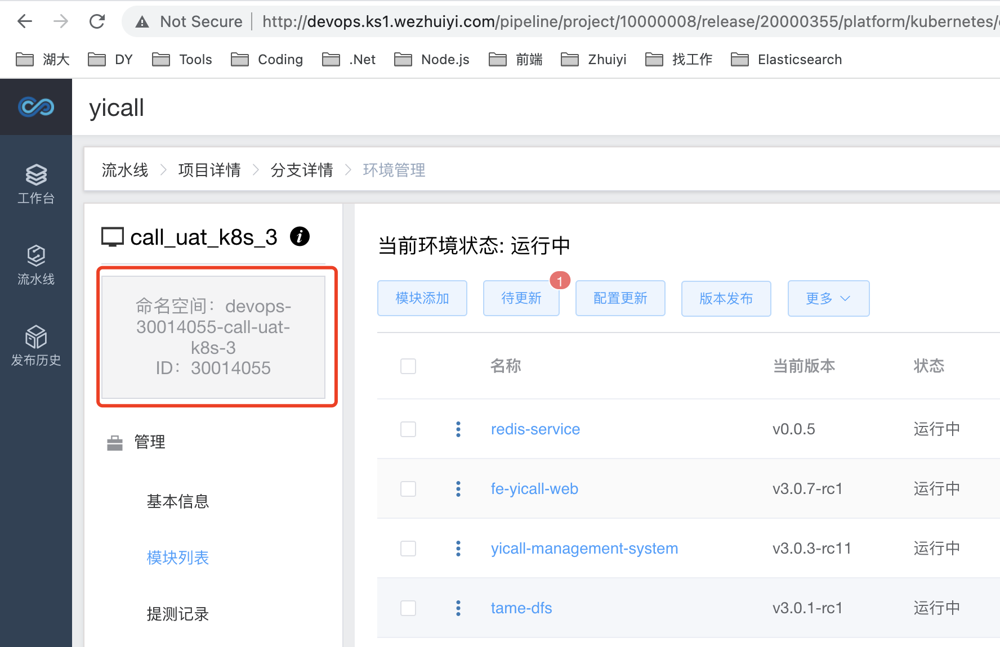

查找到命名空间后，可以执行以下命令来进行操作k8s：

``` shell
kubeconfig .kube_config.yaml -n [$namespace] ...
```

因为所有的指令都要包含前面这一串，指令比较长，所以徐灿将前面这部分用shell的别名替代。UAT环境可以使用  **k8s-call-uat**，SIT环境可以使用 **k8s-call-sit** 代替。如查看pods：

```shell
 k8s-call-uat get pods
```

### 三、查看pod

使用向Devops申请的临时账号，来登录K8S的环境后，可以执行以下指令查看到pod信息：

``` shell
k8s-call-uat get pods
```

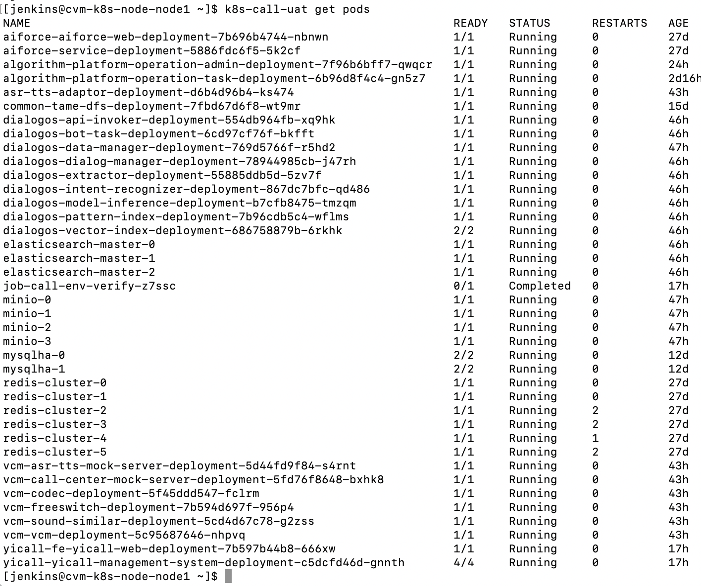

基础服务的 pod名 是不会变的，但是其他模块在每次更新流水线环境后，都会修改 pod名。基础服务的 pod名 如下：

| podName                | 说明                                                       |
| ---------------------- | ---------------------------------------------------------- |
| mysqlha-0              | MySQL主节点，查看数据请进入该节点（pwd：uWXf87plmQGz8zMM） |
| mysqlha-1              | MySQL从节点                                                |
| redis-cluster-n        | Redis集群节点，n的范围 [0, 5]                              |
| elasticsearch-master-n | ES集群节点，n的范围 [0, 2]                                 |

### 四、日志

单模块的pod可以执行下面的命令查看日志：

``` shell
k8s-call-uat logs --tail 500 -f [$podName]
```

若pod中有多个模块，可以在后面跟 `` -c [$modelName] ``，例如查看 yicall-dialog 模块的日志：

``` shell
k8s-call-uat logs --tail 500 -f yicall-management-system-xxx -c yicall-dialog
```

如图：

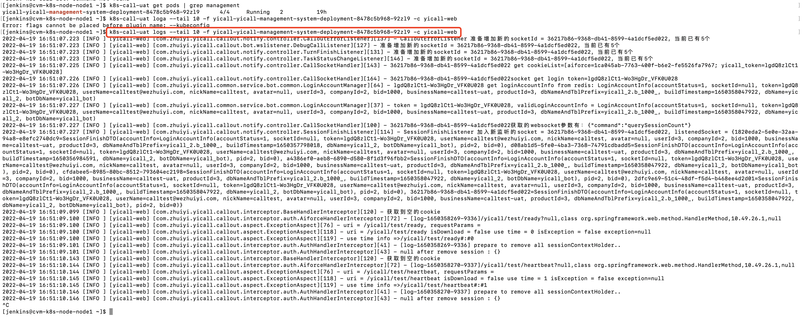

### 五、进入pod

若需要查看指定的日志文件内容，或者进入pod，可以执行以下命令：

``` shell
k8s-call-uat exec -it [$podName] -c [$modelName] bash
```

进入pod之后，可以查看pod内的文件，如日志、配置等。比如查看vcm的日志：

1、查找vcm的pod名：

``` shell
k8s-call-uat get pods | grep vcm
```

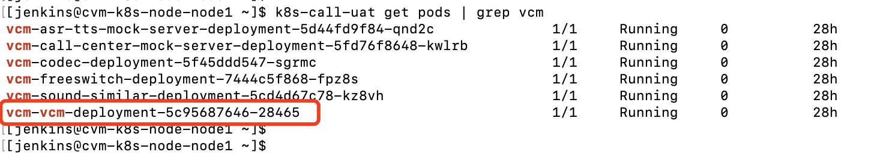

2、进入vcm的pod：

```shell
k8s-call-uat exec -it vcm-vcm-deployment-5c95687646-28465 bash
```

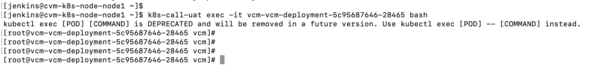

3、找到vcm的日志路径：

```shell
cd /data/vcm/vcm/logs/
```

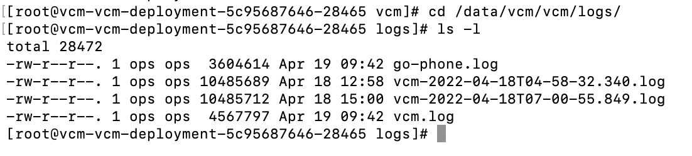vcm的日志文件是 **vcm.log**，可以执行grep、cat等指令来检索日志内容。

### 六、故障排查

当更新环境后，流水线小助手提示更新失败，可以先看看日志：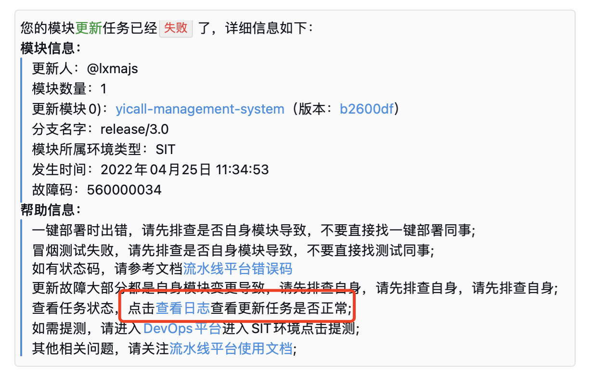

##### 1、编译成功，运行失败

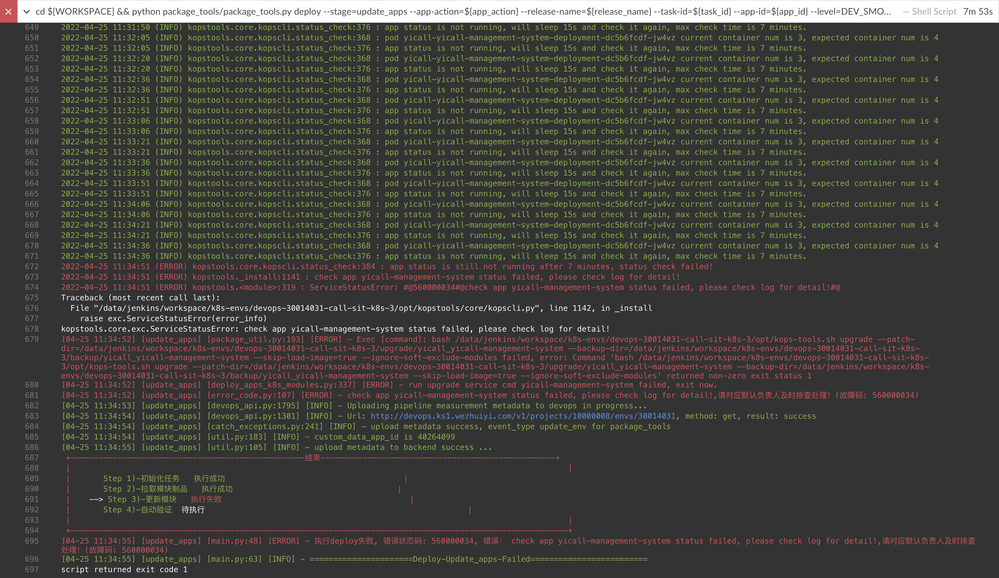

日志中的关键信息是，执行失败，错误码：**560000034**。

a）查看 K8S 环境中的服务状态，发现4个容器，只有3个容器启动成功，其中一个启动失败：

``` shell
k8s-call-sit get pods
```

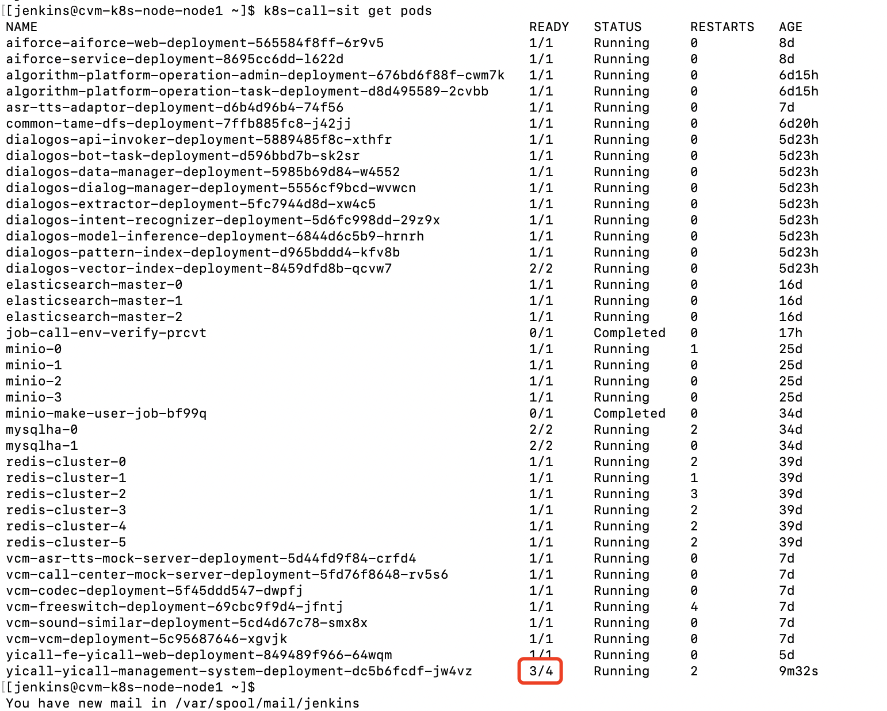

b）查看 pod 日志，排查具体哪个模块启动失败

``` shell
k8s-call-sit describe pod yicall-yicall-management-system-deployment-dc5b6fcdf-jw4vz
```

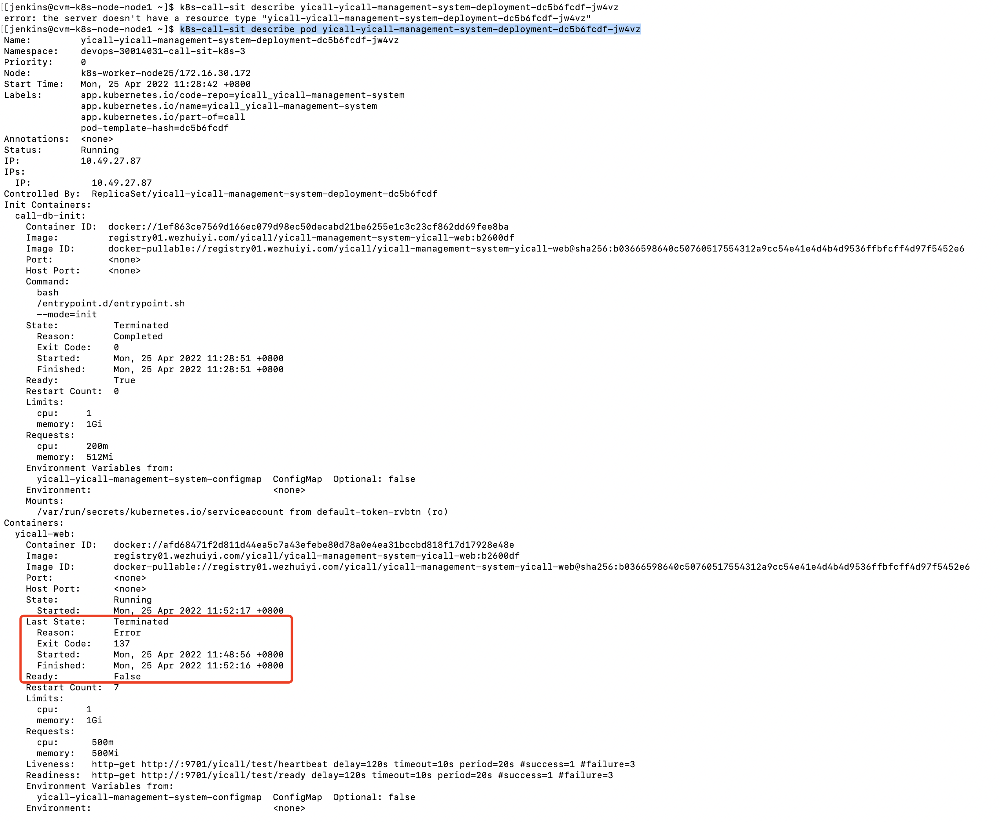

从图中可以看出，yicall-web最后的状态是 **Terminated**，表示改容器重启失败，已停止运行。

c）查看容器日志，做进一步排查

```shell
k8s-call-sit logs yicall-yicall-management-system-deployment-dc5b6fcdf-jw4vz -c yicall-web
```

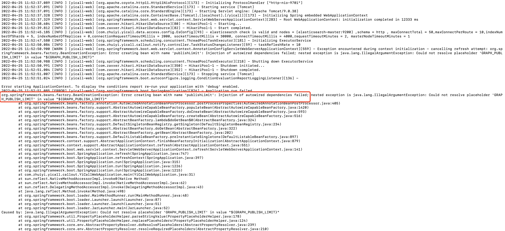

可以看到，例子中的 yicall-web 缺少了一个配置，导致启动时配置检查不通过，导致容器异常启动。
